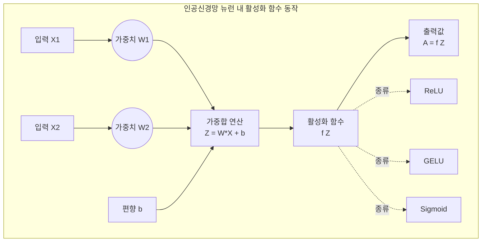

# 활성화함수 (Activation Function)

---

## I. 신경망 비정형성 확보의 핵심, 활성화함수의 개요

* **정의**: 인공신경망(ANN)의 각 뉴런에서 입력값의 가중합(Weighted Sum)을 받아 비선형(Non-linear) 특성을 부여하고 다음 레이어로 전달할 출력값을 결정하는 수학적 함수
* **등장배경**: 선형 모델(퍼셉트론)의 한계인 XOR 문제를 해결하고, 다층 신경망(Deep Neural Networks)이 복잡하고 비선형적인 실제 세계의 패턴과 데이터 관계를 학습할 수 있도록 구조적 역량 부여 필요
* **특징**: 비선형성(Non-linearity) 제공, 오차역전파(Backpropagation)를 위한 미분 가능성 확보, 기울기 소실(Gradient Vanishing) 문제 완화 및 학습 수렴 속도에 직접적 영향

---

## II. 활성화함수의 개념도 및 핵심 기술 요소

### 가. 활성화함수의 동작 아키텍처 및 연산 흐름도

* 입력 신호의 가중합($Z$)에 비선형 활성화 함수($f(Z)$)를 적용함으로써 단순한 선형 결합의 연속을 하나의 선형 함수로 환원되는 문제를 방지하고 표현력 극대화

### 나. 주요 활성화함수 및 핵심 기술 요소

| 구분 | 요소기술(키워드) | 세부 설명 및 특징 |
| --- | --- | --- |
| 전통적 함수 | **Sigmoid (Logistic)** | 출력이 (0, 1) 범위로 압축되어 이진 분류의 출력층에 주로 사용되나, 기울기 소실(Vanishing Gradient) 발생 |
| 전통적 함수 | **Tanh (Hyperbolic Tangent)** | 출력이 (-1, 1) 범위로 평균이 0이지만, 여전히 양 끝단에서 기울기 소실 문제 존재 |
| [[딥러닝]] 표준 | **ReLU (Rectified Linear Unit)** | 양수 입력은 그대로, 음수는 0으로 출력 ($max(0, x)$). 연산이 단순하고 기울기 소실 완화, Dying ReLU 한계 |
| 변형 ReLU | **Leaky ReLU** | 음수 입력에 대해 매우 작은 기울기($0.01x$)를 허용하여 Dying ReLU 현상 방지 |
| 고급 함수 | **ELU (Exponential Linear Unit)** | 음수 구간에서 지수 함수를 사용하여 평균을 0에 가깝게 만들고 학습 속도 및 정확도 향상 |
| 최신 대세 | **GELU (Gaussian Error Linear Unit)** | 입력값에 가우시안 누적 분포 함수를 곱한 형태, Transformer 및 [[초거대 언어 모델|LLM]]([[BERT]], GPT 등)의 표준 활성화 함수 |
| 고성능 함수 | **Swish** | 구글이 발견한 함수($x \cdot \sigma(\beta x)$), 깊은 신경망에서 ReLU보다 우수한 성능 발휘 |
| 출력층 함수 | **Softmax** | 다중 [[클래스]] 분류 문제에서 출력값을 확률 분포(합이 1) 형태로 변환하는 함수 |

---

## III. 전통적 활성화함수와 최신 LLM용 활성화함수 비교 및 전망

### 가. 세대별 활성화함수 비교

| 비교 항목 | Sigmoid / Tanh | ReLU | GELU / Swish |
| --- | --- | --- | --- |
| **출력 범위** | (0, 1) 또는 (-1, 1) | $[0, \infty)$ | $(-\infty, \infty)$ (비선형 곡선 형태) |
| **기울기 소실** | 심각함 ([[End-to-End]] 학습 저해) | 양수 구간에서 해소 (음수 구간은 0) | 완화됨 (미세한 기울기 유지로 학습 안정성 제고) |
| **연산 복잡도** | 지수 연산 포함으로 높음 | 단순 비교 연산으로 매우 낮음 | 확률 분포 계산 등으로 상대적으로 높음 |
| **주요 적용처** | 초기 신경망, 이진 분류 출력층 | 전통적 [[CNN]] 및 일반적인 다층 퍼셉트론 | 최신 Transformer, LLM ([[인공지능]] 고도화 환경) |

### 나. 활성화함수의 최신 트렌드 및 실무 활용 전략

* **대규모 언어 모델(LLM) 중심의 GELU 및 SwiGLU 확산**: 초거대 AI 모델의 성능을 극대화하기 위해 기존 ReLU에서 부드러운 비선형성을 제공하는 GELU나 게이트 메커니즘이 결합된 SwiGLU 구조로 전환 가속화
* **하드웨어 가속 최적화**: 복잡한 초월함수(GELU, Swish 등) 연산에 따른 지연을 줄이기 위해 전용 AI 반도체([[NPU]] 등) 레벨에서의 하드웨어 가속 연산 최적화 설계 필수적

---

### 🔗 연관 토픽

- **소속 도메인**: [[00_인공지능_MOC|🤖 인공지능]]
- **세부 분류**: `3. 딥러닝 핵심 아키텍처 & 신경망`
- **핵심 연관 토픽**:
  - [[딥러닝]]
  - [[인공지능]]
  - [[초거대 언어 모델|초거대 언어 모델(Large Language Model)]]
  - [[BERT]]
  - [[CNN|CNN (Convolutional Neural Network)]]
