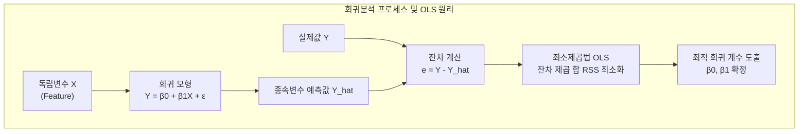

# 회귀분석 (Regression Analysis)

---

## I. 데이터 기반 예측 및 인과관계 분석의 기초, 회귀분석의 개요

* **정의**: 하나 이상의 독립변수(Independent Variable)가 종속변수(Dependent Variable)에 미치는 영향을 파악하고, 이를 수학적 함수 관계로 모델링하여 미래 값을 예측하거나 변수 간 관계를 설명하는 통계적 분석 기법
* **등장배경**: 비즈니스 및 과학적 의사결정 과정에서 직관에 의존하지 않고, 방대한 데이터로부터 변수 간의 인과관계와 상관성을 정량적으로 도출하여 미래 트렌드를 예측할 필요성 증대
* **특징**: 독립변수와 종속변수 간의 함수적 관계 추정, 최소제곱법(OLS) 기반의 최적화, 예측 성능과 통계적 유의성([[유의확률|p-value]]) 동시 검증 가능

---

## II. 회귀분석의 개념도 및 핵심 기술 요소

### 가. 회귀분석의 모델링 및 잔차 최소화 개념도

* 독립변수와 종속변수 간의 가설 모형을 설정한 후, 실제값과 예측값의 차이인 잔차(Residual)의 제곱 합을 최소화하는 최적의 회귀 계수를 도출하여 모델 완성

### 나. 회귀분석의 핵심 구성 요소 및 유형

| 구분 | 요소기술(키워드) | 세부 설명 |
| --- | --- | --- |
| 분석 유형 | **단순 선형 회귀** | 1개의 독립변수와 1개의 종속변수 간의 직선적 관계를 모델링 ($Y = \beta_0 + \beta_1X$) |
| 분석 유형 | **다중 선형 회귀** | 2개 이상의 독립변수가 종속변수에 미치는 복합적 영향을 동시에 분석 |
| 분석 유형 | **다항 회귀** | 독립변수의 차수를 높여 비선형적인 데이터 패턴을 유연하게 곡선 형태로 모델링 |
| 분석 유형 | **로지스틱 회귀** | 종속변수가 범주형(이진 분류)일 때, 시그모이드 함수를 통해 발생 확률을 0과 1 사이로 예측 |
| 최적화 기법 | **최소제곱법 (OLS)** | 잔차 제곱 합(RSS)을 최소화하는 절편과 기울기 파라미터를 수학적으로 도출하는 기법 |
| 평가 지표 | **결정계수 ($R^2$)** | 회귀 모델이 전체 데이터의 변동성을 설명하는 정도를 나타내는 지표 (0~1 사이 값) |
| 규제화 기법 | **릿지 / 라쏘 (Ridge / Lasso)** | 다중공선성을 해결하고 과적합을 방지하기 위해 회귀 계수에 페널티를 부과하는 기법 |
| 검정 기법 | **잔차 분석 (Residual)** | 회귀 모형의 기본 가정(정규성, [[등분산성]], 독립성) 충족 여부를 잔차 산포도로 확인 |

---

## III. 선형 회귀와 로지스틱 회귀 비교 및 최신 트렌드

### 가. 선형 회귀분석과 로지스틱 회귀분석 비교

| 비교 항목 | 선형 회귀분석 (Linear Regression) | 로지스틱 회귀분석 (Logistic Regression) |
| --- | --- | --- |
| **종속변수 성격** | 연속형 수치 데이터 (Continuous) | 범주형 데이터 (Binary 또는 Multiclass) |
| **출력 값 범위** | 실수 전체 범위 $(-\infty, \infty)$ | 0과 1 사이의 확률 값 $[0, 1]$ |
| **적용 활성화 함수** | 항등 함수 (Identity Function) | 시그모이드 함수 (Sigmoid Function) |
| **주요 활용 분야** | 주택 가격 예측, 매출액 추정, 기온 예측 | 스팸 메일 분류, 질병 유무 판별, 고객 이탈 예측 |

### 나. 회귀분석의 최신 트렌드 및 실무 활용 전략

* **머신러닝 및 [[딥러닝]] 기반 회귀 모형 확장**: 전통적 통계 회귀에서 나아가 XGBoost, LightGBM, 심층 신경망(Neural Networks)을 결합하여 비선형성과 고차원 데이터 처리가 가능한 고성능 예측 모델로 진화
* **인과추론(Causal Inference)과의 융합**: 단순한 상관관계 분석을 넘어 도예변수, 성향점수 매칭(Propensity Score Matching) 등을 결합하여 실질적인 비즈니스 의사결정을 위한 인과적 효과 측정 도구로 활용 확대

---

### 🔗 연관 토픽

- **소속 도메인**: [[00_인공지능_MOC|🤖 인공지능]]
- **세부 분류**: `1. 수학 · 통계학 & 데이터 전처리`
- **핵심 연관 토픽**:
  - [[등분산성|등분산성 (Homoscedasticity)]]
  - [[유의확률|유의확률 (p-value)]]
  - [[결측치]]
  - [[기술 통계|기술 통계(Descriptive statistics)]]
  - [[정량적 데이터]]
