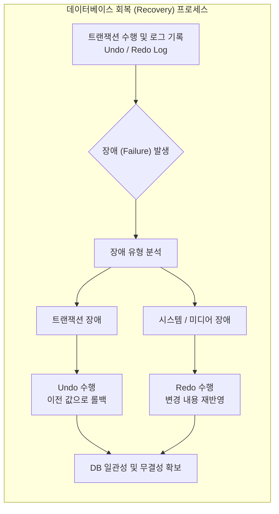

# 회복기법 (Recovery Techniques)

---

## I. 데이터베이스 무결성 보장을 위한, 회복기법의 개요

* **정의**: [[트랜잭션]] 실행 도중 장애(Failure)가 발생하여 데이터베이스가 손상되었을 때, 장애 발생 이전의 일관되고 정확한 상태로 복원하기 위해 로그(Log)를 기반으로 재실행(Redo)과 취소(Undo)를 수행하는 [[DBMS]]의 핵심 복구 메커니즘
* **등장배경**: 하드웨어 결함, 시스템 다운, 트랜잭션 오류 등 예기치 않은 장애 상황에서 데이터의 원자성(Atomicity)과 영속성(Durability)을 보장하고 데이터 무결성을 유지할 필요성 대두
* **특징**: 로그(Log) 파일 필수 활용, 트랜잭션의 ACID 특성 중 영속성과 원자성 보장, 장애 유형에 따른 차별화된 복구 [[알고리즘]] 적용

---

## II. 회복기법의 개념도 및 핵심 기술 요소

### 가. 회복기법의 로그 기반 복구 프로세스 개념도

* 트랜잭션이 수행되는 동안 변경된 데이터와 이전 데이터를 로그 파일에 기록하고, 장애 발생 시 로그의 내용(Before/After Image)을 바탕으로 Redo 또는 Undo를 수행하여 데이터베이스를 정상 상태로 복원

### 나. 회복기법의 핵심 구성 요소 및 유형

| 구분 | 요소기술(키워드) | 세부 설명 |
| --- | --- | --- |
| 회복 핵심 | **로그 (Log)** | 트랜잭션의 시작(START), 변경(UPDATE), 완료(COMMIT), 취소(ABORT) 등 모든 상태 변화를 기록하는 파일 |
| 회복 핵심 | **Redo (재실행)** | 이미 Commit된 트랜잭션이지만 디스크에 반영되지 않은 경우, 로그를 이용하여 변경 내용을 다시 적용 |
| 회복 핵심 | **Undo (취소/철회)** | 트랜잭션 수행 도중 장애가 발생하여 비정상 종료된 경우, 변경 전 값(Before Image)으로 되돌려 원자성 보장 |
| 회복 기법 | **로그 기반 회복 (Log-Based)** | 지연 업데이트(Deferred Update)와 즉시 업데이트(Immediate Update) 방식으로 구분하여 Undo/Redo 수행 |
| 회복 기법 | **체크포인트 회복 (Checkpoint)** | 일정 주기마다 검사점(Checkpoint)을 지정하여 로그 기록과 실제 디스크 DB를 동기화, 복구 시간 단축 |
| 회복 기법 | **미디어 회복 (Media Recovery)** | 디스크 손상 등 물리적 장애 발생 시, [[데이터베이스]] 백업본과 로그를 활용하여 완전 복원 |
| 갱신 방식 | **지연 업데이트 (Deferred)** | 트랜잭션이 Commit 되기 전까지는 디스크에 기록하지 않고 로그에만 저장, Undo 불필요 |
| 갱신 방식 | **즉시 업데이트 (Immediate)** | 트랜잭션 수행 중에도 변경 내용을 즉시 디스크에 반영, 장애 시 Undo 필수 수행 |

---

## III. 지연 업데이트와 즉시 업데이트 비교 및 최신 동향

### 가. 지연 업데이트와 즉시 업데이트 회복기법 비교

| 비교 항목 | 지연 업데이트 (Deferred Update) | 즉시 업데이트 (Immediate Update) |
| --- | --- | --- |
| **디스크 반영 시점** | 트랜잭션이 성공적으로 완료(Commit)된 이후 | 트랜잭션 수행 도중 실시간으로 디스크에 반영 |
| **필요 회복 작업** | Redo만 수행 (Undo는 불필요) | Undo 및 Redo 모두 수행 필요 |
| **로그 기록 내용** | 주로 변경 이후의 값(After Image) 중심 | 변경 이전(Before)과 이후(After) 값 모두 기록 |
| **시스템 부하** | 실행 중 디스크 I/O가 적어 상대적으로 가벼움 | 실시간 디스크 갱신으로 I/O 부하가 상대적으로 큼 |

### 나. 데이터베이스 회복기법의 최신 트렌드 및 실무 활용 전략

* **WAL (Write-Ahead Logging) [[프로토콜]] 고도화**: 데이터 변경 전 반드시 로그를 디스크에 먼저 기록하는 원칙을 엄격히 준수하여 분산 트랜잭션 및 클라우드 DB 환경에서의 정합성 보장
* **분산 및 인메모리 DB 복구 최적화**: 고성능 [[분산 데이터베이스]]([[NoSQL (CAP 이론 BASE 속성)|NoSQL]], [[New SQL|NewSQL]]) 환경에서 Checkpoint 주기 단축, 스냅샷(Snapshot) 기반 병렬 복구, 레플리카(Replica) 기반 자동Failover 체계 결합을 통한 [[HA(High Availability)|가용성]] 극대화

---

### 🔗 연관 토픽

- **소속 도메인**: [[00_데이터베이스_MOC|🗄️ 데이터베이스]]
- **세부 분류**: `2. 트랜잭션 & 동시성 제어 (Concurrency)`
- **핵심 연관 토픽**:
  - [[트랜잭션]]
  - [[New SQL]]
  - [[DB 회복기법]]
  - [[데이터베이스]]
  - [[DBMS]]
