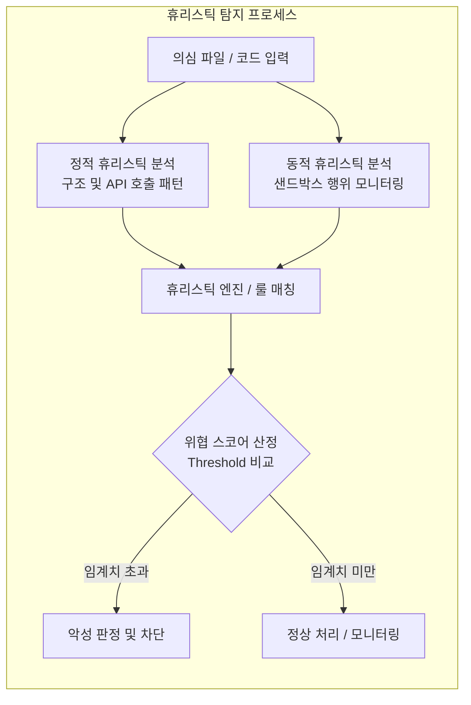

# 휴리스틱 탐지기법 (Heuristic Detection)

---

## I. 지능형 위협 선제 대응을 위한, 휴리스틱 탐지기법의 개요

* **정의**: 알려진 공격 패턴(시그니처)에만 의존하지 않고, 프로그램의 구조, 코드 패턴, 잠재적 명령어 및 실행 행위를 분석하여 미지의 신종·변종 악성코드를 확률 및 규칙 기반으로 탐지하는 보안 분석 기법
* **등장배경**: 시그니처 기반 탐지를 우회하는 [[다형성]](Polymorphic), 변종(Metamorphic) 악성코드 및 제로데이(Zero-Day) 공격이 급증함에 따라 사전 예방적 탐지 체계의 필요성 대두
* **특징**: 미지의 위협(Unknown Threat) 대응 가능, 정적 및 동적 분석 병행 수행, 가중치 기반 스코어링을 통한 위협 판단, 오탐(False Positive) 발생 가능성 존재

---

## II. 휴리스틱 탐지기법의 개념도 및 핵심 기술 요소

### 가. 휴리스틱 탐지 프로세스 개념도

* 입력된 파일이나 코드에 대해 정적/동적 분석을 수행하고, 정의된 위협 룰과 행위 가중치를 종합하여 임계치를 초과할 경우 악성 위협으로 최종 판정함

### 나. 휴리스틱 탐지의 핵심 기술 요소

| 구분 | 요소기술(키워드) | 세부 설명 |
| --- | --- | --- |
| 분석 방식 | **정적 휴리스틱 (Static)** | 파일을 실행하지 않고 구조, 임포트 함수, 의심스러운 명령어 패턴을 분석 |
| 분석 방식 | **동적 휴리스틱 (Dynamic)** | 격리된 가상 환경(Sandbox)에서 코드를 직접 실행하며 시스템 콜, 레지스트리 변조 등 행위 모니터링 |
| 핵심 도구 | **에뮬레이션 (Emulation)** | 가상 [[CPU]] 환경을 제공하여 압축/난독화된 코드를 복호화하고 내부 루틴을 분석 |
| 평가 방식 | **스코어링 시스템 (Scoring)** | 발견된 의심 행위별로 가중치를 부여하고, 누적 점수가 기준치를 넘으면 위협으로 판단 |
| 룰 정의 | **위협 룰 엔진 (YARA 등)** | 악성코드 고유의 문자열 패턴이나 바이트 시퀀스를 정의한 룰셋을 활용해 매칭 |
| 안정성 | **오탐 관리 (False Positive)** | 과도한 탐지로 인한 업무 마비를 방지하기 위해 화이트리스트 및 예외 처리 로직 적용 |

---

## III. 시그니처 기반 탐지와 휴리스틱 탐지 비교 및 최신 동향

### 가. 시그니처 기반 탐지와 휴리스틱 탐지 비교

| 비교 항목 | 시그니처 기반 탐지 (Signature-based) | 휴리스틱 탐지 (Heuristic-based) |
| --- | --- | --- |
| **탐지 대상** | 이미 알려진 고유 패턴(Hash, String)과 일치하는 위협 | 알려지지 않은 변종, 제로데이 및 의심 행위 |
| **탐지 속도** | 매우 빠름 (단순 문자열/해시 비교) | 상대적 느림 (패턴 분석 및 [[샌드박스]] 구동 필요) |
| **오탐률** | 매우 낮음 (명확한 일치 여부 판정) | 상대적으로 높음 (유사성에 따른 오탐 가능성) |
| **핵심 한계** | 시그니처가 등록되지 않은 신종 공격 무력화 | 과도한 탐지(False Positive) 및 우회 기법 존재 |

### 나. 휴리스틱 탐지의 최신 트렌드 및 실무 활용 전략

* **AI 및 머신러닝 기반 휴리스틱 고도화**: 전통적 룰 기반 휴리스틱을 넘어, [[딥러닝]] 모델을 통해 파일의 바이트 분포나 비정상적 행동 패턴을 학습하여 탐지 정확도 극대화
* **[[EDR(Endpoint Detection and Response)|EDR]] 및 [[XDR]] 연동 통합 보안 체계**: 엔드포인트 단독의 휴리스틱 탐지 한계를 극복하기 위해, 클라우드 기반 샌드박스 및 XDR(Extended Detection and Response) 플랫폼과 연계하여 전사적 위협 가시성 확보

---

### 🔗 연관 토픽

- **소속 도메인**: [[00_보안_MOC|🛡️ 보안]]
- **세부 분류**: `3. 네트워크 & 엔드포인트 · 인프라 보안`
- **핵심 연관 토픽**:
  - [[샌드박스|샌드박스 (Sandbox)]]
  - [[EDR(Endpoint Detection and Response)]]
  - [[XDR|XDR(eXtended Detection Response)]]
  - [[행위기반 탐지기법|행위기반 탐지기법 (Behavior-based Detection)]]
  - [[CPU]]
