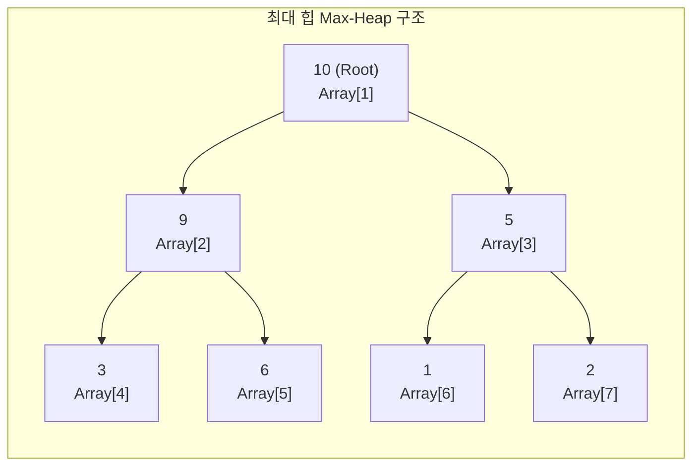

# 힙 (Heap)

---

## I. 우선순위 큐 구현을 위한 최적의 자료구조, 힙(Heap)의 개요

* **정의**: 완전 이진 트리(Complete Binary Tree)를 기반으로 하며, 부모 노드와 자식 노드 간의 대소 관계(최대 힙 또는 최소 힙)를 항상 만족하여 최댓값 또는 최솟값을 $O(1)$에 조회할 수 있는 자료구조
* **등장배경**: 일반 배열이나 연결리스트에서 최댓값/최솟값 탐색 시 소요되는 선형 시간($O(N)$)의 비효율성을 극복하고, 삽입 및 삭제 연산에서 $O(log N)$의 고속 연산을 보장하는 우선순위 큐(Priority [[Queue]]) 구현 필요성 대두
* **특징**: 느슨한 정렬 상태 유지(Partial Ordering), 배열을 이용한 효율적인 메모리 저장 구조($2i, 2i+1$), 힙 정렬 및 그래프 최단 경로(다익스트라) 알고리즘의 핵심 기반

---

## II. 힙의 개념도 및 핵심 기술 요소

### 가. 힙의 구조 및 동작 원리 (최대 힙 예시)

* 부모 노드의 값이 자식 노드의 값보다 항상 크거나 같은(Max-Heap) 조건을 만족하며, 새로운 데이터 삽입 시 마지막 위치에 추가 후 부모와 비교하여 교환하는 'Up-heap(Percolate Up)' 연산 수행

### 나. 힙의 핵심 구성 요소 및 연산

| 구분 | 요소기술(키워드) | 세부 설명 |
| --- | --- | --- |
| 힙 종류 | **최대 힙 (Max Heap)** | 부모 노드의 값이 자식 노드의 값보다 크거나 같은 트리 구조 (최댓값 추출에 최적화) |
| 힙 종류 | **최소 힙 (Min Heap)** | 부모 노드의 값이 자식 노드의 값보다 작거나 같은 트리 구조 (최솟값 추출에 최적화) |
| 구현 방식 | **배열 기반 구현** | 포인터 연산 없이 인덱스 기반으로 구현 ($Left = 2i$, $Right = 2i+1$, $Parent = \lfloor i/2 \rfloor$) |
| 주요 연산 | **삽입 (Insert / Push)** | 트리의 가장 마지막 자리에 노드를 추가한 뒤, 조건에 맞을 때까지 위로 올리는 연산 ($O(log N)$) |
| 주요 연산 | **삭제 (Delete / Pop)** | 루트 노드를 추출한 뒤, 마지막 노드를 루트로 이동하고 아래로 내리며 정렬하는 연산 ($O(log N)$) |
| 응용 [[알고리즘]] | **우선순위 큐 (Priority Queue)** | 들어온 순서와 상관없이 우선순위가 높은 데이터를 먼저 꺼내기 위해 힙을 내부 구현체로 활용 |
| 응용 알고리즘 | **힙 정렬 (Heap Sort)** | 최대 힙에서 요소를 하나씩 꺼내어 배열 뒤부터 채워나가는 방식의 정렬 알고리즘 ($O(N log N)$) |
| 응용 알고리즘 | **다익스트라 ([[다익스트라 알고리즘|Dijkstra]])** | 최단 거리 노드를 빠르게 탐색하기 위해 최소 힙을 적용하여 연산 시간 단축 |

---

## III. 힙과 이진 탐색 트리(BST) 비교 및 활용 동향

### 가. 힙(Heap)과 이진 탐색 트리(BST) 비교

| 비교 항목 | 힙 (Heap) | [[이진 탐색 트리]] (Binary Search Tree, BST) |
| --- | --- | --- |
| **정렬 조건** | 부모와 자식 간의 대소 관계만 성립 (좌우 대소 관계 없음) | 왼쪽 자식 < 부모 < 오른쪽 자식 (엄격한 정렬) |
| **중복 허용** | 중복 값 허용 | 중복 값 허용하지 않음 |
| **주요 목적** | 최댓값/최솟값의 신속한 추출 (우선순위 큐) | 효율적인 탐색, 삽입, 삭제 전체 정렬 관리 |
| **시간 복잡도** | 최대/최솟값 조회: $O(1)$, 삽입/삭제: $O(log N)$ | 평균 탐색/삽입/삭제: $O(log N)$ (최악 $O(N)$) |

### 나. 힙의 활용 동향 및 시사점

* 시스템 메모리 힙(Heap Memory)과의 명확한 구분 필요: 자료구조 힙은 트리 형태의 우선순위 제어 공간을 의미하며, OS 메모리 힙은 동적 메모리 할당 영역(Malloc/Free)을 지칭
* **대규모 실시간 데이터 처리**: 대규모 트래픽 제어, 실시간 순위 산정, AI/빅데이터 스트리밍 환경에서 고성능 우선순위 큐 처리를 위한 핵심 기반 기술로 지속 활용 중

---

### 🔗 연관 토픽

- **소속 도메인**: [[00_컴퓨터구조_MOC|💻 컴퓨터구조]]
- **세부 분류**: `4. 기본 자료구조 (Data Structures)`
- **핵심 연관 토픽**:
  - [[다익스트라 알고리즘|다익스트라 (Dijkstra) 알고리즘]]
  - [[Queue]]
  - [[이진 탐색 트리|이진 탐색 트리(Binary Search Tree)]]
  - [[알고리즘]]
  - [[트리 순회|트리 순회 (Tree Traversal)]]
