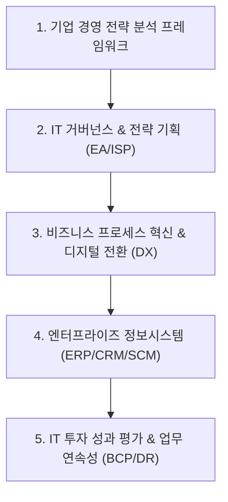

# 📈 경영전략 MOC (Map of Content)

> **상위 허브**: [[00_02_IT_Tech_MOC|🏠 IT & 테크 마스터 MOC]] | **소속 토픽 수**: **77개**  
> 경영 환경 분석 프레임워크, IT 거버넌스, 엔터프라이즈 아키텍처(EA), 비즈니스 혁신(BPR/DX), 기업 솔루션(ERP/CRM/SCM) 및 비즈니스 연속성(BCP)을 체계화한 전략 지도입니다.

---

## 🗺️ 지식 도메인 로드맵

---

## 📑 핵심 분류 체계 및 토픽 목록

### 1. 경영 환경 분석 & 전략 수립 프레임워크 (28)

> SWOT 분석, 3C/4C 분석, BCG Matrix, Ansoff Matrix, 5 Forces, 가치사슬(Value Chain), 백캐스팅(Backcasting)

- [[3C 4C 분석|3C  4C 분석]]
- [[가치사슬|가치사슬(Value Chain)]]
- [[가트너 2025 전략 기술|가트너 2025 전략 기술 (Gartner Top 10 Strategic Technology Trends for 2025)]]
- [[고객여정지도|고객여정지도 (Customer Journey Map)]]
- [[그로스 해킹|그로스 해킹(Growth hacking)]]
- [[기술 부채|기술 부채]]
- [[디지털 전환|디지털 전환(DX)]]
- [[디지털 카르텔|디지털 카르텔]]
- [[비즈니스 연속성 계획|비즈니스 연속성 계획]]
- [[서비타이제이션|서비타이제이션(Servitization)]]
- [[의도 경제|의도 경제(Intention Economy)]]
- [[환경분석|환경분석]]
- [[Ansoff Matrix|Ansoff Matrix]]
- [[Backcasting|Backcasting (백캐스팅)]]
- [[BCG Matrix|BCG Matrix]]
- [[CIO|CIO]]
- [[CPND|CPND]]
- [[CRM|CRM]]
- [[DRP(RTO, RPO 등)|DRP(RTO, RPO 등)]]
- [[ESG 경영|ESG 경영]]
- [[ISP (Information Strategy Plan)|ISP (Information Strategy Plan)]]
- [[IT 거버넌스|IT 거버넌스]]
- [[IT 투자성과 평가|IT 투자성과 평가]]
- [[IT-ROI 투자 성과평가 모델|IT-ROI 투자 성과평가 모델]]
- [[MECE와 LISS|MECE와 LISS]]
- [[PEST 분석|PEST 분석]]
- [[SCM (Supply Chain Management)|SCM (Supply Chain Management)]]
- [[SWOT분석|SWOT분석]]

### 2. IT 거버넌스 & 엔터프라이즈 아키텍처 (EA/ISP) (15)

> IT 거버넌스, ISP/ISMP, EA(엔터프라이즈 아키텍처), ITA, CIO/EAO의 역할, IT 기획 체계

- [[데이터 거버넌스|데이터 거버넌스 (Data Governance)]]
- [[전자정부 성과관리 지침|전자정부 성과관리 지침]]
- [[프롭테크|프롭테크 (PropTech)]]
- [[CALS|CALS]]
- [[EAI|EAI]]
- [[EAO|EAO]]
- [[ISMP|ISMP (Information System Master Plan)]]
- [[ISO 38500 2024|ISO 38500:2024]]
- [[ISP 및 ISMP 수립 공통가이드 9판(2025.05)|ISP 및 ISMP 수립 공통가이드 9판(2025.05)]]
- [[ITIL(IT Infrastructure Library) 4.0|ITIL(IT Infrastructure Library) 4.0]]
- [[ITSM(Information Technology Service Management)|ITSM(Information Technology Service Management)]]
- [[LISS (Linearly Independent Spanning Set)|LISS (Linearly Independent Spanning Set)]]
- [[MES|MES (Manufacturing Execution System)]]
- [[SI|SI]]
- [[TRL|TRL(Technology Readiness Level)]]

### 3. 비즈니스 프로세스 혁신 & 디지털 전환 (DX) (22)

> BPR(업무 프로세스 재설계), PI, 6시그마, 디지털 트랜스포메이션(DX), 비즈니스 모델 혁신, 데이터 준비도/성숙도

- [[공유경제|공유경제 (Sharing Economy)]]
- [[구독경제|구독경제 (Subscription Economy)]]
- [[기술 가치 평가|기술 가치 평가]]
- [[기술수용 주기|기술수용 주기(Technology Adoption Life Cycle)]]
- [[데이터 분석 준비도와 성숙도|데이터 분석 준비도와 성숙도]]
- [[디자인 씽킹|디자인 씽킹]]
- [[딥테크|딥테크 (Deep Tech)]]
- [[리빙랩, S.O.S랩|리빙랩(Living Lab), S.O.S랩]]
- [[서비스 수준 관리|서비스 수준 관리 (SLM Service Level Management)]]
- [[신경망분석|신경망분석]]
- [[프로토콜 경제|프로토콜 경제(Protocol Economy)]]
- [[핀테크|핀테크 (FinTech)]]
- [[BCM|BCM (Business Continuity Management)]]
- [[BCP|BCP (Business Continuity Planning)]]
- [[BIA (Business Impact Analysis)|BIA (Business Impact Analysis)]]
- [[BSC|BSC (Balanced Scorecard), IT-BSC (IT-Balanced Scorecard)]]
- [[데이터 마이닝|Data Mining (데이터 마이닝)]]
- [[DRaaS|DRaaS]]
- [[DRS (Disaster Recovery System)|DRS (Disaster Recovery System)]]
- [[EDI|EDI]]
- [[ISO 22301|ISO 22301]]
- [[IT Compliance|IT-Compliance]]

### 4. 기업 핵심 정보시스템 (ERP · CRM · SCM) (3)

> ERP, CRM(고객관계관리), SCM(공급망관리), EAI/ESB 연계, EDI, 지식관리시스템(KMS), CALS, SI 사업

- [[정보시스템 하드웨어 규모산정 지침|정보시스템 하드웨어 규모산정 지침]]
- [[KMS|KMS]]
- [[SOS랩 (Solution in Our Society Lab)|SOS랩 (Solution in Our Society Lab)]]

### 5. IT 투자 성과 평가 & 비즈니스 연속성 계획 (BCP) (9)

> BSC, IT ROI, SLA/SLM, 비즈니스 연속성 계획(BCP), BIA, 재해복구시스템(DRS/DRP, RTO, RPO, DRaaS)

- [[경제성 평가 기법|경제성 평가 기법]]
- [[다중지역 A-A DRS|다중지역 A-A DRS]]
- [[디지털 안전 3법|디지털 안전 3법]]
- [[시빅 해킹|시빅 해킹(Civic Hacking)]]
- [[엠비언트 커머스|엠비언트 커머스 (Ambient Commerce)]]
- [[지식재산권|지식재산권]]
- [[OKR|OKR]]
- [[PDCA(Plan-Do-Check-Act, Deming Cycle)|PDCA(Plan-Do-Check-Act, Deming Cycle)]]
- [[SLA|SLA (Service Level Agreement)]]

---

## 🧭 빠른 이동 및 관련 도메인
- [[00_02_IT_Tech_MOC|🏠 IT & 테크 마스터 MOC로 돌아가기]]
- [[content/index|🌐 Supreme Note 디지털 가든 홈]]
