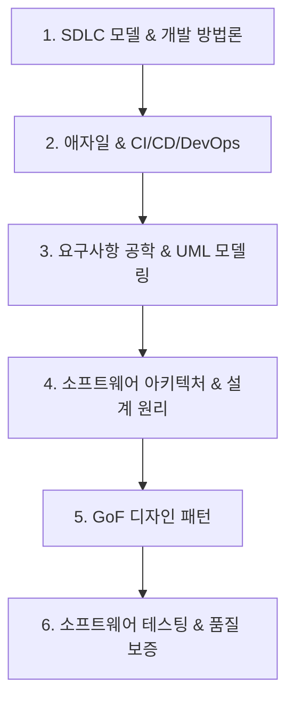

# 🏗️ 소프트웨어공학 MOC (Map of Content)

> **상위 허브**: [[00_02_IT_Tech_MOC|🏠 IT & 테크 마스터 MOC]] | **소속 토픽 수**: **183개**  
> 소프트웨어 생명주기(SDLC), 애자일/DevOps, 아키텍처 설계 원리, 마이크로서비스(MSA), 디자인 패턴, 테스팅 및 품질 관리를 망라한 엔지니어링 지도입니다.

---

## 🗺️ 지식 도메인 로드맵

---

## 📑 핵심 분류 체계 및 토픽 목록

### 1. 소프트웨어 개발 생명주기(SDLC) & 방법론 (24)

> 폭포수, 나선형, 프로토타이핑, 반복/증분형 모델, V-모델 및 소프트웨어 수명주기 표준

- [[단위 테스트|단위 테스트]]
- [[반복적 개발 모델|반복적 개발 모델 (Iteration Model)]]
- [[소프트웨어 개발 방법론|소프트웨어 개발 방법론]]
- [[소프트웨어 아키텍처|소프트웨어 아키텍쳐]]
- [[소프트웨어 안전 확보를 위한 지침|소프트웨어 안전 확보를 위한 지침]]
- [[유지보수|유지보수]]
- [[정적 분석 도구|정적 분석 도구]]
- [[증분형 개발 모델|증분형 개발 모델 (Incremental Model)]]
- [[지능정보기술 감리 실무 가이드|지능정보기술 감리 실무 가이드 (빅데이터 중심)]]
- [[진화형 개발 모델|진화형 개발 모델 (Evolutional Model)]]
- [[폭포수 모델|폭포수 모델]]
- [[프로토타이핑 모델|프로토타이핑 모델]]
- [[형상 관리|형상 관리]]
- [[형상 관리 도구|형상 관리 도구]]
- [[Agile|Agile]]
- [[CI, CD (Continuous Integration, Continuous Delivery)|CI, CD (Continuous Integration, Continuous Delivery)]]
- [[ISO 29119|ISO 29119]]
- [[ISO IEC IEEE 14764|ISO/IEC/IEEE 14764]]
- [[Lehman의 Software 변화의 원리|Lehman의 Software 변화의 원리]]
- [[RAD(락스)|RAD(락스)]]
- [[SDLC|SDLC]]
- [[SPICE|SPICE]]
- [[Spiral 모델|Spiral 모델]]
- [[Test Process|Test Process]]

### 2. 애자일(Agile) & 지속적 통합/배포(CI/CD) (25)

> Agile 선언/원칙, 스크럼(SCRUM), XP, TDD/BDD, 페어 프로그래밍, CI/CD 및 데브옵스 문화

- [[데메테르의 법칙|데메테르의 법칙 (Law of Demeter)]]
- [[DevOps|데브옵스 (DevOps)]]
- [[리그레션 테스트|리그레션(회귀, Regression) 테스트]]
- [[뮤테이션 테스트|뮤테이션 테스트 (Mutation Test)]]
- [[서킷브레이커|서킷브레이커]]
- [[소프트웨어 테스트|소프트웨어 테스트 (Software Test)]]
- [[요구 사항 분석|요구 사항 분석]]
- [[정보시스템 감리 점검 해설서|정보시스템 감리 점검 해설서 (Inspection Manual)]]
- [[탐색적 테스트|탐색적 테스트]]
- [[테스트 실행 도구|테스트 실행 도구]]
- [[테스트 오라클|테스트 오라클]]
- [[소프트웨어 테스트 원리|테스트 원리]]
- [[테스트 커버리지|테스트 커버리지 (Test Coverage)]]
- [[테스트 하네스|테스트 하네스]]
- [[테일러링|테일러링 (Tailoring)]]
- [[페르소나|페르소나 (Persona)]]
- [[CISC vs RISC|CISC vs RISC]]
- [[Clean Architecture|Clean Architecture]]
- [[FMEA (Failure Mode and Effects Analysis)|FMEA (Failure Mode and Effects Analysis)]]
- [[HAZOP (Hazard and Operability Study)|HAZOP (Hazard and Operability Study)]]
- [[SRE (Site Reliability Engineering)|SRE (Site Reliability Engineering)]]
- [[STPA|STPA (System-Theoretic Process Analysis)]]
- [[TDD|TDD (Test Driven Development)]]
- [[Test Coverage|Test Coverage]]
- [[Test Exit Criteria|Test Exit Criteria]]

### 3. 요구사항 공학 & UML 객체지향 분석/설계 (43)

> 요구사항 도출/분석/명세/검증, 유즈케이스 다이어그램, DFD, 시퀀스 다이어그램 등 UML 전반

- [[객체|객체]]
- [[객체지향|객체지향]]
- [[객체지향 프로그래밍 특징|객체지향 프로그래밍 특징]]
- [[경험기반 테스트|경험기반 기법]]
- [[나씨-슈나이더만|나씨-슈나이더만]]
- [[데이터 흐름도|데이터 흐름도]]
- [[릴리즈 엔지니어링|릴리즈 엔지니어링]]
- [[변동성|변동성]]
- [[블랙박스 테스트|블랙박스 테스트]]
- [[빅데이터 감리|빅데이터 감리 (Big Data Audit)]]
- [[상태 머신 다이어그램|상태 머신 다이어그램 (State Machine Diagram)]]
- [[성능 테스트|성능 테스트]]
- [[소프트웨어 설계의 원리|소프트웨어 설계의 원리]]
- [[소프트웨어 품질 속성 시나리오|소프트웨어 품질 속성 시나리오]]
- [[소프트웨어 프로덕트 라인|소프트웨어 프로덕트 라인]]
- [[순차 다이어그램|순차 다이어그램 (Sequence Diagram)]]
- [[시스템 테스트|시스템 테스트]]
- [[신뢰성|신뢰성]]
- [[요구 공학|요구 공학 (Requirements Engineering)]]
- [[유즈케이스 다이어그램|유즈케이스 다이어그램]]
- [[유틸리티 트리|유틸리티 트리 (Utility Tree)]]
- [[인수 테스트|인수 테스트]]
- [[정보시스템 감리결과보고서|정보시스템 감리결과보고서]]
- [[정성적 위험 분석|정성적 위험 분석]]
- [[추상화|추상화 (Abstraction)]]
- [[클래스|클래스]]
- [[클래스 다이어그램|클래스 다이어그램 (Class Diagram)]]
- [[테스트 통제 도구|테스트 통제 도구]]
- [[ATAM|ATAM]]
- [[Function Point|Function Point]]
- [[Interaction overview diagram|Interaction overview diagram]]
- [[Product Line (Software Product Line)|Product Line (Software Product Line)]]
- [[SAAM|SAAM]]
- [[SP 인증|SP 인증]]
- [[SW 규모산정|SW 규모산정]]
- [[SW 아키텍처 평가|SW 아키텍처 평가 (Software Architecture Evaluation)]]
- [[SW Architecture 구축 절차|SW Architecture 구축 절차]]
- [[Test 일반|Test 일반]]
- [[UML|UML (정적, 동적 다이어그램)]]
- [[UML Diagram 전체|UML / Diagram 전체]]
- [[UML의 4+1 View Model|UML의 4+1 View Model]]
- [[UML의 관계|UML의 관계 (Relationship)]]
- [[Usecase diagram|Usecase diagram]]

### 4. 아키텍처 스타일 & 객체지향 설계 원리 (50)

> 모듈화(결합도, 응집도), SOLID, Clean Architecture, MSA, DDD, API Gateway, 서킷브레이커

- [[3R|3R]]
- [[객체지향 설계 원리|객체지향 설계 원리]]
- [[결합도|결합도]]
- [[공공기관 정보화사업 예비타당성|공공기관 정보화사업 예비타당성]]
- [[다형성|다형성 (Polymorphism)]]
- [[디자인 패턴|디자인 패턴 (Design Pattern)]]
- [[모듈화|모듈화 (Modularity)]]
- [[상속성|상속성 (Inheritance)]]
- [[서비스 매쉬|서비스 매쉬 (Service Mesh)]]
- [[성능 테스트 도구|성능 테스트 도구]]
- [[소프트웨어 리팩토링|소프트웨어 리팩토링]]
- [[소프트웨어 아키텍처 스타일|소프트웨어 아키텍처 스타일]]
- [[싱글턴 패턴|싱글턴 패턴 (Singleton pattern)]]
- [[어댑터 패턴|어댑터 패턴 (Adapter Pattern)]]
- [[응집도|응집도]]
- [[인스턴스|인스턴스]]
- [[재사용|재사용]]
- [[정보은닉|정보은닉 (Information Hiding)]]
- [[카오스 엔지니어링|카오스 엔지니어링 (Chaos Engineering)]]
- [[카오스 테스트|카오스 테스트 (Chaos Test)]]
- [[캡슐화|캡슐화 (encapsulation)]]
- [[컴퓨팅적 사고능력|컴퓨팅적 사고능력]]
- [[통합 테스트|통합 테스트]]
- [[프레임워크|프레임워크]]
- [[프로시저|프로시저]]
- [[AOP (Aspect Oriented Programming)|AOP (Aspect Oriented Programming)]]
- [[API Gateway|API Gateway]]
- [[ARID|ARID]]
- [[CBAM|CBAM(Cost Benefit Analysis Method)]]
- [[CMMI 3.0|CMMI 3.0]]
- [[DDD (Domain Driven Design)|DDD (Domain Driven Design)]]
- [[Design Pattern (23개 패턴)|Design Pattern (23개 패턴)]]
- [[EDA|EDA (Event-Driven Architecture)]]
- [[Factory Method (생성 위임)|Factory Method (생성 위임)]]
- [[ISO IEC IEEE 42010 2022|ISO/IEC/IEEE 42010:2022]]
- [[JSON|JSON]]
- [[Keyword Driven Testing|Keyword Driven Testing]]
- [[McCabe 회전 복잡도|McCabe 회전 복잡도]]
- [[MSA (Micro Service Architecture)|MSA (Micro Service Architecture)]]
- [[MVC 패턴 (Model-View-Controller Pattern)|MVC 패턴 (Model-View-Controller Pattern)]]
- [[MVI (Model-View-Intent) 패턴|MVI (Model-View-Intent) 패턴]]
- [[MVVM (Model, View, View Model)|MVVM (Model, View, View Model)]]
- [[Observer (상태 변화 통지)|Observer (상태 변화 통지)]]
- [[Proxy Pattern|Proxy (대리자, 최근 기출)]]
- [[Regression Test|Regression Test]]
- [[SAGA패턴|SAGA패턴]]
- [[Singleton (전역 인스턴스)|Singleton (전역 인스턴스)]]
- [[Strategy (알고리즘 교체)|Strategy (알고리즘 교체)]]
- [[SW Architecture 평가|SW Architecture 평가]]
- [[Timeout|Timeout]]

### 5. GoF 디자인 패턴 (Creational, Structural, Behavioral) (0)

> 싱글톤, 팩토리 메서드, 옵저버, 전략(Strategy), 프록시, 어댑터 등 재사용 가능한 객체 설계 패턴

- *(관련 토픽 준비 중)*

### 6. 소프트웨어 테스팅 & 품질 보증 (QA/QC) (41)

> 화이트/블랙박스, 단위/통합/시스템/인수 테스트, 테스트 자동화, CMMI, SPICE, ISO 29119, 리팩토링 및 3R

- [[감리 PMO 비교표|감리/PMO 비교표]]
- [[공공소프트웨어사업 과업심의 가이드|공공소프트웨어사업 과업심의 가이드]]
- [[공통감리 절차|공통감리 절차]]
- [[기능안전 표준|기능안전 표준 (Functional Safety Standards)]]
- [[난독화|난독화]]
- [[무중단 배포|무중단 배포]]
- [[사용성 평가|사용성 평가]]
- [[상용 소프트웨어 직접구매 제도|상용 소프트웨어 직접구매 제도]]
- [[상용 소프트웨어 품질성능 평가 시험|상용소프트웨어 품질성능 평가 시험]]
- [[소프트웨어사업 영향평가|소프트웨어사업 영향평가]]
- [[오픈소스 거버넌스|오픈소스 거버넌스]]
- [[오픈소스 SW 보안위협|오픈소스 SW 보안위협]]
- [[워터폴|워터폴]]
- [[위험 기반 테스트|위험 기반 테스트]]
- [[응답시간|응답시간]]
- [[정량적 위험 분석|정량적 위험 분석]]
- [[정보시스템 감리|정보시스템 감리]]
- [[정보시스템 감리 의무 대상과 관점별 점검 기준|정보시스템 감리 의무 대상과 관점별 점검 기준]]
- [[정보시스템 운영 성과관리|정보시스템 운영 성과관리]]
- [[정보시스템 운영 유지보수 감리|정보시스템 운영/유지보수 감리]]
- [[코드 커버리지|코드 커버리지(Code Coverage)]]
- [[튜링 테스트|튜링 테스트]]
- [[퍼징 테스트|퍼징 테스트 (Fuzzing Test)]]
- [[폐쇄형 라이선스|폐쇄형 라이선스 (Closed Source Software License)]]
- [[화이트박스 테스트|화이트박스 테스트]]
- [[AI 개발비 산정|AI 개발비 산정]]
- [[AJAX|AJAX]]
- [[Annotation|Annotation]]
- [[Back to Back 테스트|Back to Back 테스트]]
- [[CMMI|CMMI]]
- [[Debugging|Debugging]]
- [[ETA (Event Tree Analysis)|ETA (Event Tree Analysis)]]
- [[FTA (Fault Tree Analysis)|FTA (Fault Tree Analysis)]]
- [[GS 인증|GS 인증]]
- [[ISO 29119-11|ISO 29119-11]]
- [[ISO IEC 25010 2023|ISO/IEC 25010:2023]]
- [[SBOM|SBOM]]
- [[SW 사업대가 ('25년 개정판)|SW 사업대가 ('25년 개정판)]]
- [[SW 안전성(SW Safety) 및 분석 개념|SW 안전성(SW Safety) 및 분석 개념]]
- [[SW사업 대가산정 가이드|SW사업 대가산정 가이드]]
- [[XML|XML]]

---

## 🧭 빠른 이동 및 관련 도메인
- [[00_02_IT_Tech_MOC|🏠 IT & 테크 마스터 MOC로 돌아가기]]
- [[content/index|🌐 Supreme Note 디지털 가든 홈]]
