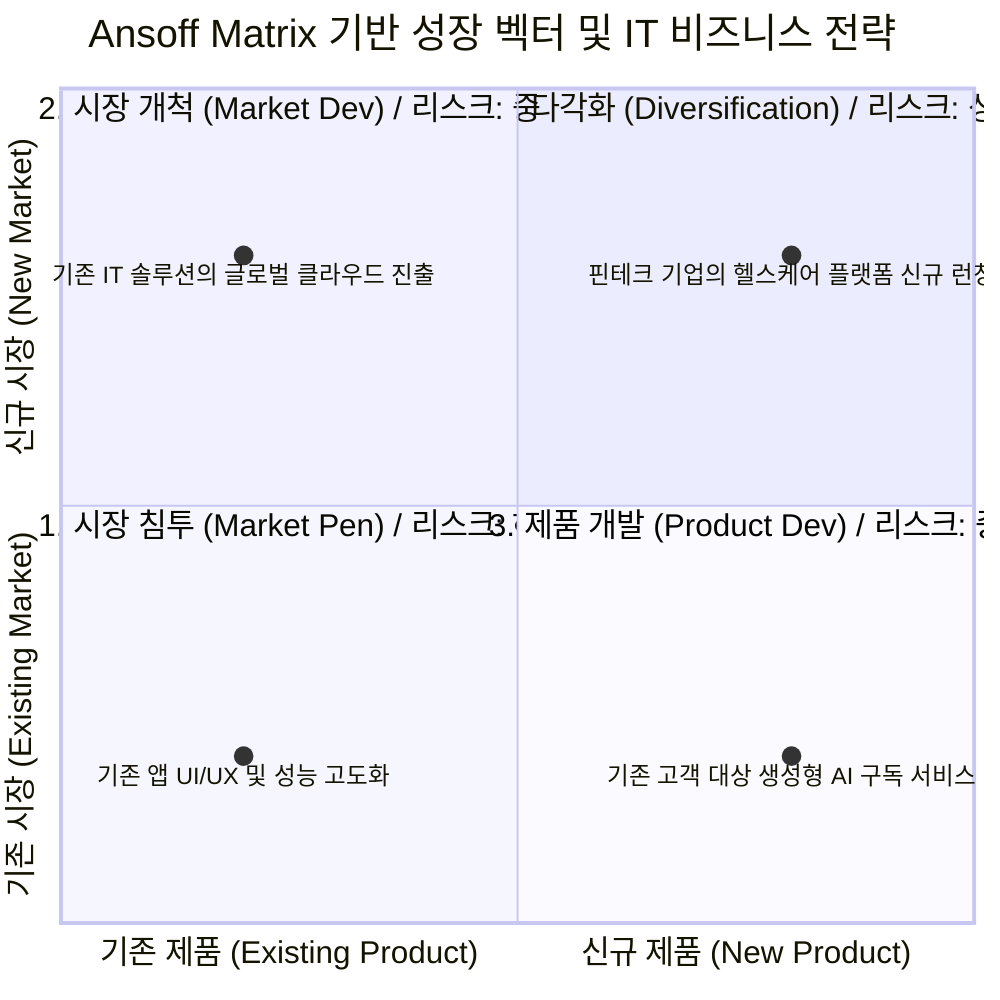

# Ansoff Matrix (앤소프 매트릭스)

---

## I. 기업의 지속 가능한 성장을 위한 포트폴리오 전략, Ansoff Matrix의 개요

* **정의**: 기업의 성장 전략을 수립하기 위해, 제품(Product)과 시장(Market)이라는 두 가지 축을 기준으로 기존과 신규 영역을 교차시켜 4가지 비즈니스 성장 방향성을 도출하는 전략 분석 [[프레임워크]]
* **등장배경 및 필요성**:
* 비즈니스 환경 변화에 대응하여, 한정된 자원을 바탕으로 기업이 나아가야 할 최적의 확장 경로 및 리스크(Risk) 평가 기준 필요
* [[ISP (Information Strategy Plan)|ISP]](정보화 전략 계획) 및 디지털 트랜스포메이션(DX) 기획 시, IT 신규 서비스 및 플랫폼 런칭 방향성을 논리적으로 정의하기 위해 활용

* **특징**: 제품과 시장의 관숙도(신규/기존)에 따라 리스크가 기하급수적으로 증가하며, 다각화(Diversification) 전략에서 가장 높은 위험도를 동반함

---

## II. Ansoff Matrix의 개념도 및 핵심 구성 요소

### 가. Ansoff Matrix의 개념도 및 성장 벡터

* 기업은 일반적으로 리스크가 가장 낮은 시장 침투(1상한)에서 시작하여, 기업의 자본과 IT 기술 역량을 바탕으로 제품 개발이나 시장 개척을 거쳐 최종적으로 다각화(4상한)로 진입함

### 나. Ansoff Matrix의 핵심 전략 및 구성 요소

| 구분 | 전략 요소 (키워드) | 세부 설명 (IT 비즈니스 관점) |
| --- | --- | --- |
| **전략 1** | 시장 침투 (Market Penetration) | **[기존 시장 + 기존 제품]** 점유율 확대 전략 (예: 마케팅 강화, 앱 리텐션 최적화, UI/UX 개선) |
| **전략 2** | 시장 개척 (Market Development) | **[신규 시장 + 기존 제품]** 새로운 고객층 확보 (예: 내수용 B2B 솔루션의 글로벌 수출 및 클라우드 SaaS화) |
| **전략 3** | 제품 개발 (Product Development) | **[기존 시장 + 신규 제품]** 기존 충성 고객에게 새로운 가치 제공 (예: 이커머스 고객 대상 페이(Pay) 서비스 및 AI 챗봇 런칭) |
| **전략 4** | 다각화 (Diversification) | **[신규 시장 + 신규 제품]** 완전히 새로운 영역 진출로 고수익/고위험 동반 (예: 수직적/수평적 M&A, 이종 산업 결합 플랫폼) |
| **분석 기준** | 리스크 평가 (Risk Assessment) | 기존 역량 [[재사용]] 여부에 따라 다각화 > 시장개척 ≒ 제품개발 > 시장침투 순으로 실패 위험도 산정 |
| **분석 기준** | 시너지 (Synergy) 확보 | 신규 사업 진출 시 기존 IT 인프라, 데이터, 고객 풀(Pool)을 공유하여 개발 효율성 및 교차 판매(Cross-selling) 극대화 |
| **활용 체계** | 갭 분석 (Gap Analysis) | 현재 매출 목표와 기존 비즈니스의 성장 한계 간의 차이(Gap)를 메우기 위해 어떤 매트릭스 전략을 채택할지 결정 |
| **IT 연계** | 포트폴리오 관리 (PPM) | 각 사분면 전략에 맞추어 IT 프로젝트 우선순위를 할당하고, ROI(투자대비효과) 기반의 예산 분배 수행 |

---

## III. Ansoff Matrix와 BCG Matrix의 비교 및 IT 융합 비즈니스 전망

### 가. 비즈니스 포트폴리오 전략 프레임워크 비교 (Ansoff vs BCG)

| 비교 항목 | Ansoff Matrix (앤소프 매트릭스) | [[BCG Matrix]] (보스턴 컨설팅 그룹 매트릭스) |
| --- | --- | --- |
| **분석 목적** | 기업의 **성장 방향성(방향 타겟팅)** 도출 | 기업의 **자원 배분 및 캐시플로우** 관리 |
| **평가 축 (X/Y)** | 제품 (기존/신규) / 시장 (기존/신규) | 시장 점유율 (고/저) / 시장 성장률 (고/저) |
| **결과물 (사분면)** | 시장침투, 시장개척, 제품개발, 다각화 | Star, Cash Cow, Question Mark, Dog |
| **전략적 포커스** | '어떻게 성장할 것인가?' (리스크 기반 판단) | '어디에 투자하고 철수할 것인가?' (수익성 기반 판단) |
| **활용 시기** | 신규 비즈니스 모델 기획, M&A 검토 시 | 기존 다수 사업부/프로젝트의 성과 평가 시 |

### 나. 플랫폼 및 디지털 경제에서의 활용 전망

* **경계의 붕괴(Big Blur) 현상 가속**: 최근 빅테크 및 플랫폼 기업(슈퍼앱)들은 방대한 데이터와 AI 기술을 바탕으로 '제품 개발'과 '시장 개척'의 경계를 허물며 공격적인 '다각화([[핀테크]], 모빌리티, 콘텐츠 동시 진출)'를 시도하고 있음
* **리스크 완화를 위한 애자일([[Agile]]) 접근**: 다각화 전략의 높은 실패 위험을 줄이기 위해, 전통적 빅뱅(Big-bang) 방식 대신 [[MVP]](최소 기능 제품) 런칭 후 피드백을 수용하는 린 스타트업([[린 방법론|Lean]] Startup) 및 [[클라우드 네이티브]] 기반의 유연한 아키텍처 도입이 필수적임

---

### 🔗 연관 토픽

- **소속 도메인**: [[00_경영전략_MOC|📈 경영전략]]
- **세부 분류**: `1. 경영 환경 분석 & 전략 수립 프레임워크`
- **핵심 연관 토픽**:
  - [[ISP (Information Strategy Plan)]]
  - [[BCG Matrix]]
  - [[린 방법론|린 (Lean) 방법론]]
  - [[IT 거버넌스]]
  - [[프레임워크]]
