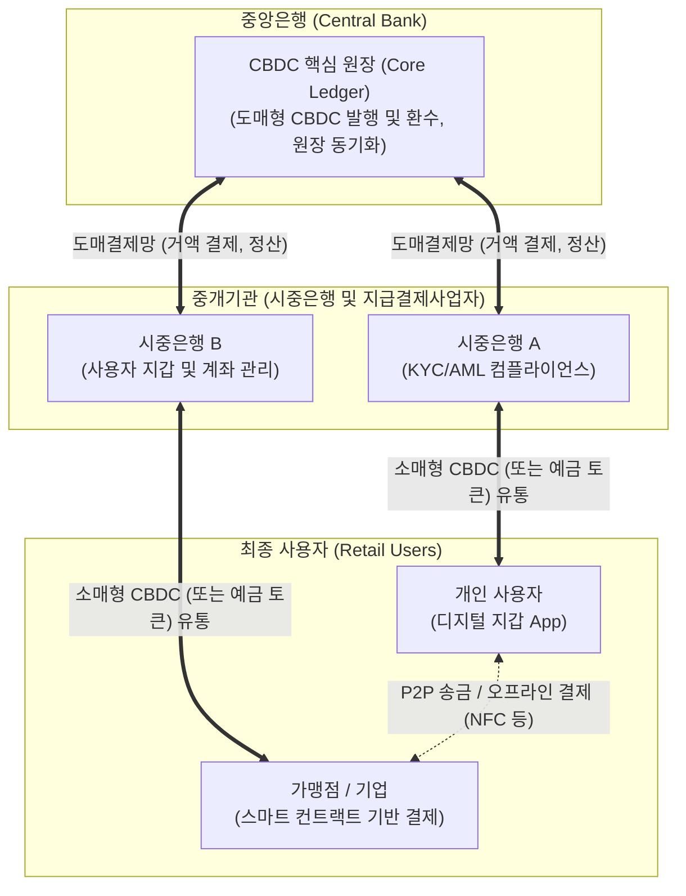

# CBDC (Central Bank Digital Currency)

---

## I. 법정 디지털 화폐, CBDC의 개요

* **정의**: 중앙은행이 전자적 형태로 발행하여 현금과 동일한 법화(Legal Tender)로서의 지위를 가지는 중앙은행 디지털 화폐
* **등장 배경**: 현금 이용 감소 및 비대면 경제 가속화, 민간 가상자산(암호화폐, 스테이블코인 등) 확산에 따른 통화주권 위협, 금융 포용성 제고
* **특징**: 가치 [[변동성]] 없음(명목화폐와 1:1 교환), 중앙은행의 직접 발행([[신뢰성]] 및 결제 완결성 보장), 프로그래머블 결제(스마트 컨트랙트) 지원

---

## II. CBDC의 아키텍처 및 핵심 구성요소

### 가. CBDC의 아키텍처 및 동작 원리 (혼합형 / Two-Tier 구조)

* 중앙은행이 도매형 CBDC를 중개기관에 발행하고, 중개기관(시중은행)이 대중에게 소매형 CBDC를 유통하는 **혼합형(Two-Tier) 아키텍처** 채택
* 중개기관이 고객 확인(KYC), 자금세탁방지(AML) 및 지갑 관리를 전담하여 중앙은행의 운영 부담 및 프라이버시 침해 위험 최소화

### 나. CBDC의 핵심 기술 요소

| 분류 | 핵심 기술 (키워드) | 세부 설명 |
| --- | --- | --- |
| **원장 관리** | 분산원장기술 (DLT) | [[블록체인]] 기반으로 중앙은행-시중은행 간 투명한 거래 기록 및 [[무결성]] 보장 |
| **원장 관리** | 중앙집중형 원장 (DB) | 대규모 소매 거래의 초당 처리 속도(TPS) 극대화를 위한 기존 DB 아키텍처 혼용 |
| **거래 처리** | 스마트 컨트랙트 | 특정 조건 달성 시 자금이 이체되는 프로그래머블(Programmable) 결제 구현 |
| **프라이버시** | 영지식 증명 ([[영지식증명|ZKP]]) | 거래 당사자의 정보(잔액, 신원)를 노출하지 않고 거래의 유효성만 검증 기술 |
| **인터페이스** | 디지털 지갑 (Wallet) | 사용자 인증, 키 관리(PKI 기반), 온/오프라인 송금 인터페이스 제공 |
| **오프라인결제** | [[NFC]] / BLE 단말 통신 | 재난, 통신 단절 상황에서도 근거리 무선 통신을 통한 P2P 가치 이전 기술 |
| **컴플라이언스** | KYC / AML 연동 API | 불법 자금 추적 및 거래 한도 제어를 위한 기존 금융망 신원 인증 체계 통합 |
| **상호운용성** | 크로스보더 [[프로토콜]] | mBridge 등 이기종 국가 CBDC 플랫폼 간 직접 환전 및 실시간 국경 간 송금망 |

---

## III. CBDC와 주요 가상자산 비교 및 국내외 추진 동향

### 가. CBDC와 민간 가상자산 비교

| 비교 항목 | CBDC (중앙은행 디지털 화폐) | 암호화폐 (Cryptocurrency) | 스테이블코인 (Stablecoin) |
| --- | --- | --- | --- |
| **발행 주체** | **중앙은행** (국가) | 민간 (탈중앙화 [[알고리즘]]) | 민간 (테더, 서클 등 특정 기업) |
| **법적 지위** | **법화 (Legal Tender)** | 없음 (가상자산으로 분류) | 없음 (가상자산 또는 전자지급수단) |
| **가치 변동성** | **없음** (명목 화폐와 1:1 고정) | 매우 높음 (수요/공급에 따라 급변) | 낮음 (달러 등 법화 자산에 페깅) |
| **목적/활용** | 지급 결제, 송금, 통화 정책 | 투자, 투기, 디파이(DeFi) | 암호화폐 거래 기축통화, 가치 저장 |

### 나. 최근 추진 동향 및 전망

* **한국 (한국은행)**: 도매형 CBDC 인프라 위에서 시중은행의 '예금 토큰(Tokenized Deposit)'을 발행하여 일반인/기업 대상 바우처 및 결제 실증 테스트 집중 추진 중 (2024~2025)
* **글로벌 동향**:
* **유럽/중국**: 디지털 유로화 준비 및 e-CNY(디지털 위안화)를 통한 오프라인/스마트 결제 선도
* **미국**: 사생활 침해 및 정부 통제 우려로 연방 차원의 CBDC 프로젝트 중단 행정명령 서명 (2025.01)

* **향후 전망**: 뱅크런(Digital Bank Run) 우려 해소를 위한 이자 미지급 설계 및 보유 한도 설정, CBDC망 시스템 장애에 대비한 사이버 복원력(Resilience) 확보 방안이 핵심 과제로 대두됨

---

### 🔗 연관 토픽

- **소속 도메인**: [[00_디지털서비스_MOC|🚀 디지털서비스]]
- **세부 분류**: `2. 블록체인 & 분산원장 · Web3`
- **핵심 연관 토픽**:
  - [[영지식증명|영지식증명(Zero Knowledge Proof)]]
  - [[블록체인|블록체인 (Block Chain)]]
  - [[무결성]]
  - [[핀테크|핀테크 (FinTech)]]
  - [[NFT (Non Fungible Token)]]
