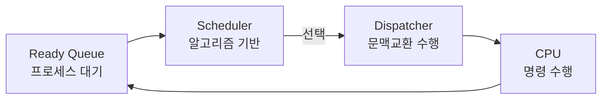

# CPU Scheduling

---
## I. 시스템 생산성 및 공정성 최적화, CPU스케줄링 개요

| 구분 | 내용 |
| :--- | :--- |
| **정의** | 다중프로그래밍 OS에서 준비큐에 대기중인 [[프로세스]]에게 CPU자원 할당하는 커널 메커니즘 |
| **평가 지표** | - 반환시간, - 대기시간 - 처리량, - [[응답시간]] |

---
## II. CPU 스케줄링의 아키텍처 및 핵심알고리즘

### 가. CPU 스케줄링의 동작 원리 및 아키텍처

- 스케줄러가 정책에 따라 선점할 프로세스 선택, 디스패처가 이전 프로세스의 문맥을 저장하고 선택된 프로세스에 CPU 제어권을 넘겨 실행.

### 나. CPU 스케줄링 핵심 알고리즘 및 기술요소

| 분류       | 기술                | 설명             |
| :------- | :---------------- | :------------- |
| **비선점형** | - [[FCFS]]        | - 먼저 도착한 순서    |
|          | - [[SJF]]         | - 짧은시간 먼저      |
|          | - [[HRN]]         | - SJF의 기아현상 보완 |
| **선점형**  | - [[Round Robin]] | - 동일 할당시간      |
|          | - [[SRT]]         | - SJF 선점형 버전   |
|          | - [[MLQ]]         | - 우선순위 독립 큐 유지 |
|          | - [[MLFQ]]        | - CPU사용특성에 따라  |
| **기아관리** | - Aging           | - 오래대기한 것에 부여  |

---
## III. 스케줄링 방식 비교 및 최신 기술동향

### 가. 선점형 vs 비선점형 비교

| 항목 | 선점형 | 비선점형 |
| :--- | :--- | :--- |
| **자원 회수** | CPU 점유권을 회수 가능 | 프로세스 반납 전까지 불가능 |
| **응답성** | 높음 | 낮음 |
| **오버헤드** | 문맥교환이 빈번함 | 오버헤드 낮음 |

### 나. 최신 스케줄링 기술동향

- 이기종 컴퓨팅 스케줄링, Cloud-Native 및 AI 기반 스케줄링, 에너지 인지 스케줄링

