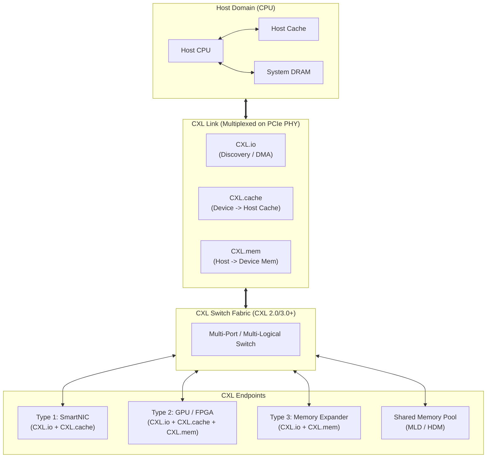

# CXL (Compute Express Link)

## I. 차세대 메모리 공유 인터커넥트 표준, CXL의 개요

- **정의**: PCIe 물리 계층을 기반으로 CPU, GPU, 가속기, 메모리 확장 장치 간 캐시 일관성(Cache Coherency)을 유지하며 초저지연·초고대역폭 데이터 통신을 지원하는 개방형 인터커넥트 표준
    
      
    
- **필요성 및 배경**:
    
      
    - **메모리 벽(Memory Wall) 극복**: CPU 소켓당 물리적 DDR DIMM 슬롯 확장 한계 해결 및 대역폭 병목 해소
        
          
        
    - **메모리 파편화(Stranded Memory) 제거**: 동적 풀링(Pooling)을 통한 데이터센터 메모리 자원 낭비 최소화
        
          
        
    - **초거대 AI 워크로드 지원**: LLM 모델 파라미터 및 KV 캐시 급증에 따른 TB 단위 메모리 스케일아웃 지원
        
          
        

## II. CXL의 아키텍처 및 핵심 기술 요소

### 가. CXL의 아키텍처 및 동작 원리

- 단일 물리 링크(PCIe PHY) 위에 **CXL.io, CXL.cache, CXL.mem** 3대 서브프로토콜을 동적 다중화(ARB/MUX)하여 전송
    
      
    
- 스위칭 패브릭을 통해 여러 호스트와 가속기가 Type 3 장치의 메모리를 동적으로 풀링(Pooling) 및 공유(Sharing)하는 구조
    
      
    

### 나. CXL의 핵심 기술 및 구성 요소

|**구분**|**핵심 기술/요소**|**세부 설명**|
|---|---|---|
|**프로토콜**|**CXL.io**|필수 프로토콜, 장치 열거(Enumeration), 초기화, DMA 및 비일관성 레지스터 I/O 처리|
|**프로토콜**|**CXL.cache**|가속기가 호스트 CPU의 시스템 메모리를 저지연 캐시 일관성으로 직접 참조·캐싱|
|**프로토콜**|**CXL.mem**|호스트 CPU가 디바이스 부착 메모리(HDM)를 로컬 메모리처럼 바이트 단위 Load/Store 접근|
|**장치 유형**|**Type 1 Device**|자체 로컬 메모리 없이 호스트 메모리 캐싱 위주로 동작하는 가속기 (SmartNIC, PGAS NIC)|
|**장치 유형**|**Type 2 Device**|자체 고속 메모리(HBM/GDDR)를 보유하고 호스트-디바이스 간 양방향 캐시 일관성 유지 (GPU, FPGA)|
|**장치 유형**|**Type 3 Device**|호스트에 추가 메모리 용량을 확장·제공하는 메모리 버퍼 장치 (CXL DRAM Expander, MLD)|
|**토폴로지**|**MLD & Fabric**|Multi-Logical Device 기반 메모리 풀링 및 다단계 스위칭(Multi-level Switch, Mesh/Leaf-Spine) 지원|
|**일관성 제어**|**Back Invalidation (BI)**|CXL 3.0+ 하드웨어 기반 캐시 무효화 기술로 복수 호스트 간 진정한 메모리 공유(Sharing) 구현|
|**주소 매핑**|**HDM Decoder**|Host Physical Address(HPA)를 Device Physical Address(DPA)로 고속 변환|
|**OS/계층화**|**Memory Tiering**|HMAT/CDAT 기반 커널 자동 계층화, Hot Data(DDR) / Cold Data(CXL) 자동 Promotion/Demotion|

## III. CXL vs PCIe 비교 및 발전 전망

### 가. CXL과 레거시 PCIe 인터페이스 비교

|**비교 항목**|**CXL (Compute Express Link)**|**PCIe (PCI Express)**|
|---|---|---|
|**접근 방식**|**바이트(Byte) 단위 직접 Load/Store 접근**|**블록(Block) 단위 패킷 DMA 전송**|
|**캐시 일관성**|**하드웨어 레벨 양방향 캐시 일관성 보장**|지원 불가 (소프트웨어 드라이버 오버헤드 발생)|
|**지연 시간 (Latency)**|**수십~백여 ns 수준 (DRAM 근접)**|마이크로초(µs) 수준 (드라이버/커널 트랩 개입)|
|**메모리 활용**|**메모리 풀링 및 다중 호스트 공유(Sharing)**|단일 호스트 종속 할당 (호스트 간 공유 불가)|

### 나. 향후 발전 전망 및 시사점

- **컴포저블 인프라(CDI)의 핵심 축**: 서버 단위 고정 하드웨어 아키텍처에서 컴퓨팅(CPU/GPU)과 메모리를 독립 확장·할당하는 **Disaggregated Datacenter**로의 진화 주도
    
      
    
- **칩렛(Chiplet) 및 표준화 확장**: UCIe(Universal Chiplet Interconnect Express)와 CXL의 결합을 통해 패키지 내부 및 랙 스케일(Rack-scale) 전반의 통일된 캐시 일관성 생태계 완성