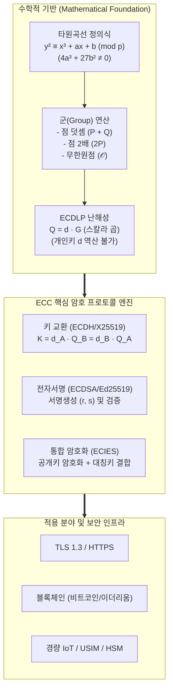

# ECC(Elliptic Curve Cryptography)

## I. 이산대수 기반 경량·고강도 공개키 암호, ECC의 개요

- **정의**: 유한체(Finite Field) 상의 타원곡선 이산대수 문제(ECDLP, Elliptic Curve Discrete Logarithm Problem)의 계산적 난해성에 기반하여, 적은 비트 수로 초고강도 보안성을 제공하는 비대칭키(공개키) 암호화 알고리즘
    
      
    
- **등장배경 및 특징**:
    
      
    - **RSA 키 길이 한계 극복**: 소인수분해 난이도 하락에 따른 RSA 키 길이 증가(3072-bit 이상)로 인한 연산 부하 및 메모리 병목 해소
        
          
        
    - **초경량·초고속 처리**: 256-bit 키 길이로 RSA 3072-bit 수준의 동일 보안 강도 제공, 전력·연산 제약 환경(IoT, 모바일) 최적화
        
          
        
    - **핵심 연산 원리**: 점 덧셈(Point Addition) 및 점 2배 산출(Point Doubling)의 반복을 통한 스칼라 곱셈($Q = d \cdot G$) 기반 일방향 함수 구조
        
          
        

## II. ECC의 아키텍처 및 핵심 기술 요소

### 가. ECC의 메커니즘 및 암호화 아키텍처

- 타원곡선의 기준점($G$)에 개인키($d$)를 스칼라 배 곱하여 공개키($Q$)를 생성하며, $Q$와 $G$가 공개되어도 역연산($d$)이 계산적으로 불가능(ECDLP)한 특성을 활용하여 키 교환·전자서명·하이브리드 암호화 수행
    
      
    

### 나. ECC의 핵심 기술 및 구성 요소

|**구분**|**핵심 기술/요소**|**세부 설명**|
|---|---|---|
|**수학적 기반**|**Weierstrass 방정식**|$y^2 = x^3 + ax + b \pmod p$, 비특이 곡선 조건($4a^3 + 27b^2 \neq 0$) 만족|
|**수학적 기반**|**ECDLP**|$Q = d \cdot G$에서 점 $G, Q$를 알 때 스칼라 값 $d$(개인키)를 구하는 이산대수 역산의 난해성|
|**기본 연산**|**Point Addition / Doubling**|기하학적 접선 및 교점 계산을 유한체 모듈러 연산으로 치환하여 군(Abelian Group) 형성|
|**기본 연산**|**Scalar Multiplication**|Double-and-Add, Montgomery Ladder 기법을 적용한 $k \cdot P$ 연산 가속화 및 부채널 공격 방어|
|**암호 프로토콜**|**ECDH / X25519**|Diffie-Hellman 원리를 타원곡선에 적용한 고속 세션키 교환 프로토콜 (TLS 1.3 표준)|
|**암호 프로토콜**|**ECDSA / EdDSA**|타원곡선 기반 전자서명 알고리즘 (Ed25519: 슈노르 서명 결합, 부채널 내성 및 고속 검증)|
|**표준 곡선**|**NIST Curves & secp256k1**|NIST P-256(범용), secp256k1(Koblitz 곡선 기반 블록체인 서명), Curve25519(고속/안전 곡선)|
|**하이브리드 암호**|**ECIES**|타원곡선 기반 공개키 암호와 대칭키(AES) 및 메시지 인증코드(MAC)를 결합한 암·복호화 기법|

## III. ECC vs RSA 비교 및 향후 전망

### 가. ECC와 RSA 암호 기술 비교

|**비교 항목**|**ECC (Elliptic Curve Cryptography)**|**RSA (Rivest-Shamir-Adleman)**|
|---|---|---|
|**수학적 난제**|**타원곡선 이산대수 문제 (ECDLP)**|**큰 수의 소인수분해 문제 (IFP)**|
|**키 길이 (128-bit 보안 기준)**|**256 bit** (매우 짧음)|**3072 bit** (상대적으로 매우 긺)|
|**연산 및 처리 속도**|키 생성 및 서명 속도 **매우 빠름**, 저전력 소모|서명 검증은 빠르나, 키 생성 및 서명 연산 무거움|
|**자원 점유율**|메모리, 대역폭, 저장공간 점유 최소화|대용량 인증서 크기 및 네트워크 대역폭 소모 큼|
|**주요 적용 분야**|**TLS 1.3, 블록체인, 모바일 결제, 경량 IoT 기기**|레거시 PKI, 전자서명 인증서, 웹 보안 인프라|

### 나. 향후 전망 및 PQC 전환 대응 방향

- **양자 컴퓨팅 위협(Shor 알고리즘)**: 양자 컴퓨터 등장 시 쇼어(Shor) 알고리즘에 의해 다항 시간($O(n^3)$) 내 ECDLP가 완전 해독되는 근본적 보안 취약점 노출
    
      
    
- **하이브리드 PQC(Post-Quantum Cryptography) 마이그레이션**: 과도기적 안정성 확보를 위해 격자 기반 PQC(ML-KEM/Kyber, ML-DSA/Dilithium)와 고속 ECC(X25519/Ed25519)를 이중 결합하는 하이브리드 암호화 표준(Composite Crypto)으로 진화 중