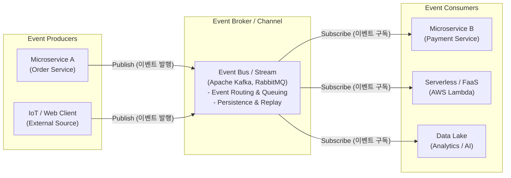

# EDA (Event-Driven Architecture)

## I. 느슨한 결합 기반의 비동기 분산 아키텍처, EDA의 개요

- **정의**: 시스템 내 상태 변화(Event)를 감지하여 비동기적으로 메시지를 발행(Publish)하고, 이를 구독(Subscribe)하는 서비스가 반응하여 비즈니스 로직을 처리하는 소프트웨어 아키텍처
    
      
    
- MSA(Microservices Architecture) 및 클라우드 네이티브 환경에서 서비스 간 의존성을 최소화하고 유연성을 확보하기 위한 핵심 패턴
    
      
    
- **특징**: 서비스 간 느슨한 결합(Loose Coupling), 비동기 통신(Asynchronous), 높은 확장성(Scalability) 및 탄력성, 실시간 스트리밍 데이터 처리 용이
    
      
    

## II. EDA의 개념도 및 핵심 기술 요소

### 가. EDA의 개념도 및 동작 원리

- 이벤트 생성자(Producer)가 이벤트를 발생시키면, 브로커(Broker)가 이를 적절한 큐/토픽에 라우팅 및 보관하고 구독자(Consumer)가 비동기적으로 가져가(Pull/Push) 처리하는 구조
    
      
    

### 나. EDA의 핵심 기술 요소

|**구분**|**핵심 기술(키워드)**|**세부 설명**|
|---|---|---|
|**구성 요소**|Event Producer|상태 변화를 감지하여 이벤트를 생성 및 브로커로 발행하는 주체|
|**구성 요소**|Event Broker|발행된 이벤트를 수신, 버퍼링, 라우팅하여 구독자에게 전달 (Kafka 등)|
|**구성 요소**|Event Consumer|브로커로부터 이벤트를 구독하여 실제 비즈니스 로직을 수행하는 서비스|
|**설계 패턴**|Event Sourcing|데이터의 현재 상태가 아닌, 상태 변경을 일으킨 모든 이벤트의 이력을 순차적으로 저장|
|**설계 패턴**|CQRS|시스템의 상태를 변경하는 명령(Command)과 조회(Query)의 책임을 분리하는 패턴|
|**설계 패턴**|Choreography Saga|중앙 통제(Orchestrator) 없이 이벤트를 교환하며 분산 트랜잭션을 관리하는 기법|
|**표준화**|CloudEvents|클라우드 환경에서 플랫폼 간 호환성을 위해 CNCF가 제정한 이벤트 데이터 메타데이터 표준|
|**데이터 처리**|Stream Processing|끊임없이 생성되는 이벤트 스트림 데이터를 실시간으로 수집, 분석, 처리 (Flink, Spark)|

## III. EDA와 기존 아키텍처(Request-Driven) 비교 및 향후 전망

### 가. EDA vs Request-Driven Architecture(RDA) 비교

|**비교 항목**|**Request-Driven (API 기반)**|**Event-Driven (EDA 기반)**|
|---|---|---|
|**통신 패러다임**|동기식(Synchronous) P2P 호출|비동기식(Asynchronous) Pub/Sub|
|**결합도(Coupling)**|강결합 (서비스 간 물리적/논리적 의존성 높음)|느슨한 결합 (브로커를 통한 논리적 분리)|
|**장애 격리성**|타 서비스 장애 시 연쇄 장애(Cascading Failure) 발생 위험|큐잉/버퍼링을 통해 장애 격리(Isolation) 우수|
|**트래픽 대응**|트래픽 폭증 시 병목 현상 발생 (스케일 아웃 복잡)|브로커에서 트래픽 완충(Buffering), 독립적 확장 용이|
|**데이터 일관성**|2PC 등 강한 일관성(Strong Consistency) 확보 유리|결과적 일관성(Eventual Consistency) 모델 수용 필요|

### 나. 향후 전망 및 동향

- **Serverless 결합 가속화**: AWS EventBridge, Azure Event Grid 등 클라우드 네이티브 서버리스 서비스와 결합하여 인프라 관리 없는 완전 관리형 EDA 구축 증가
    
      
    
- **데이터 메시(Data Mesh)와의 융합**: 분산된 도메인별 데이터를 실시간 스트리밍 이벤트로 연계하여 분석 효율성을 극대화하는 엔터프라이즈 데이터 아키텍처로 진화
    
      
    
- **결과적 일관성(Eventual Consistency) 극복 과제**: 분산 트랜잭션의 신뢰성 보장을 위해 Saga 패턴 및 Outbox 패턴의 프레임워크 수준 지원(예: Debezium CDC 연동) 지속 확대 중
