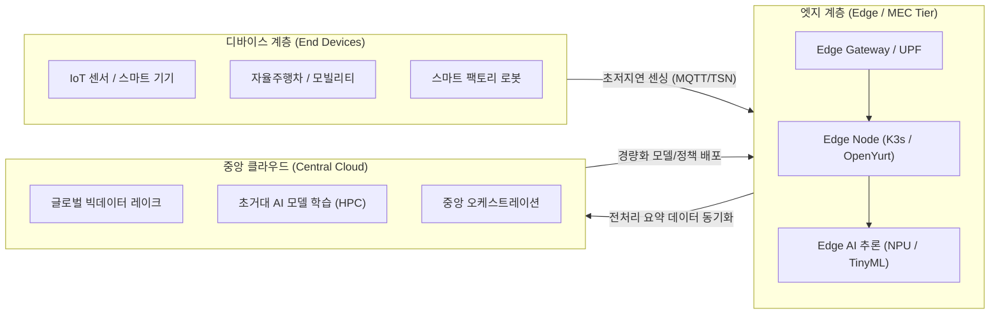

# EDGE

---

## I. 초저지연·분산 지능 구현, 엣지 컴퓨팅(Edge Computing)의 개요
- 정의: 데이터가 발생하는 영역에서 실시간으로 데이터를 분산 수집·처리·분석하여 초저지연을 구현하는 분산 컴퓨팅 기술
* 특징: 데이터 폭증 및 대역폭 한계, 초저지연 요구, 보안 및 프라이버시 강화
## II. 엣지 컴퓨팅의 아키텍처 및 핵심 기술 요소
### 가. 엣지 컴퓨팅의 개념 아키텍처 및 동작 원리

- 중앙 클라우드로 비동기 전송하는 3계층(Device-Edge-Cloud) 협동 구조
### 나. 엣지 컴퓨팅의 핵심 기술 요소

| **분류**        | **핵심 기술(키워드)**                          | **세부 설명 및 특징**            |
| ------------- | --------------------------------------- | ------------------------- |
| **네트워크 / 통신** | **MEC (Multi-access Edge Computing)**   | 기지국/UPF 인접 배치로 무선망 경로 단축  |
| **네트워크 / 통신** | **TSN (Time-Sensitive Networking)**     | 확정적 지연시간 보장 기술            |
| **[[가상화]] / 배포**  | **KubeEdge**                            | 저전력·저메모리 경량 컨테이너 오케스트레이션  |
| **가상화 / 배포**  | **Wasm (WebAssembly)**                  | 초경량 [[바이너리 런타임]] 환경 |
| **엣지 AI**     | **TinyML / On-Device AI**               | 경량 모델 추론                  |
| **엣지 AI**     | **[[연합 학습]] (Federated Learning)**      | 로컬에서 모델 학습 후 파라미터만 집계     |
| **데이터 / 제어**  | **[[EDA]] (Event-Driven Architecture)** | 실시간 스트리밍 처리 및 저지연 메시징 브로커 |
| **보안 / 신뢰**   | **Zero Trust Edge (ZTE)**               | 분산 노드 대상 마이크로 [[가상메모리의 페이징과 세그멘테이션|세그멘테이션]] 검증   |

## III. 엣지 컴퓨팅과 클라우드 컴퓨팅 비교 및 향후 발전 전망

| **비교 항목**           | **엣지 컴퓨팅 (Edge Computing)**   | **[[클라우드 컴퓨팅]] (Cloud Computing)**  |
| ------------------- | ----------------------------- | ------------------------------- |
| **처리 위치**           | 데이터 발생지 인접 노드 및 분산 [[게이트웨이]]      | 중앙 집중식 데이터 센터                   |
| **주요 역할**           | **실시간 제어, 즉시 판단, 프라이버시 보호**   | **대규모 모델 학습, 장기 데이터 분석, 중앙 관리** |
| **지연 시간 (Latency)** | 밀리초(ms) 단위의 초저지연 (실시간 응답)     | 수십~수백 밀리초(ms) 수준                |
| **네트워크 부하**         | 로컬 전처리 및 필터링으로 [[백홀 트래픽]] 최소화 | 모든 원시 데이터 전송으로 대역폭 소모 큼         |
| **연산 능력**           | 제한된 연산 자원                     | 무제한에 가까운 고성능 병렬 연산              |
- Edge AI 및 [[Physical AI]]로의 진화, Cloud-Edge Continuum (연속체)