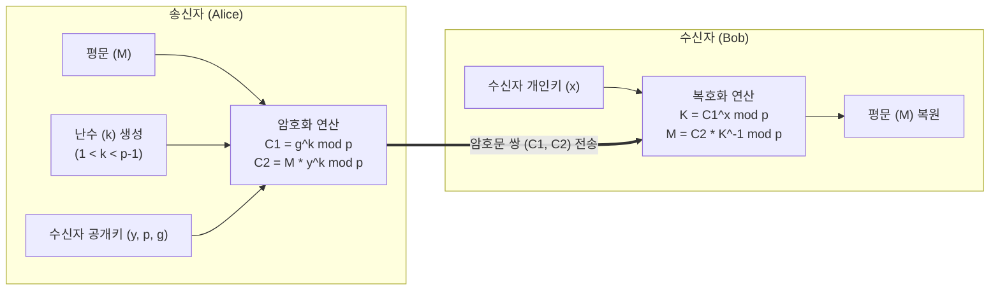

# ElGamal (엘가말)

---

## I. 이산대수 난제 기반의 확률적 공개키 암호, ElGamal의 개요

* **정의**: 이산대수 문제(Discrete Logarithm Problem)의 계산적 어려움을 기반으로 고안되어, 데이터 [[암호화]] 및 전자서명 기능에 모두 활용 가능한 미국의 공개키(비대칭키) [[암호 알고리즘]]
* **필요성 및 주요 특징**:
* **확률적 암호화 (Probabilistic Encryption)**: 암호화 과정에 난수($k$)를 개입시켜 동일한 평문을 암호화하더라도 매번 다른 암호문이 생성되므로, 재전송 공격(Replay Attack) 방어 가능
* **메시지 확장 (Message Expansion)**: 1개의 평문 [[블록 암호화]] 시 2개의 암호문 블록$(C_1, C_2)$이 생성되어 데이터 통신량이 2배로 증가하는 구조적 오버헤드 존재
* **다양한 활용성**: 기본적인 데이터 [[기밀성]] 확보뿐만 아니라, 변형을 통해 전자서명([[DSA]]의 근간) 체계 및 키 교환 알고리즘으로 발전 및 활용됨

---

## II. ElGamal의 개념도 및 핵심 기술 요소

### 가. ElGamal 암호화 및 복호화 메커니즘 개념도

* 송신자는 매번 고유한 난수 $k$를 생성하여 평문을 암호화하며, 그 결과로 임시 키 정보($C_1$)와 마스킹된 데이터($C_2$)를 전송함
* 수신자는 자신만이 알고 있는 개인키 $x$를 사용하여 $C_1$으로부터 비밀 값 $K$를 복원한 뒤, 모듈러 역원을 곱해 평문 $M$을 산출함

### 나. ElGamal의 핵심 기술 및 구성 요소

| 구분 | 요소기술(키워드) | 세부 설명 |
| --- | --- | --- |
| **수학적 기반** | 이산대수 문제 ([[DLP]]) | $y = g^x \mod p$ 식에서 $p, g, y$를 알아도 지수 $x$를 역산출하기 극히 어려운 수학적 성질 |
| **시스템 변수** | 글로벌 파라미터 (p, g) | 공개키 쌍 생성의 기준이 되는 큰 소수 $p$와 원시근(Generator) $g$ |
| **키 관리** | 개인키 (x) 및 공개키 (y) | 수신자가 무작위로 선택하여 숨기는 개인키 $x$와, 이를 수식에 대입해 공개하는 공개키 $y$ |
| **보안 핵심** | 일회성 난수 (k) | 암호화 시마다 송신자가 새롭게 생성하는 난수로, 암호문의 다형성([[다형성|Polymorphism]])을 보장 |
| **암호화 산출물** | 암호문 쌍 (C1, C2) | $C_1$은 수신자가 난수 정보를 복구하기 위한 단서, $C_2$는 실제 평문이 암호화된 데이터 |
| **보안 취약점 제어** | 난수 [[재사용]] 금지 | 동일한 난수 $k$를 재사용하여 여러 메시지를 암호화할 경우 평문이 해독될 수 있는 취약점 존재 |
| **복호화 연산** | 모듈러 역원 연산 | 덧셈 또는 곱셈에 대한 역원을 확장된 유클리드 [[알고리즘]](EEA)을 통해 산출하여 평문 복원 |
| **응용 기술** | ElGamal 서명 방식 | 암호화 알고리즘의 식을 변형하여 메시지의 해시값과 결합, 부인방지용 전자서명으로 활용 |

---

## III. 주요 공개키 암호 알고리즘 비교 및 최신 동향

### 가. ElGamal과 타 공개키 암호 알고리즘 비교

| 비교 항목 | ElGamal | [[RSA (Rivest Shamir Adleman)|RSA]] | [[ECC]] |
| --- | --- | --- | --- |
| **수학적 기반 난제** | 이산대수 문제 (DLP) | 소인수분해 문제 (IFP) | 타원곡선 이산대수 문제 (ECDLP) |
| **암호화 특성** | **확률적 암호화** (매번 다른 암호문) | **확정적 암호화** (동일 평문 = 동일 암호문) | 확률적/결정론적 구조 모두 가능 |
| **데이터 오버헤드** | 암호문 크기가 **평문의 2배**로 증가 | 암호문과 평문의 크기가 동일 | 짧은 키 길이로 오버헤드 매우 낮음 |
| **난수 의존성** | 암호화 시 매번 별도의 난수(k) 필요 | 기본 암호화식에서는 불필요 | 서명(ECDSA) 및 교환 시 난수 필요 |
| **주요 발전 및 활용** | DSA (미국 전자서명 표준)의 근간 | 글로벌 범용 공개키 암호/서명 표준 | 스마트폰, IoT 등 경량 환경 최적화 표준 |

### 나. ElGamal 기반 기술의 향후 전망 및 활용 동향

* **[[블록체인]] 프라이버시 보호에 활용**: 동형 암호적 성질(Homomorphic property, 암호문 상태에서의 제한적 덧셈/곱셈 연산)을 일부 지니고 있어, 영지식 증명([[영지식증명|ZKP]]) 및 전자투표(E-Voting) 프로토콜에서 다자간 기밀 연산을 수행하는 핵심 알고리즘으로 연구 및 활용됨
* **현대 암호학에서의 위상 변천**: ElGamal 그 자체로는 메시지 확장의 비효율성 때문에 순수 데이터 암호화용으로는 RSA에 밀려 잘 쓰이지 않으나, 그 수학적 구조는 **DSA, ECDSA 등 현대 전자서명 인프라를 탄생시킨 핵심 근간 기술**로서 학술적, 실무적 중요성이 매우 높음

---

### 🔗 연관 토픽

- **소속 도메인**: [[00_보안_MOC|🛡️ 보안]]
- **세부 분류**: `2. 현대 암호학 & 키 관리 · 전자서명`
- **핵심 연관 토픽**:
  - [[RSA (Rivest Shamir Adleman)]]
  - [[ECC|ECC(Elliptic Curve Cryptography)]]
  - [[영지식증명|영지식증명(Zero Knowledge Proof)]]
  - [[암호화|암호화 (Encryption)]]
  - [[기밀성]]
