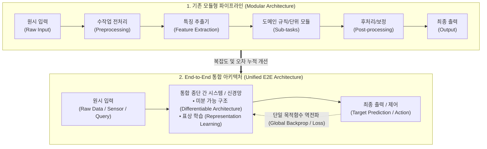

# End-to-End (E2E)

## I. 파이프라인 전 과정의 단일 최적화 패러다임, End-to-End(E2E)의 개요

- **정의**: 시스템 및 데이터 처리 과정에서 중간 단계별 수작업 개입이나 독립 모듈 분할 없이, 원시 입력(Raw Input)부터 최종 출력(Final Output)까지 전 과정을 하나의 통합 체계로 처리·학습·검증하는 엔지니어링 패러다임
    
      
    
- **등장배경 및 특징**:
    
      
    - **오차 누적(Error Propagation) 방지**: 다단계 파이프라인(전처리-특징추출-규칙추론-후처리)에서 발생하는 단계별 손실 및 바이어스 전파 차단
        
          
        
    - **글로벌 최적화(Global Optimization)**: 국소 최적화(Local Optima) 한계를 극복하고 목적 함수(Loss Function) 기반의 단일 종단 간 역전파 및 피드백 수행
        
          
        
    - **특징**: 단순화된 파이프라인(Simplicity), 수작업 엔지니어링 최소화, 고성능 컴퓨팅 및 대규모 데이터셋 기반 통합 처리
        
          
        

## II. End-to-End(E2E)의 아키텍처 및 핵심 기술 요소

### 가. End-to-End와 모듈형(Modular) 구조의 아키텍처 비교 및 동작 메커니즘

- 원시 데이터를 중간 파편화 없이 단일 파이프라인으로 전달하여, 단일 손실(Loss)을 기반으로 전체 네트워크 파라미터를 동시 최적화
    
      
    

### 나. End-to-End(E2E)의 핵심 기술 및 구성 요소

|**구분**|**핵심 기술(키워드)**|**세부 설명**|
|---|---|---|
|**AI/모델링**|**Differentiable Architecture**|모든 연산 과정이 미분 가능한 함수로 연결되어, 종단 간 역전파(Backpropagation) 알고리즘을 통한 글로벌 최적화 지원|
|**AI/모델링**|**Representation Learning**|수작업 특징 공학(Feature Engineering)을 대체하여, 대규모 데이터로부터 유의미한 잠재 표상(Latent Feature)을 자동 추출|
|**AI/모델링**|**VLA (Vision-Language-Action)**|멀티모달 센서 입력(Vision/Language)으로부터 물리적 로봇/자율주행 제어 액션(Action)까지 단일 파운데이션 모델로 E2E 수행|
|**소프트웨어 공학**|**E2E Testing (종단간 테스트)**|UI 계층부터 비즈니스 로직, DB, 외부 3rd Party 연동까지 사용자 관점의 전체 비즈니스 흐름 무결성 자동화 검증(Playwright, Cypress)|
|**데이터 엔지니어링**|**E2E Data Pipeline**|소스 데이터 수집(Ingestion)부터 정제, 변환, 카탈로그 등록, 서빙까지 단일 오케스트레이션(Airflow, Dagster)으로 제어|
|**시스템/네트워크**|**E2E Observability (가시성)**|분산 트레이싱(OpenTelemetry), APM, 로그, 메트릭을 단일 트랜잭션 ID로 연계하여 병목 및 장애 원인을 종단 간 추적|
|**시스템/네트워크**|**E2E Network Slicing**|5G/6G 환경에서 단말(UE)부터 무선망(RAN), 코어망(Core), 전송망(Transport)까지 SLA 기반 가상 네트워크를 전 구간 일체화 격리|
|**MLOps**|**E2E ML Lifecycle**|데이터 레이블링, 모델 학습, 평가, 배포, 모니터링, 재학습 피드백 루프를 단일 플랫폼으로 결합한 지속적 통합/배포(CI/CD/CT)|

## III. End-to-End vs 모듈형(Modular) 방식 비교 및 발전 전망

### 가. End-to-End(E2E) vs 모듈형(Modular) 방식 비교

|**비교 항목**|**End-to-End (E2E) 체계**|**모듈형 (Modular) 체계**|
|---|---|---|
|**설계 철학**|데이터 주도 글로벌 단일 최적화|분할 정복(Divide & Conquer) 및 기능 분리|
|**오차 전파**|**없음 (글로벌 손실 함수로 일괄 튜닝)**|**존재 (이전 단계의 오류가 다음 단계로 누적/증폭)**|
|**엔지니어링 비용**|모델 설계 단순, 대규모 고품질 데이터 의존|단계별 인터페이스 정의 및 도메인 규칙 튜닝 필요|
|**설명가능성(XAI)**|낮음 (블랙박스 특성 강함, 내부 디버깅 난이도 높음)|높음 (각 모듈별 중간 입출력 검증 및 추적 용이)|
|**유지보수 및 변경**|부분 수정 시 전체 모델 재학습 필요 가능성|개별 모듈 독립적 수정 및 단위 교체 용이|
|**주요 적용 사례**|차세대 자율주행(FSD), 음성인식(Whisper), E2E 테스트|클래식 자율주행 스택, 마이크로서비스(MSA), 단위 테스팅|

### 나. End-to-End 기술 발전 전망 및 산업 적용 동향

- **Physical AI 및 자율주행의 E2E 패러다임 대전환**: 인지-판단-제어로 분절된 기존 자율주행 스택이 카메라/라이다 원시 데이터에서 조향·가감속 제어 신호로 직접 출력되는 단일 E2E 파운데이션 신경망으로 통합 가속화
    
      
    
- **설명가능성(XAI) 및 안전성 하이브리드 보완**: E2E 블랙박스 한계를 보완하기 위해 중요 제어 구간에 규칙 기반 안전 펜스(Rule-based Safety Fallback)를 결합한 **'E2E-with-Safety Guardrail' 하이브리드 아키텍처** 정착 추세