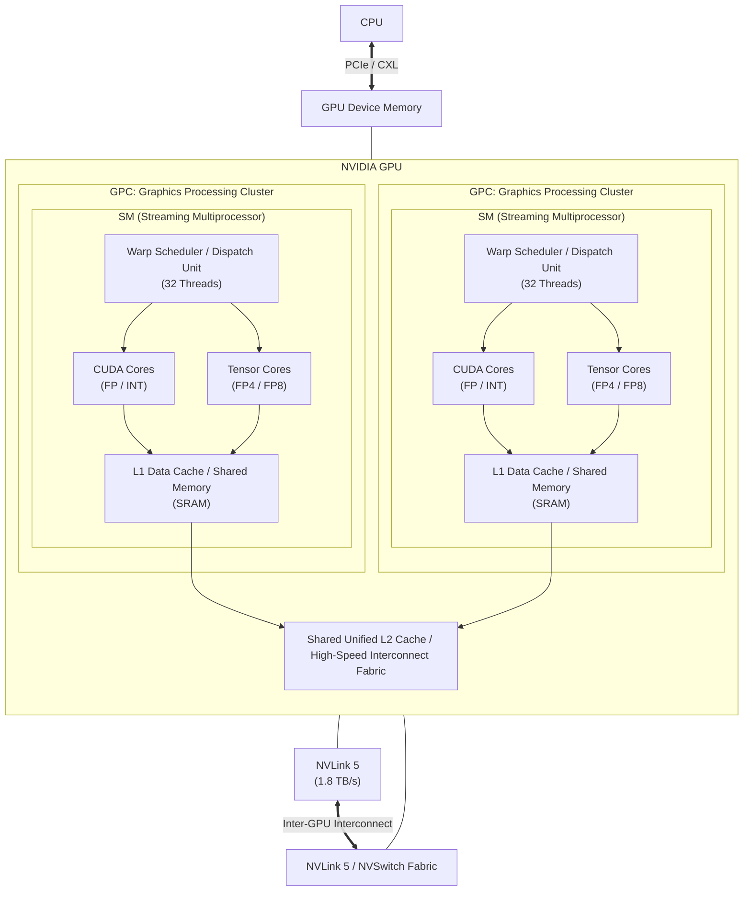

# [[GPU]]

---

## I. 대규모 병렬 연산 기반 가속 프로세서 GPU의 개요

- **정의**: 대량의 단순 연산을 동시에 처리하기 위해 수천 개의 코어로 구성된 초병렬 구조의 하드웨어 가속 프로세서
- 그래픽 렌더링을 넘어 AI/LLM 학습 및 추론을 수행하는 GPGPU(General-Purpose computing on GPU)
- 특징: 병렬 연산, SIMT(Single Instruction, Multiple Threads)기반 병렬성, 초고대역폭 메모리 구조

---

## II. GPU의 아키텍처 및 핵심 구성요소

### 가. GPU의 아키텍처 및 동작 원리

- CPU가 GPU로 오프로드 -> 32개 [[쓰레드|스레드]]를 1개 warp 번들링 -> SM 내부의 코어에 분배를 통한 병렬처리

### 나. GPU의 핵심 기술 요소

| 구분            | 핵심 기술        | 설명                                   |
| :-------------- | :--------------- | :------------------------------------- |
| 연산 코어       | CUDA Core        | 범용 산술 유닛                         |
| 연산 코어       | Tensor Core      | 행렬 곱셈 - 누산                       |
| 연산 코어       | Ray Tracing Core | 광선 추적 전용                         |
| 실행 모델       | SIMT             | 32개의 스레드를 1개의 Warp로 묶어 제어 |
| 메모리          | HBM4             | 초고대역폭 데이터 전송                 |
| 인터커넥트      | NV Link          | 직접 통신 대역폭                       |
| 아키텍처/패키징 | Chiplet          | TSV 기반 2.5D 패키징                   |
| 소프트웨어      | CUDA             | 자동 양자화 스케일링 엔진              |

---

## III. GPU vs NPU 비교

| 비교 항목      | GPU                           | [[NPU]]                            |
| :------------- | :---------------------------- | :--------------------------------- |
| 설계 철학      | 대용량 병렬 처리              | 신경망 전용 가속                   |
| 코어 구조      | 수천~수만 개의 소형 병렬 코어 | [[MAC 배열]] / [[시스톨릭 어레이]] |
| 연산 모델      | SIMD/SIMT                     | Tnesor/Matrix                      |
| 범용성/유연성  | 유연성 높음                   | 유연성 낮음([[딥러닝]] 알고리즘 특화)  |
| 전력 효율성    | 전력 효율성 낮음              | 전력 효율성 높음                   |
| 주요 활용 분야 | AI 모델 학습                  | 온디바이스 AI                      |

- 랙 스케일 통합, 액체 냉강 도입, 메모리 중심 컴퓨팅
