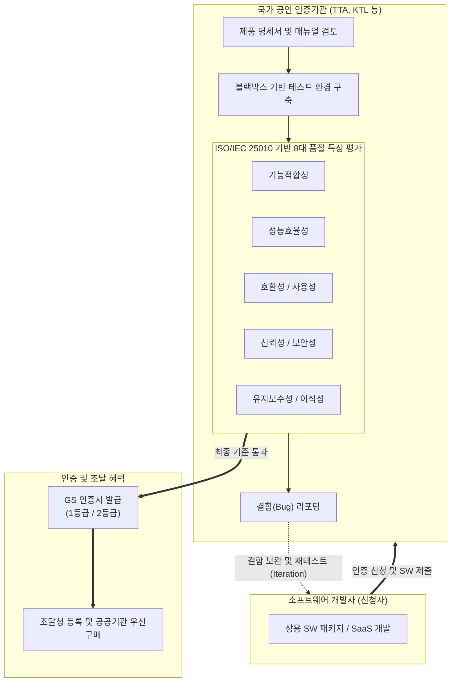

# GS 인증 (Good Software Certification)

---

## I. 국산 소프트웨어 품질의 객관적 검증 및 공공 판로 지원, GS 인증의 개요

* **정의**: 국산 소프트웨어의 완성도와 신뢰성을 높이기 위해, 국제 표준(ISO/IEC 25023, 25051 등)에 기반하여 제품의 기능적·비기능적 품질을 평가하고 국가 공인 시험기관이 인증을 부여하는 소프트웨어 품질 인증 제도
* **필요성 및 주요 특징**:
* **객관적 품질 보증**: ISO/IEC 25010 표준을 바탕으로 기능 적합성, 성능 효율성, 호환성, 사용성, [[신뢰성]], 보안성 등 8대 품질 속성을 철저하게 테스트(Black-box 기반)하여 결함을 사전에 제거
* **공공시장 진출의 필수 관문**: GS 인증(특히 1등급) 획득 시 중소기업벤처부 우선구매 대상, 조달청 3자 단가 계약 및 나라장터 등록, 성능보험 가입 면제 등 강력한 공공 조달 혜택 부여
* **소프트웨어 산업 경쟁력 강화**: 중소/벤처 기업이 개발한 우수 SW의 시장 진입을 돕고, 발주처(공공/민간)에는 품질이 검증된 소프트웨어 선택 기준을 제공

---

## II. GS 인증의 개념도 및 핵심 평가 요소

### 가. GS 인증 평가 절차 및 품질 검증 개념도

* 개발사가 신청서를 제출하면 인증기관은 실제 운영 환경과 유사한 테스트베드를 구축하고, ISO/IEC 25010의 8대 품질 특성을 기준으로 블랙박스 테스트를 수행함
* 발견된 결함은 개발사로 피드백되어 수정 과정을 거치며, 최종적으로 모든 결함이 조치되고 기준을 통과하면 등급별 GS 인증서가 발급됨

### 나. GS 인증의 핵심 기준 및 구성 요소

| 구분 | 요소기술 및 기준 (키워드) | 세부 설명 |
| --- | --- | --- |
| **평가 기준 표준** | ISO/IEC 25010 | 소프트웨어 제품의 품질 모델을 정의한 국제 표준 (기존 ISO/IEC 9126을 대체 및 고도화) |
| **평가 모듈 표준** | ISO/IEC 25051 / 25041 | 패키지 소프트웨어(COTS)의 품질 요구사항, 테스트 지침 및 평가 모듈을 규정한 국제 표준 |
| **인증 등급** | 1등급 (Grade 1) | 제품 설명서, 사용자 매뉴얼, 실행 프로그램이 품질 요구사항을 완벽히 충족하는 최고 품질 등급 (주요 조달 혜택 집중) |
| **인증 등급** | 2등급 (Grade 2) | 필수적인 기능 및 신뢰성 위주로 평가하여 1등급 대비 완화된 기준을 적용하는 기본 품질 등급 |
| **평가 방법** | Black-box Testing | 소스 코드를 직접 보지 않고, 사용자 관점에서 기능명세서를 바탕으로 입력값에 대한 올바른 출력 여부를 검증 |
| **주요 평가 기관** | TTA, KTL, KTC 등 | 한국정보통신기술협회(TTA), 한국산업기술시험원(KTL) 등 국가기술표준원 산하 KOLAS 인정 공인 시험기관 |
| **보안성 특성** | 시큐어 코딩 / 취약점 점검 | 정보 유출 방지 및 접근 통제 확인 (단, 전문 보안 솔루션의 경우 CC 인증과 별개로/또는 연계하여 기본 보안성 점검) |

---

## III. 공공 IT 인증 제도 비교 및 최신 동향

### 가. 공공 소프트웨어 핵심 인증 제도 비교 (GS 인증 vs CC 인증)

| 비교 항목 | GS 인증 (Good Software) | CC 인증 (Common Criteria) |
| --- | --- | --- |
| **인증 목적** | 범용 소프트웨어의 **종합적인 품질(기능, 성능 등)** 증명 | 정보보호 제품의 **보안성(Security) 및 안정성** 증명 |
| **적용 대상** | 패키지 SW, SaaS, 임베디드 SW 전반 | [[방화벽]], [[VPN]], 백신, 망연계 솔루션 등 보안 제품 |
| **기반 국제 표준** | **ISO/IEC 25010** (소프트웨어 품질 모델) | **ISO/IEC 15408** (정보보호 시스템 평가 기준) |
| **평가 성격** | 사용자 관점의 [[블랙박스 테스트]] 및 사용성 중시 | 소스코드 수준의 취약점 및 보안 설계 메커니즘 분석 (EAL 등급) |
| **조달청 혜택** | 제3자 단가계약 등록 및 공공기관 우선구매 대상 | 공공기관 도입 정보보호 제품의 필수 요구 조건 |

### 나. GS 인증의 최신 정책 동향 및 발전 전망

* **클라우드(SaaS) 특화 GS 인증 기준 도입**: 기존 온프레미스 패키지 SW 중심의 평가에서 벗어나, [[클라우드 네이티브]] 환경에 맞춘 멀티테넌시(Multi-tenancy), 오토 스케일링(Auto-scaling)에 따른 자원 효율성, 오픈 API 호환성 등을 중점적으로 평가하는 SaaS 전용 GS 인증 체계가 강화되고 있음
* **AI 및 신기술 소프트웨어 품질 검증 확대**: 제품 내에 [[인공지능]](AI)이나 [[블록체인]] 등 신기술이 탑재되는 비중이 급증함에 따라, 단순히 기능이 동작하는지를 넘어 AI 모델의 결과 재현성(신뢰성), 학습 데이터의 유효성, 그리고 AI 안전성(Trustworthy AI) 가이드라인을 반영한 새로운 품질 지표 모델(ISO/IEC 25059 등 연계)이 GS 인증 평가 풀에 점진적으로 편입되고 있음

---

### 🔗 연관 토픽

- **소속 도메인**: [[00_소프트웨어공학_MOC|🏗️ 소프트웨어공학]]
- **세부 분류**: `6. 소프트웨어 테스팅 & 품질 보증 (QA/QC)`
- **핵심 연관 토픽**:
  - [[신뢰성]]
  - [[방화벽]]
  - [[인공지능]]
  - [[블랙박스 테스트]]
  - [[Debugging]]
