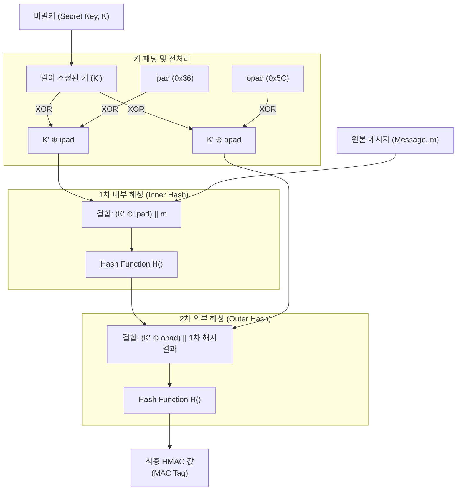

# HMAC (Hash-based Message Authentication Code)

---

## I. 메시지 무결성과 송신자 인증을 동시 보장하는 암호화 기술, HMAC의 개요

* **정의**: 암호학적 해시 함수(Hash Function)와 송수신자가 사전에 공유한 비밀키(Secret Key)를 결합하여, 네트워크를 통해 전달되는 데이터의 [[무결성]](Integrity)과 송신자의 신원(Authentication)을 검증하는 메시지 인증 코드 (RFC 2104 표준)
* **필요성 및 주요 특징**:
* **무결성과 인증의 동시 달성**: 단순 해시(SHA-256 등)가 데이터의 위변조(무결성)만 확인하는 반면, HMAC은 '비밀키'를 아는 자만이 올바른 해시값을 생성할 수 있으므로 메시지 출처의 인증까지 보장
* **길이 연장 공격(Length Extension Attack) 방어**: `Hash(Key + Message)`와 같은 단순한 키 결합 방식의 취약점을 극복하기 위해, 두 번의 중첩된 해싱 연산과 패딩(Padding)을 적용하여 원천적인 공격 차단
* **알고리즘의 유연성**: HMAC 구조 자체는 특정 해시 함수에 종속되지 않아, 시스템 보안 요구사항에 따라 내부 해시 엔진을 MD5, SHA-1에서 최신 SHA-256, SHA-3 등으로 쉽게 교체 가능

---

## II. HMAC의 개념도 및 핵심 알고리즘 요소

### 가. HMAC의 이중 해시 연산 아키텍처 개념도

* **동작 공식**: `HMAC(K, m) = H((K' ⊕ opad) || H((K' ⊕ ipad) || m))`
* 키($K$)의 길이를 해시 블록 크기에 맞게 조정한($K'$) 후, 각각 다른 패딩 값(`ipad`, `opad`)과 배타적 논리합(XOR)을 수행하고, 메시지를 더해 두 번의 해시 연산($H$)을 거쳐 최종 태그를 생성함

### 나. HMAC의 핵심 기술 및 구성 요소

| 구분 | 요소기술(키워드) | 세부 설명 |
| --- | --- | --- |
| **핵심 입력값** | Secret Key ($K$) | 송신자와 수신자만이 사전에 안전하게 공유하여 나누어 가지고 있는 대칭 비밀키 |
| **핵심 입력값** | Hash Function ($H$) | 임의의 길이를 가진 메시지를 고정된 길이의 암호화된 값으로 변환하는 단방향 함수 (예: SHA-256) |
| **패딩 상수** | ipad (Inner Pad) | 1차 내부 해시에 사용되는 상수. `0x36` (바이트 `00110110`) 값을 블록 크기만큼 반복한 바이트 열 |
| **패딩 상수** | opad (Outer Pad) | 2차 외부 해시에 사용되는 상수. `0x5C` (바이트 `01011100`) 값을 블록 크기만큼 반복한 바이트 열 |
| **보안 메커니즘** | XOR 연산 ($\oplus$) | 비밀키를 패딩 값과 각각 배타적 논리합 연산하여, 두 개의 서로 다른 파생 키(Inner Key, Outer Key)를 생성 |
| **보안 메커니즘** | 이중 해싱 (Double Hashing) | 해시 함수를 두 번 중첩 적용함으로써, 공격자가 기존 해시값 뒤에 임의의 데이터를 덧붙여 새로운 유효 해시를 만들어내는 '길이 연장 공격'을 무력화 |

---

## III. 인증 방식 비교 및 최신 산업 동향

### 가. 메시지 인증 기법 비교 (HMAC vs 전자서명)

| 비교 항목 | HMAC ([[MAC]] 기반 인증) | 전자서명 (Digital Signature) |
| --- | --- | --- |
| **키 기반(암호 방식)** | **대칭키 (Symmetric Key)** 기반 | **비대칭키 (Public/Private Key)** 기반 |
| **무결성 / 인증** | 모두 보장 (데이터 변조 확인 및 신원 확인) | 모두 보장 (데이터 변조 확인 및 신원 확인) |
| **부인 방지 (Non-repudiation)** | **불가** (수신자도 동일한 키를 가져 서명 생성 가능) | **가능** (개인키 소유자만 서명할 수 있으므로 발송 사실 부인 불가) |
| **연산 속도** | 해시 기반이므로 **매우 빠름** (대규모 트래픽 적합) | [[RSA (Rivest Shamir Adleman)|RSA]], [[ECC]] 등 공개키 연산을 거치므로 상대적으로 느림 |
| **주요 활용 분야** | API 인증, JWT(HS256), [[IP Sec|IPsec]], TLS 레코드 인증 | 공동인증서(구 공인인증서), 소프트웨어 배포 서명, [[블록체인]] |

### 나. HMAC의 최신 활용 동향 및 적용 사례

* **JWT([[JSON]] Web Token) 및 상태 무저장(Stateless) 인증의 표준**: 현대 웹/앱 아키텍처 및 마이크로서비스([[MSA (Micro Service Architecture)|MSA]])에서 세션을 유지하지 않고 사용자 권한을 인가할 때 사용되는 JWT의 서명(Signature) 알고리즘으로 HS256 (HMAC with SHA-256)이 업계 표준으로 가장 널리 사용됨
* **클라우드 API 인증 (AWS Signature Version 4)**: AWS, GCP 등 주요 퍼블릭 클라우드 서비스는 REST API 호출 시 악의적인 재전송 공격(Replay Attack)과 위변조를 막기 위해, 요청 페이로드와 타임스탬프를 비밀 액세스 키(Secret Access Key)와 결합하여 HMAC-SHA256으로 서명하는 방식을 강제하고 있음

---

### 🔗 연관 토픽

- **소속 도메인**: [[00_보안_MOC|🛡️ 보안]]
- **세부 분류**: `1. 정보보안 원칙 & 거버넌스 · 인증`
- **핵심 연관 토픽**:
  - [[MAC]]
  - [[암호화|암호화 (Encryption)]]
  - [[일방향 암호화 방식]]
  - [[IP Sec]]
  - [[MDC]]
