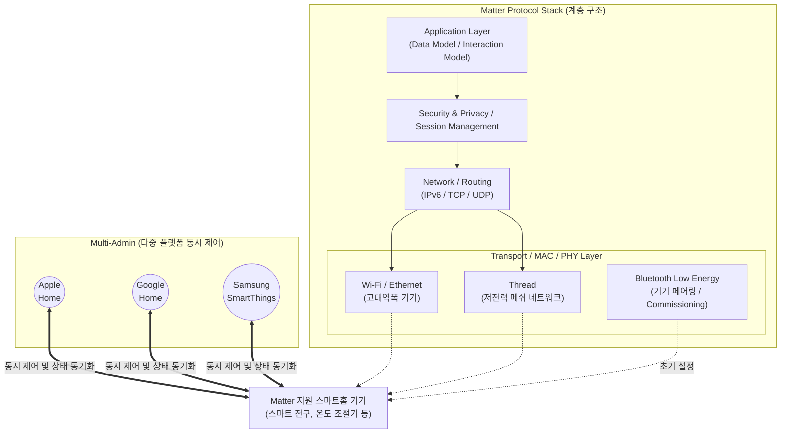

# IoT Matter (매터)

---

## I. 스마트홈 파편화 해소를 위한 범용 오픈소스 연동 표준, IoT Matter의 개요

* **정의**: 다양한 제조사의 스마트홈 기기 간 호환성 문제를 해결하기 위해 CSA(Connectivity Standards Alliance) 주도로 개발된, 특정 플랫폼에 종속되지 않는 [[IPv6]] 기반의 개방형 어플리케이션 계층 연동 표준 [[프로토콜]]
* **등장 배경 및 필요성**:
* **플랫폼 파편화(Fragmentation) 한계**: 애플(HomeKit), 구글(Google Home), 아마존(Alexa) 등 빅테크 기업의 독자 규격 사용으로 인한 상호 연동 불가 및 소비자 혼란 가중
* **개발 및 인증 비용 증대**: IoT 기기 제조사가 여러 에코시스템을 동시에 지원하기 위해 발생하는 중복 개발 비용 및 인증(Certification) 부담 해소 필요
* **클라우드 의존성 탈피**: 인터넷 연결 단절 시 스마트홈 제어가 불가능한 기존 클라우드 기반 연동의 한계를 극복하고, 응답 지연이 없는 로컬 제어(Local Control) 요구 증대

---

## II. IoT Matter의 아키텍처 및 핵심 기술 요소

### 가. IoT Matter의 아키텍처 및 동작 개념도

* IPv6 네트워크 기반 위에서 동작하며, 설정(Commissioning) 시에는 BLE를, 통신 시에는 Wi-Fi(고속)와 Thread(저전력)를 사용하여 멀티 에코시스템 환경(Multi-Admin)을 제공함.

### 나. IoT Matter의 핵심 기술 요소

| 분류 | 핵심 기술 (키워드) | 세부 설명 |
| --- | --- | --- |
| **기반 통신** | **IPv6 (Internet Protocol v6)** | 모든 Matter 기기에 고유 IP를 부여하여 [[게이트웨이]] 종속 없이 엔드-투-엔드([[End-to-End]]) 직접 통신 지원 |
| **네트워크** | **Thread (스레드)** | IEEE 802.15.4 기반의 저전력, 자기 치유(Self-Healing) 기능을 갖춘 IPv6 무선 메쉬 네트워크 기술 |
| **초기 설정** | **BLE Commissioning** | 사용자 스마트폰을 통해 새로운 기기를 네트워크에 쉽고 안전하게 등록(Onboarding)하기 위해 BLE 활용 |
| **운영 제어** | **Multi-Admin (멀티 어드민)** | 하나의 Matter 기기를 여러 플랫폼(구글, 애플, 삼성 등)에 동시에 등록하고 독립적으로 제어하는 권한 공유 기술 |
| **운영 제어** | **Local Control (로컬 제어)** | 외부 클라우드를 거치지 않고 가정 내 로컬 네트워크망에서 기기를 직접 제어하여 초저지연 및 프라이버시 확보 |
| **보안 체계** | **[[DAC]] (Device Attestation Cert)** | 기기 제조 단계에서 부여되는 X.509 기반 인증서로, 정품 여부 및 무결성을 검증하는 PKI 기술 |
| **보안 체계** | **[[DCL]] (Distributed Compliance Ledger)** | [[블록체인]](Distributed Ledger)을 활용하여 Matter 인증 기기의 펌웨어 및 보안 상태를 투명하게 추적·관리하는 분산 원장 |
| **하위 호환** | **Matter Bridge (브릿지)** | 기존 Zigbee, Z-Wave 등 비(非) Matter 레거시 기기를 Matter 네트워크로 편입시켜 주는 프로토콜 변환 기술 |

---

## III. Matter와 OCF 연동 표준 비교 및 향후 전망

### 가. Matter vs OCF (Open Connectivity Foundation) 비교

| 비교 항목 | Matter (CSA 주도) | OCF (OCF 주도) |
| --- | --- | --- |
| **주도 기업** | Apple, Google, Amazon, Samsung 등 B2C 빅테크 | Intel, Samsung, Qualcomm 등 칩셋 및 가전 제조사 |
| **[[네트워크 계층]]** | **IPv6, Wi-Fi, Thread, Ethernet** 명시적 한정 | 매체 독립적 (Wi-Fi, Bluetooth, Zigbee 등 모두 수용) |
| **보안 및 인증** | 블록체인(DCL) 기반 글로벌 통합 인증 체계 | OCF 자체 보안 PKI [[프레임워크]] |
| **시장 생태계** | 스마트 스피커 및 모바일 OS 기본 탑재로 **급격한 확산** | B2B 및 대형 가전 위주로 적용, 대중적 확산 한계 |
| **목표 지향점** | 실질적인 상호운용성(Interoperability) 및 UX 통일 | 자원(Resource) 기반의 범용 IoT 프레임워크 제공 |

### 나. 향후 전망 및 시사점

* **적용 카테고리 확장**: 초기 조명, 플러그 등 단순 제어 기기에서 로봇 청소기, 에너지 관리 시스템(EMS), 백색 가전, 전기차 충전기(EVSE) 등 가정 내 모든 디바이스 영역으로 Matter 표준 지원 범위가 지속 확대(버전 1.3/1.4 이상)되고 있음.
* **초개인화 자율형 스마트홈으로의 진화**: Matter를 통해 인프라 연동이 완벽히 해결됨에 따라, 향후 스마트홈 경쟁력은 기기 연결 자체를 넘어 생성형 AI([[초거대 언어 모델|LLM]]) 및 엣지 AI([[EDGE|Edge]] AI)가 결합되어 거주자의 패턴을 분석하고 스스로 동작하는 '자율형 스마트홈(Autonomous Smart Home)' 서비스 역량으로 이동할 전망임.

---

### 🔗 연관 토픽

- **소속 도메인**: [[00_네트워크_MOC|🌐 네트워크]]
- **세부 분류**: `1. OSI 7계층 & 데이터링크 계층 (L1/L2)`
- **핵심 연관 토픽**:
  - [[네트워크 계층|네트워크 계층 (Network Layer)]]
  - [[프로토콜]]
  - [[게이트웨이]]
  - [[IPv6]]
  - [[End-to-End]]
