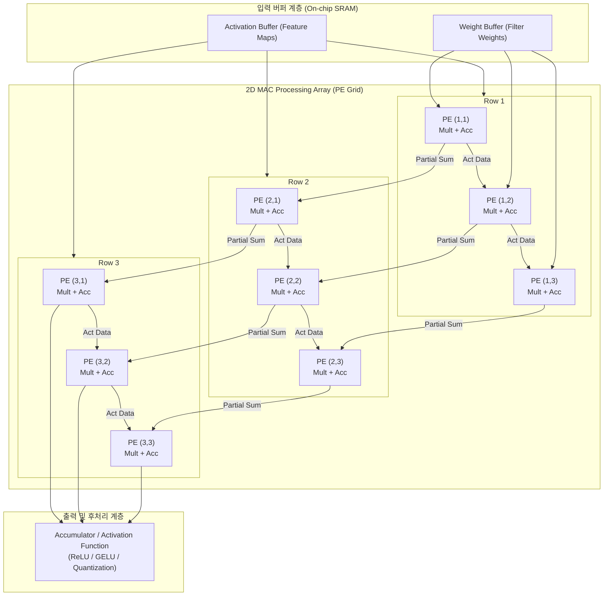

# MAC 배열

---

## I. 딥러닝 행렬 연산 고속화를 위한 하드웨어 코어, MAC 배열의 개요
- 정의: 딥러닝의 핵심 연산인 합성곱과 행렬 곱을 초고속 처리하기 위해, 다수의 곱셈-누산 유닛을 1D/2D 격자망으로 집적하여 연산 병렬성과 데이터 재사용성을 극대화한 하드웨어 가속 아키텍처
- 특징: 메모리 벽 극복, 초고병렬 처리, 에너지 효율성 최적화

---
## II. MAC 배열의 아키텍처 및 핵심 기술 요소

### 가. MAC 배열의 2차원 연산 아키텍처 및 데이터 흐름

- 활성화 데이터와 가중치가 배열 내부로 주입되어 각 PE에서  연산을 수행하고, 생성된 부분합]이 누적 전파되어 최종 행렬 결과 출력
### 나. MAC 배열의 핵심 기술 요소

| **구분**                | **핵심 기술(키워드)**               | **세부 설명 및 특징**                    |
| --------------------- | ---------------------------- | --------------------------------- |
| **연산 코어**             | **PE (Processing Element)**  | 구성된 최소 연산 단위                      |
| **연산 코어**             | **CSA (Carry-Save Adder)**   | 다중 덧셈 연산 속도를 가속하는 회로              |
| **데이터플로우 (Dataflow)** | **Weight Stationary (WS)**   | 재사용하는 방식                          |
| **데이터플로우 (Dataflow)** | **Output Stationary (OS)**   | 메모리 쓰기 대역폭을 최소화하는 구조              |
| **데이터플로우 (Dataflow)** | **Row Stationary (RS)**      | 행 단위로 매핑하여 재사용                    |
| **정밀도 및 가속**          | **혼합 정밀도 (Mixed Precision)** | 누적하여 연산 속도와 정확도 동시 확보             |
| **정밀도 및 가속**          | **희소성 가속 (Sparsity Engine)** | 연산 및 데이터 이동을 스킵                   |
| **차세대 인터커넥트**         | **CIM Crossbar Array**       | 옴의 법칙 및 키르히호프 법칙을 이용한 아날로그 MAC 배열 |

---
## III. MAC 배열 vs 범용 ALU 배열 비교 및 발전 전망

| **비교 항목**     | **MAC 배열 (AI / NPU 가속기)**                           | **범용 ALU 배열 (CPU / 일반 코어)**              |
| ------------- | --------------------------------------------------- | ---------------------------------------- |
| **연산 특화도**    | **행렬 곱셈·누산($A \times B + C$) 전용 구조**                | **사칙연산, 논리연산, 분기 등 범용 연산 수행**            |
| **데이터 공유 방식** | **PE 간 직접 연결(Systolic / Mesh)을 통한 데이터 재사용**         | **중앙 레지스터 파일 및 공유 캐시 경유**                |
| **제어 오버헤드**   | 단순한 제어 로직, 높은 면적 대비 연산 집적도                          | 복잡한 명령어 디코더, 분기 예측기(Branch Predictor) 필요 |
| **에너지 효율성**   | 극도로 높음 (TOPS/W 최적화)                                 | 범용성으로 인해 상대적으로 낮음                        |
| **대표 적용 사례**  | **Google TPU Matrix Unit, NVIDIA Tensor Core, NPU** | **x86 CPU 코어, ARM Cortex-A ALU**         |
- 초저정밀도 포맷 도입, 3D 적층 및 PIM(Processing-In-Memory) 결합