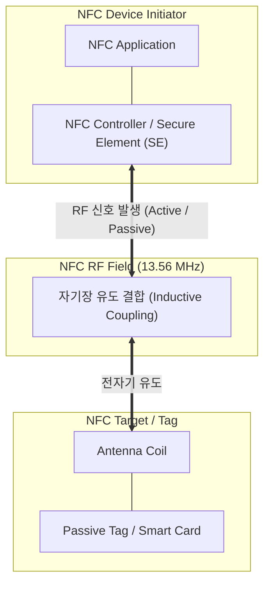

# NFC (Near Field Communication)

---

## I. 근거리 무선 통신 기술, NFC의 개요

### 가. NFC의 정의

* 13.56MHz 주파수 대역을 사용하여 수 센티미터(10cm 이내)의 아주 가까운 거리에서 양방향 통신을 지원하는 비접촉식 근거리 무선 통신 기술

### 나. NFC의 등장 배경 및 특징

* **[[RFID]]/Smart Card 기술의 진화**: 기존 RFID의 일방향성 및 결제 제한성을 극복하고, 기기 간 양방향 데이터 교환 및 보안성 강화 필요성에 따라 표준화
* **특징**:
* **초단거리 보안성**: 통신 거리가 매우 짧아 도신(Eavesdropping) 및 중간자 공격(MITM) 방어에 유리
* **다양한 동작 모드**: 카드 에뮬레이션, 리더/라이터, P2P 모드를 모두 지원하여 호환성 우수
* **호환성**: 기존 ISO/IEC 14443 및 FeliCa 등 비접촉식 스마트카드 인프라와 완벽한 호환 보장

---

## II. NFC의 아키텍처 및 핵심 기술 요소

### 가. NFC의 동작 모드 및 시스템 아키텍처

* NFC 통신은 자기장 유도 결합 방식을 사용하여, 주도 기기(Initiator)가 무선 주파수(RF) 필드를 형성하면 대상 기기(Target)가 에너지를 공급받거나 응답함
* 하드웨어 보안 요소(SE, Secure Element)를 연동하여 금융 결제 및 신분증 인증 정보를 안전하게 보호함

### 나. NFC의 핵심 기술 및 구성 요소

| 구분 | 요소기술(키워드) | 세부 설명 |
| --- | --- | --- |
| **통신 모드** | Card Emulation Mode | - 스마트폰 등이 교통카드나 신용카드처럼 동작하여 리더기에 태깅되는 모드 |
| **통신 모드** | Reader / Writer Mode | - NFC 스마트폰이 태그(Tag)나 포스터의 스마트 포스터 정보를 읽거나 쓰는 모드 |
| **통신 모드** | Peer-to-Peer (P2P) Mode | - 두 대의 NFC 기기 간 양방향으로 연락처, 사진, 파일 등을 직접 교환하는 모드 |
| **하드웨어 보안** | Secure Element (SE) | - 암호 키와 사용자 금융 정보를 안전하게 저장하는 독립된 하드웨어 칩 또는 유심(USIM) |
| **소프트웨어 보안** | Host Card Emulation (HCE) | - 하드웨어 SE 없이 클라우드 및 OS 소프트웨어 레벨에서 카드 에뮬레이션을 안전하게 처리 |
| **물리 규격** | 13.56 MHz & ISO/IEC 18092 | - 국제 표준으로 제정된 RFID 기반의 근거리 무선 주파수 대역 및 통신 [[프로토콜]] 규격 |
| **연동 기술** | SWP (Single Wire Protocol) | - NFC칩과 통신사 USIM(SE) 간의 암호화된 데이터를 전송하기 위한 단일 배선 인터페이스 |
| **응용 서비스** | Apple Pay / Google Pay | - 토큰화(Tokenization) 기술을 결합하여 오프라인 매장에서 안전한 모바일 결제 구현 |

---

## III. NFC와 블루투스/RFID 비교 및 향후 동향

### 가. 근거리 무선 통신 기술 비교 (NFC vs BLE vs RFID)

| 비교 항목 | NFC (Near Field Communication) | BLE (Bluetooth Low Energy) | RFID (Radio Frequency ID) |
| --- | --- | --- | --- |
| **통신 거리** | **초단거리 (10cm 이내)** | 중단거리 (10m ~ 100m) | 단거리 ~ 장거리 (수 cm ~ 수 m) |
| **통신 방향** | 양방향 (Bi-directional) | 양방향 (Bi-directional) | 단방향 (Tag → Reader 위주) |
| **주파수 대역** | 13.56 MHz | 2.4 GHz ISM Band | LF, HF, UHF (다양함) |
| **연결 설정 시간** | 즉시 태깅 (0.1초 이내) | 페어링(Pairing) 절차 필요 (수 초) | 태그 인식 즉시 응답 |
| **주요 활용 분야** | 모바일 결제, 출입증, 교통카드 | 비콘 위치추적, 웨어러블 기기 연동 | 물류 관리, 재고 조사, 자산 추적 |

### 나. NFC 기술의 향후 전망 및 최신 동향

* **디지털 지갑 및 신분증으로의 확장**: 모바일 결제 범용화를 넘어, 모바일 주민등록증, 운전면허증, 모바일 사원증 등 신원 확인(ID) 인프라의 핵심 수단으로 자리매김
* **IoT 기기 페어링 간소화**: 스마트 홈 가전, 의료기기, 오디오 장비 등의 초기 블루투스/Wi-Fi 연결 시 복잡한 설정 과정을 없애고 '태그 앤 고(Tag & Go)' 방식으로 연결성을 제공하는 형태로 고도화 중

---

### 🔗 연관 토픽

- **소속 도메인**: [[00_네트워크_MOC|🌐 네트워크]]
- **세부 분류**: `4. 무선 및 차세대 이동통신 (5G/6G/Wi-Fi)`
- **핵심 연관 토픽**:
  - [[RFID]]
  - [[프로토콜]]
  - [[FIDO]]
  - [[핀테크|핀테크 (FinTech)]]
  - [[CTAP]]
