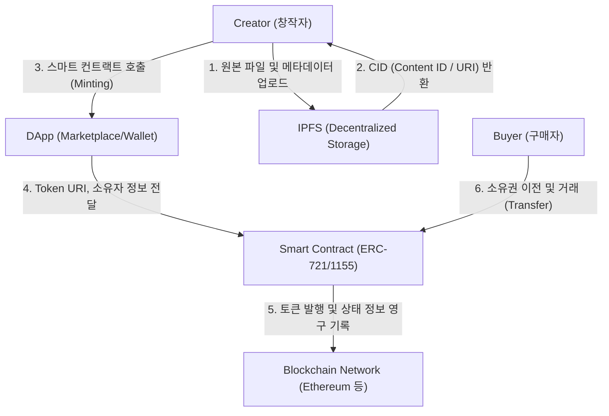

# NFT (Non Fungible Token)

---

## I. 디지털 자산의 소유권 증명, NFT(Non Fungible Token)의 개요

### 가. NFT의 정의

* [[블록체인]] 네트워크 상에 기록되어 위변조가 불가능하며, 디지털 자산(미디어, 예술품 등)에 고유성과 원본성을 부여하는 대체 불가능한 [[암호화]] 토큰.
* 스마트 컨트랙트를 통해 소유권 이력을 투명하게 관리하고, 디지털 콘텐츠의 희소성을 보장하는 웹 3.0([[Web 3.0]]) 시대의 핵심 기술 요소.

### 나. NFT의 필요성 및 주요 특징

* **고유성(Uniqueness)**: 분산 원장에 영구 기록되며, 개별 토큰마다 고유한 메타데이터(Metadata)와 식별자(Token ID) 부여.
* **추적성 및 투명성**: 최초 발행자(Minter)부터 현재 소유자까지의 모든 거래 이력 및 진위 여부가 블록체인 상에 공개되어 투명하게 검증 가능.
* **상호운용성(Interoperability)**: ERC-721 등 개방형 표준 [[프로토콜]] 기반으로 구현되어 이기종 DApp 및 마켓플레이스 간 독립적이고 자유로운 연동 지원.

---

## II. NFT의 아키텍처 및 핵심 구성요소

### 가. NFT의 아키텍처 및 동작 원리

* 메인넷 과부하 방지 및 수수료(Gas Fee) 절감을 위해 대용량 원본 파일은 오프체인(IPFS)에 분산 저장.
* 반환된 링크 정보(Token URI)와 최소한의 메타데이터만을 온체인(스마트 컨트랙트)에 기록하여 소유권을 매핑하고 생애주기를 관리함.

### 나. NFT의 핵심 기술 및 구성 요소

| 구분 | 요소기술(키워드) | 세부 설명 |
| --- | --- | --- |
| **코어 프로토콜** | ERC-721 / ERC-1155 | Ethereum 기반 대표 NFT 표준, 1155는 다중 토큰(FT+NFT) 동시 관리 및 전송 지원 |
| **데이터 구조** | Metadata ([[JSON]]) | NFT의 이름, 설명, 원본 파일의 위치(URI), 고유 속성(Traits) 등을 정의한 [[스키마]] |
| **탈중앙 저장소** | IPFS | 원본 콘텐츠 변조 방지 및 블록체인 블록 용량 한계 극복을 위한 P2P 분산 파일 시스템 |
| **제어 로직** | 스마트 컨트랙트 | 토큰 발행(Minting), 송금, 서명 검증, 로열티 배분을 중개자 없이 블록체인 위에서 자동화 수행 |
| **식별 체계** | Token ID / CID | 토큰의 고유 식별 번호 및 IPFS에 저장된 파일의 위변조 방지용 [[무결성]] 해시값 |
| **인증 수단** | Web3 Wallet | 지갑 내 프라이빗 키(Private Key)를 활용한 소유권 증명, 디지털 서명 및 거래 승인 (MetaMask 등) |
| **데이터 연동** | Dynamic NFT (dNFT) | 오라클(Oracle) 기술 연동을 통해 외부 환경 변화 데이터를 반영하여 상태나 이미지가 갱신되는 토큰 |
| **인프라** | 메인넷 (Mainnet) | 스마트 컨트랙트 코드가 배포되고 소유권 데이터가 탈중앙화된 방식으로 영구 보존되는 블록체인 네트워크 |

---

## III. NFT와 FT의 비교 및 최신 기술 동향

### 가. NFT와 FT(Fungible Token) 기술 비교

| 비교 항목 | NFT (Non-Fungible Token) | FT (Fungible Token) |
| --- | --- | --- |
| **가치 등가성** | 대체 불가 (토큰 간 고유한 식별자와 독립적 가치 보유) | 대체 가능 (동일 토큰 간 1:1 완벽한 교환 및 상호 대체 가능) |
| **분할성** | 원칙적 분할 불가 (1개의 온전한 단위로 거래) | 자유로운 분할 가능 (소수점 단위까지 세밀한 거래 지원) |
| **표준 프로토콜** | ERC-721, ERC-1155, ERC-6551 | ERC-20 |
| **대표 사례/응용** | 디지털 아트, 수집품, 티켓, RWA(실물자산) 유동화 | 비트코인(BTC), 이더리움(ETH) 등 가치 저장 및 교환용 가상화폐 |

### 나. NFT의 최신 기술 동향 및 향후 전망

* **ERC-6551 (TBA, Token Bound Account) 도입**: NFT 자체가 하나의 독립된 지갑(Wallet) 역할을 수행하여 다른 토큰이나 하위 NFT를 소유할 수 있게 하는 계정 [[추상화]] 기술 적용.
* **ERC-404 표준 확산 (Hybrid Token)**: FT와 NFT의 특성을 결합하여 NFT의 고질적 한계인 '유동성 부족' 문제를 해결하고 실질적인 자산의 분할 소유 및 파편화를 구현한 신규 표준 생태계 확장.
* **SBT (Soulbound Token) 활용 증가**: 양도 및 거래가 불가능한 형태로 진화하여 학위 증명, 이력 관리, DAO 투표권 등 Web3 환경의 신뢰할 수 있는 디지털 신원(DID) 증명 수단으로 안착.
* **RWA (Real World Asset) 결합 가속화**: 단순 디지털 콘텐츠를 넘어 부동산, 채권, 명품 등 오프라인 실물 자산과 1:1 페깅된 유동화 수단으로 기관 투자자 및 전통 금융권과의 융합 가속화.

---

### 🔗 연관 토픽

- **소속 도메인**: [[00_디지털서비스_MOC|🚀 디지털서비스]]
- **세부 분류**: `2. 블록체인 & 분산원장 · Web3`
- **핵심 연관 토픽**:
  - [[블록체인|블록체인 (Block Chain)]]
  - [[Web 3.0]]
  - [[무결성]]
  - [[암호화|암호화 (Encryption)]]
  - [[스키마]]
