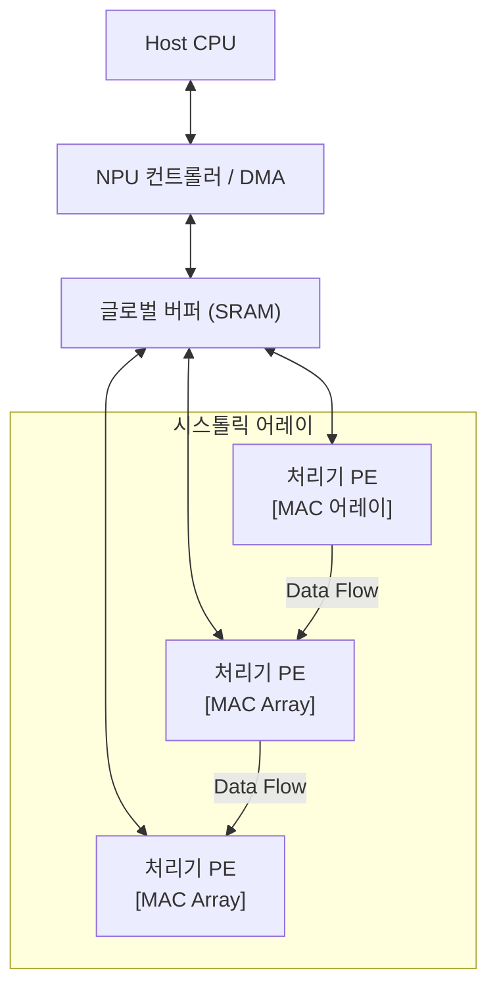

# [[NPU]]

---

## I. 인공지능 연간 가속을 위한 전용프로세서, [[NPU]]의 개요

### 가. 정의 및 특징

- **정의**: 인공지능의 학습 및 추론에 필요한 대규모 병렬 연산을 저전력, 고속으로 처리하기 위한 AI 전용 프로세서
- **특징**
  - 대규모 MAC 연산기 집적
  - Systolic Array 기반
  - 전성비 극대화
  - Edge 환경 사용

---

## II. [NPU]의 아키텍처 및 핵심 기술요소

### 가. NPU의 동작 원리 및 아키텍처 개념도

- MAC은 곱셈 후 누산을 하드웨어저그올 동시에 수행

### 나. NPU 핵심 구성요소

| 구분       | 기술                   | 특징                   |
| :--------- | :--------------------- | :--------------------- |
| 연산 구조  | - MAC 유닛             | - 곱셈 후 누산         |
| 연산 구조  | - 시스톨릭 어레이      | - 2차원 격자 형태 배열 |
| 메모리     | - 대용량 SRAM          | - 효율적 메모리 활용   |
| 제어조직   | - 데이터 플로우 최적화 | - 이동최소화           |
| 데이터     | - 경량화/양자화        | - 연산속도 향상        |
| 네트워크   | - NoC                  | - Network on Chip      |
| 인터페이스 | - CXL/PCIE 연결        | - 대역폭 확보          |

- GPU 대비 연산 효율성이 높아 [[EDGE]]에 사용

---

## III. NPU와 [[GPU]] 비교

| 비교 항목     | [NPU              | [GPU]          |
| :-------- | :---------------- | :------------- |
| **주요 목적** | AI 연산 전용          | 그래픽 및 병렬연산     |
| **아키텍처**  | 대규모 MAC, 시스톨릭 어레이 | 수천개의 단순코어      |
| **유연성**   | 유연성 낮음            | 유연성 높음         |
| **전력효율**  | 매우 높음             | 보통             |
| **적용**    | On Device AI 추론   | 그래픽 렌더링, AI 학습 |

- On Device AI 및 AI PC 확산에 따른 NPU 수요 증가
- [[PIM]](Process in Memory) 아키텍처로 진화
