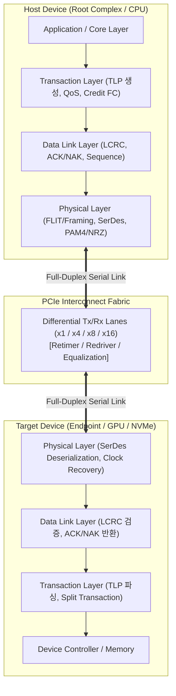

# PCIe (Peripheral Component Interconnect Express)

## I. 점대점(Point-to-Point) 직렬 고속 인터커넥트, PCIe의 개요

- **정의**: 컴퓨팅 시스템 내 CPU, [[GPU]], NVMe SSD 등 주요 고성능 주변장치를 **직렬(Serial) 차동 신호 방식**으로 점대점 연결하여 고대역폭·초저지연 데이터 통신을 제공하는 3계층 구조의 표준 인터커넥트 기술
    
      
    
- **등장배경 및 특징**:
    
      
    - **공유 병렬 버스(PCI/PCI-X) 한계 극복**: 클록 스큐(Skew) 및 대역폭 병목 해소를 위한 전이중(Full-Duplex) 직렬 통신 전환
        
          
        
    - 레인(Lane) 기반# PCIe
        
          
        

## I. 고속 직렬 점대점 인터커넥트, PCIe(Peripheral Component Interconnect Express)의 개요

- **정의**: CPU, GPU, 스토리지 및 AI 가속기 간 고속 데이터 전송을 위해 점대점([[Point-to-Point]]) 직렬 통신과 계층형 [[프로토콜]]을 채택한 표준 확장 버스 인터페이스
    
      
    
- **등장 배경**:
    
      
    - 기존 병렬 버스(PCI/PCI-X)의 클록 스큐(Clock Skew) 및 물리적 대역폭 확장 한계 극복
        
          
        
    - NVMe SSD, 대규모 LLM 학습용 GPGPU 가속기 등 초고대역폭 및 저지연 인터커넥트 요구 증대
        
          
        
- **핵심 특징**: 점대점(Point-to-Point) 전이중(Full-Duplex) 통신, 패킷 기반 3계층 아키텍처, 레인(Lane, x1~x16) 확장성, 하위 호환성(Backward Compatibility)
    
      
    

## II. PCIe의 아키텍처 및 핵심 기술 요소

### 가. PCIe의 계층 아키텍처 및 데이터 전송 메커니즘

- 송신 측 계층별 헤더·LCRC 패킹(Encapsulation) $\rightarrow$ 직렬화(SerDes) 및 차동 신호 전송 $\rightarrow$ 수신 측 역패킹 및 CRC/재전송 무결성 검증 구조
    
      
    

### 나. PCIe의 핵심 기술 요소

|**구분**|**핵심 기술(키워드)**|**세부 설명**|
|---|---|---|
|**계층 구조**|Transaction Layer|분할 [[트랜잭션]](Split Transaction), 크레딧 기반 흐름 제어(Credit-based Flow Control), TLP 패킷 생성|
|**계층 구조**|Data Link Layer|DLLP 패킷 관리, LCRC(Link CRC-32) 무결성 검증, ACK/NAK 기반 손실 패킷 재전송 메커니즘|
|**계층 구조**|Physical Layer|SerDes 기반 병렬-직렬 변환, 차동 신호(Differential Signaling), 클록 데이터 복원(CDR)|
|**신호 변조**|PAM4 (Gen 6/7)|4단계 전압 준위를 통해 심볼당 2비트를 전송하는 펄스 진폭 변조 방식 (NRZ 대비 대역폭 2배)|
|**오류 정정**|Low-Latency FEC|PAM4 도입에 따른 신호 노이즈(SNR 저하)를 보정하기 위해 Data Link 계층과 연계된 저지연 전방오류정정|
|**전송 단위**|FLIT (Flow Control Unit)|256 Byte 고정 크기 전송 블록 도입, 패킷 헤더·FEC·CRC를 통합하여 프로토콜 오버헤드 최소화|
|**신호 보정**|Equalization / Retimer|고주파 채널 삽입 손실(Insertion Loss) 보전을 위한 CTLE/DFE 이퀄라이저 및 신호 재생 Retimer 칩셋|
|**버스 토폴로지**|Root Complex & Switch|I/O 트래픽 계층 트리 구성, 가상 채널(VC) 및 트래픽 클래스(TC) 기반의 패킷 우선순위 QoS 제공|

## III. PCIe 세대별 진화 비교 및 차세대 활용 전망

### 가. PCIe 세대별 기술 규격 비교

|**비교 항목**|**PCIe 4.0**|**PCIe 5.0**|**PCIe 6.0**|**PCIe 7.0**|
|---|---|---|---|---|
|**전송 속도 (Raw Rate)**|16.0 GT/s|32.0 GT/s|64.0 GT/s|128.0 GT/s|
|**대역폭 (x16 양방향)**|64 GB/s|128 GB/s|256 GB/s|512 GB/s|
|**신호 변조 방식**|NRZ (2-Level)|NRZ (2-Level)|PAM4 (4-Level)|PAM4 (4-Level)|
|**인코딩 / 프레이밍**|128b/130b|128b/130b|FLIT Mode (1b/1b)|FLIT Mode (1b/1b)|
|**오류 정정 (FEC)**|미적용 (CRC 기반)|미적용 (CRC 기반)|Low-Latency FEC + CRC|Low-Latency FEC + CRC|
|**주요 적용 분야**|범용 SSD, GPU|클라우드 서버, AI 가속기|초거대 AI 클러스터|800G/1.6T 차세대 데이터센터|

### 나. 향후 전망 및 기술적 시사점

- **[[CXL]](Compute Express Link) 기반 확장**: PCIe 5.0/6.0 물리 계층을 공유하여 이종 프로세서(CPU-GPU-[[NPU]]) 간 캐시 일관성(Cache Coherency) 및 메모리 풀링(Memory Pooling) 구현
    
      
    
- **광학 인터커넥트(Optical PCIe) 전환**: PCIe 7.0 이상 고주파 대역에서 구리선(Copper)의 물리적 감쇄 한계를 극복하기 위해 실리콘 포토닉스(CPO, Co-Packaged Optics) 연계 필수화