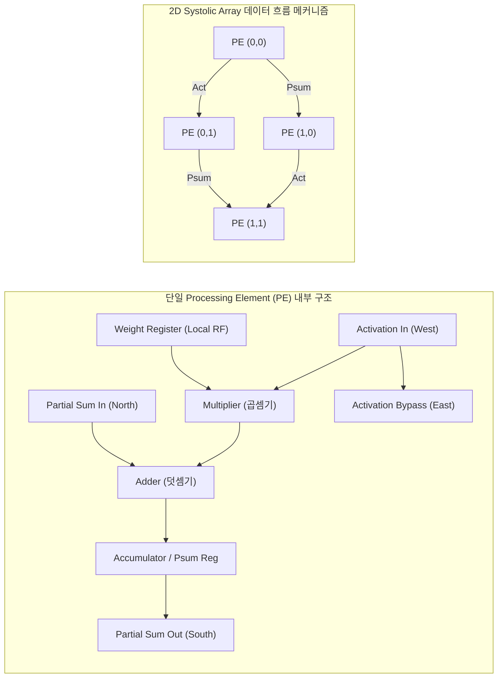

# PE(Processing Element)
## I. NPU 병렬 연산의 최소 단위, PE(Processing Element)의 개요
- 정의: [[NPU]] 내에서 [[딥러닝]] 텐서 연산을 초고속·저전력으로 수행하기 위해 MAC 연산기, 로컬 레지스터, 데이터 전송 인터페이스로 구성된 최소 하드웨어 연산 유닛.
- 특징: 메모리 벽 극복, 도메인 특화 아키텍처([[DSA]]), 공간적 데이터 흐름(Spatial Architecture)
## II. PE의 아키텍처 및 핵심 기술 요소
### 가. PE의 내부 아키텍처 및 2D Systolic Array 동작 원리

- 인접 PE로 전송되는 파이프라인 구조.
### 나. PE의 핵심 기술 및 구성 요소

| **구분**     | **핵심 기술(키워드)**               | **기술 설명 및 세부 특징**               |
| ---------- | ---------------------------- | ------------------------------- |
| **연산 유닛**  | **MAC Unit**                 | 곱셈 및 누산을 처리하는 핵심 연산 블록          |
| **연산 유닛**  | **Mixed-Precision ALU**      | 모델 경량화 및 고효율 처리를 위한 가변 정밀도 지원   |
| **저장 버퍼**  | **Local Register File (RF)** | 글로벌 메모리 접근 최소화                  |
| **저장 버퍼**  | **Double Buffering**         | 연산과 데이터 로드/스토어를 오버랩하여 대기 사이클 제거 |
| **데이터 흐름** | **Weight Stationary (WS)**   | 로드 전력 절감                        |
| **데이터 흐름** | **Output Stationary (OS)**   | 누산 버스 트래픽 최소화                   |
| **데이터 흐름** | **Row Stationary (RS)**      | 에너지 효율 극대화                      |
| **효율화 기법** | **Zero-skipping Logic**      | 연산 및 메모리 접근을 스킵                 |
| **효율화 기법** | **Clock/Power Gating**       | 정적/동적 전력 소모 억제                  |

## III. PE 기반 NPU vs GPU 연산 코어 비교 및 향후 전망

| **비교 항목**    | **NPU Processing Element (PE)**                 | **[[GPU]] CUDA Core (Streaming Processor)**         |
| ------------ | ----------------------------------------------- | ----------------------------------------------- |
| **연산 제어 구조** | SIMD/Systolic 기반 고정 데이터플로우, 극소화된 제어 로직          | SIMT 기반 독립적 [[CPU Scheduling|스케줄링]], Warp Scheduler 및 Branch 유닛 포함 |
| **메모리 의존도**  | PE 간 직접 전송(Data Reuse)으로 레지스터/캐시 의존도 극소화        | 레지스터 파일 및 공유 메모리(Shared Memory) 의존도 높음          |
| **최적화 대상**   | Dense/Sparse Matrix Multiplication (GEMM, Conv) | 범용 그래픽 렌더링, 병렬 수치 해석 및 딥러닝 연산                   |
| **전력 효율성**   | 매우 높음 (수~수십 TOPS/W, Domain-Specific 특화)         | 중간 (범용 파이프라인 및 복잡한 제어로 전력 소모 상대적 높음)            |
- [[PIM]]/PNM 연계 융합, 초저정밀도 및 미세 스케일링(Microscaling)