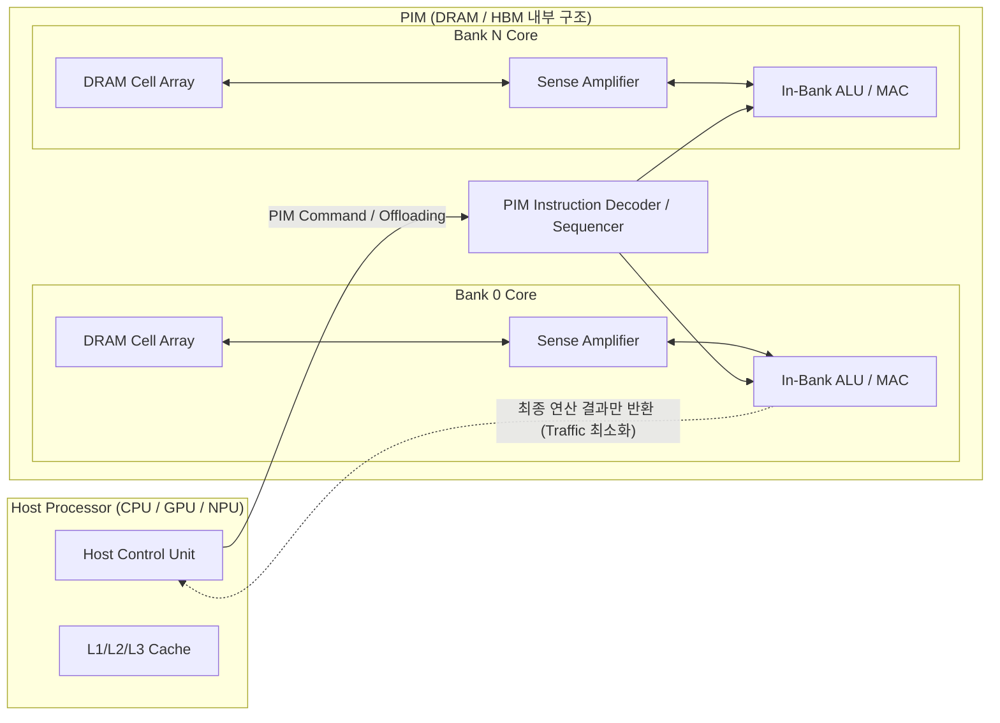

## I. 메모리 병목 및 전력 한계 극복, PIM(Processing-In-Memory)의 개요
- 정의: 폰 노이만 구조의 메모리 벽(Memory Wall)을 극복하기 위해 메모리 내부(DRAM Bank, Cell Array)에 연산기(ALU/MAC)를 직접 집적하여, 데이터 이동 없이 메모리 내부에서 연산을 수행하는 지능형 융합 반도체 기술.
- 폰 노이만 병목 해소, 에너지 소비 및 발열 절감, Memory-Bound 워크로드 가속

---
## II. PIM의 아키텍처 및 핵심 기술 요소
### 가. PIM의 개념도 및 데이터 처리 동작 원리

- **동작 원리**: Host가 PIM 제어 명령(Custom Command)을 전달하면, 메모리 내부의 뱅크별 연산 유닛(In-Bank ALU)이 내부 로컬 버스를 통해 셀 데이터를 직접 인출하여 병렬(Bank-level Parallelism) 연산(GEMV, Element-wise)을 수행하고 최종 결괏값만 Host로 반환.
### 나. PIM의 핵심 기술 및 구성 요소

  

| **구분**       | **요소기술(키워드)**                | **세부 설명 및 특징**                                               |
| ------------ | ---------------------------- | ------------------------------------------------------------ |
| **연산 코어**    | **In-Bank ALU / MAC**        | DRAM 뱅크마다 1:1 또는 1:N으로 내장되는 FP16/BF16/INT8 고속 산술 연산 장치   |
| **연산 코어**    | **SIMD Engine**          | 벡터 데이터 및 텐서 행렬-벡터 곱셈(GEMV)을 단일 사이클로 처리하는 병렬 유닛               |
| **제어/명령**    | **PIM Sequencer**            | Host 표준 커맨드(JEDEC) 사이에 PIM 연산 명령을 디코딩하여 내부 파이프라인 제어          |
| **제어/명령**    | **Instruction Buffer & SFR** | PIM 전용 연산 매크로 명령 및 가중치/상태 레지스터(Special Function Register) 저장 |
| **도메인 분류**   | **Digital PIM**              | Sense-Amp 후단 디지털 신호 기반 연산, 공정 수율 및 신뢰성 우수 (예: [[HBM]]-PIM, AiM)  |
| **도메인 분류**   | **Analog PIM**               | Sense-Amp 전단 크로스바(Crossbar) 어레이에서 옴·키르히호프 법칙 기반 초저전력 연산      |
| **인터커넥트**    | **TSV / Local Bus**          | HBM Core Die 적층 구조 내 수직 전송 채널(TSV) 및 뱅크 간 고속 내부 전송 경로        |
| **소프트웨어 스택** | **PIM Compiler / Framework** | PyTorch, TensorFlow 모델의 연산 그래프 중 메모리 바운드 연산을 자동 분할·오프로딩      |
| **표준화/확장**   | **JEDEC PIM / [[CXL]] 연동**       | 표준 DRAM 타이밍 호환 규격 및 CXL(Compute Express Link) 기반 메모리 풀링 연계   |

---
## III. PIM vs PNM 비교 및 향후 전망

| **비교 항목**     | **PIM (Processing-In-Memory)**             | **PNM (Processing-Near-Memory)**             |
| ------------- | ------------------------------------------ | -------------------------------------------- |
| **연산 위치**     | 메모리 셀 어레이 내부 (In-DRAM / In-Bank)           | 메모리 인터페이스/컨트롤러 인접 (Base Die, CXL Controller) |
| **데이터 대역폭**   | 내부 극대화 대역폭 활용 (극초고속)                       | 버스 대역폭 대비 고속 (PIM 대비 중간 수준)                  |
| **설계/공정 난이도** | 높음 (DRAM 미세공정과 로직 공정 융합 한계)                | 보통 (기존 표준 DRAM 재사용 및 로직 다이 분리 설계)            |
| **적용 사례**     | Samsung HBM-PIM, Aquabolt-XL, SK Hynix AiM | Samsung CXL-PNM, HBM Base Die Processing     |
