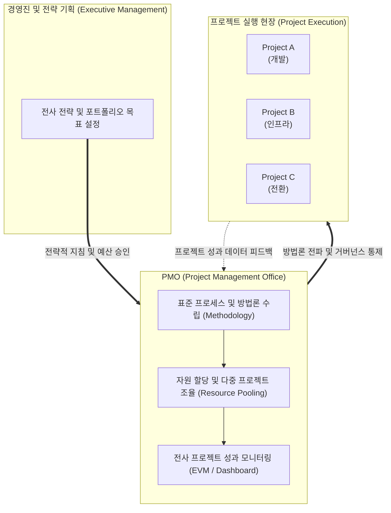

# PMO (Project Management Office, 프로젝트 관리 사무국)

---

## I. 전사적 프로젝트 관리 역량 제고를 위한 거버넌스 조직, PMO의 개요

* **정의**: 조직 내에서 프로젝트 관리 표준을 수립하고, 다수의 프로젝트를 통합적으로 관리·조율하며, 프로젝트 관리자(PM)의 역량 강화 및 거버넌스를 총괄하는 전사적 전문 조직(Organization)
* **배경 및 필요성**:
* 개별 프로젝트 중심 관리의 한계 극복: 다수의 프로젝트가 동시다발적으로 진행될 때 자원 충돌, 예산 낭비, 중복 투자 발생 방지
* 전략적 목표와 실행의 연계: 조직의 비즈니스 전략과 개별 프로젝트 성과를 일치시키고(Portfolio Alignment), 전사 차원의 프로젝트 성공률 제고

* **특징**: 프로젝트의 성격과 조직의 성숙도에 따라 단순 지원형부터 전사 의사결정 통제형까지 다양한 형태로 진화하며, 기업의 [[프로세스]] 성숙도(OPM3, [[CMMI]] 등)를 견인함

---

## II. PMO의 아키텍처 및 유형별 핵심 역할

### 가. PMO의 전사적 위치 및 거버넌스 구조 개념도

* PMO는 경영진의 전략적 방향을 받아 전사 프로젝트 표준과 자원을 통제하며, 각 현장 프로젝트의 실행 결과를 모니터링하여 경영진에 투명하게 보고함.

### 나. PMO의 3가지 진화 유형 (Garland 모델 기준)

| 분류 | PMO 유형 (Type) | 권한 및 역할 수준 | 주요 특징 및 기능 |
| --- | --- | --- | --- |
| **1. 지원형** | Supportive PMO | **낮음 (자문 및 가이드 제공)** | 모범 사례(Best Practice), 템플릿, 교육 등을 제공하는 일종의 컨설팅 및 자원 센터 역할 |
| **2. 통제형** | Controlling PMO | **중간 (규정 준수 강제)** | 특정 방법론 준수를 요구하고, 거버넌스 프레임워크나 템플릿 사용을 감시하며 감사(Audit) 수행 |
| **3. 지시형** | Directive PMO | **높음 (직접 프로젝트 관리)** | PMO가 직접 프로젝트를 소유하고 관리자를 파견하여 프로젝트 수행의 전권을 행사하고 통제 |

---

## III. PMO의 주요 기능 비교 및 현대적 발전 동향

### 가. PMO와 전통적 PM(Project Manager)의 역할 비교

| 비교 항목 | PM (Project Manager) | PMO (Project Management Office) |
| --- | --- | --- |
| **관리 대상** | **단일 프로젝트** (Single Project) | **전사적 다중 프로젝트 / 포트폴리오** (Multi-projects) |
| **핵심 목표** | 범위, 일정, 예산(Iron Triangle) 내에서 프로젝트 완수 | 전사 자원의 최적 배분, 프로젝트 성공률 향상, 조직 표준화 |
| **책임 범위** | 개별 프로젝트의 산출물 및 품질 책임 | 전사 프로젝트 포트폴리오의 ROI 및 전략적 정렬 책임 |
| **권한 성격** | 개별 프로젝트 팀에 대한 직접적인 지휘 및 통제 권한 | 전사 프로세스 수립, 자원 조율, 코칭 및 거버넌스 통제 권한 |

### 나. 한계 극복 및 현대적 발전 동향

* **애자일([[Agile]]) 조직과의 충돌 해소 및 VPMO 진화**: 과거의 통제형 PMO가 문서 작업(Documentation)을 강제하여 애자일 팀의 속도를 저해한다는 비판을 받았으나, 최근에는 가치(Value) 중심의 린([[린 방법론|Lean]]) 거버넌스를 지원하고, 장애 요소를 제거해 주는 **가치 지향형 PMO(Value PMO)** 또는 **Agile PMO**로 진화하고 있음.
* **AI 기반 예방적 프로젝트 거버넌스**: 과거의 사후 보고서 중심 모니터링에서 벗어나, AI/ML 기반의 프로젝트 관리 도구를 도입하여 일정 지연 리스크, 예산 초과 징후, 리소스 병목 현상을 실시간 예측하고 선제적 시정 조치를 제안하는 **[[디지털 전환]](DT) 기반 지능형 PMO** 구축이 가속화되고 있음.

---

### 🔗 연관 토픽

- **소속 도메인**: [[00_프로젝트관리_MOC|📋 프로젝트관리]]
- **세부 분류**: `1. PMBOK 표준 & 프로젝트 거버넌스`
- **핵심 연관 토픽**:
  - [[PMBOK 프로세스 그룹 (5단계)]]
  - [[린 방법론|린 (Lean) 방법론]]
  - [[디지털 전환|디지털 전환(DX)]]
  - [[CMMI]]
  - [[Agile]]
