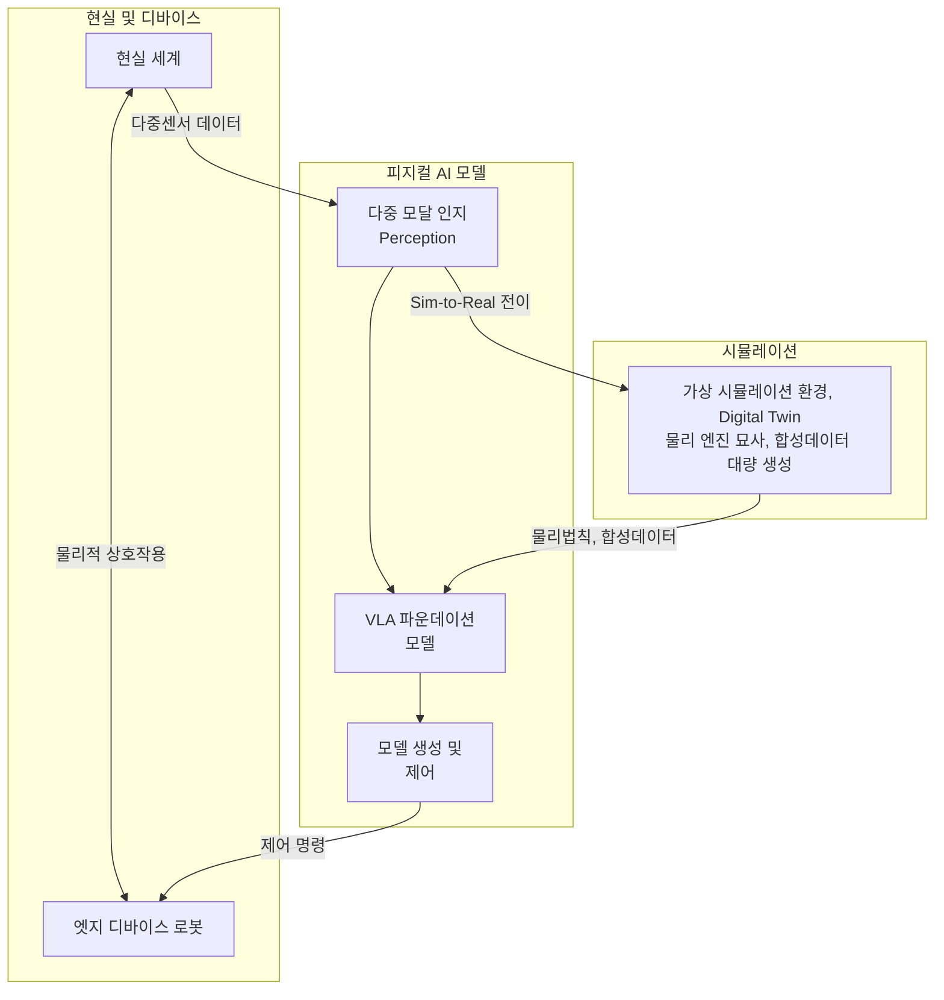

# Physical AI

## I. 현실 세계와 상호작용하는 지능형 시스템, 피지컬 AI 개요

| 구분     | 내용                                                               |
| :----- | :--------------------------------------------------------------- |
| **정의** | 현실 세계의 물리법칙을 이해하고, 하드웨어를 통해 스스로 인지·추론·행동하며 물리적 작업을 수행하는 [[인공지능]] 시스템 |
| **특징** | - Vision-Language-Action 기반 - Sim to Real 의 중요성 - 체화된 지능      |

---

## II. 피지컬 AI의 아키텍처 및 핵심 기술요소

### 가. 피지컬 AI의 동작원리 및 아키텍처

- 다중 센서로 환경을 인지하고, VLA 모델을 통해 상황추론 및 계획하며, 액추에이터를 통한 행동수행

### 나. 피지컬 AI의 핵심 기술요소

| 구분                | 기술             | 특징              |
| :---------------- | :------------- | :-------------- |
| **인지, 추론**        | - VLA 파운데이션 모델 | - 시각, 언어, 행동 특화 |
| **인지, 추론**        | - 공간지능         | - 3D공간 이해도 향상   |
| **인지, 추론**        | - 멀티 모달 센서 퓨전  | - 정밀한 주변환경 인식   |
| **학습 및 시뮬레이션** | - Sim to Real  | - 현실 세계 적용기술    |
| **학습 및 시뮬레이션** | - 물리 기반 시뮬레이터  | - 물리법칙 가상훈련     |
| **학습 및 시뮬레이션** | - 합성데이터        | - 시뮬레이터에서 학습    |
| **행동 및 제어**       | - 전신 제어 알고리즘   | - 역동학 연산 동시처리   |
| **행동 및 제어**       | - 엣지 AI        | - 온디바이스 추론환경    |

- 센서와 행동제어 값을 통한 시뮬레이션 수행

---

## III. 피지컬 AI와 기존 생성형 AI 비교

### 가. 기존 생성형 AI와의 비교

| 항목 | 기존 생성형 AI | 피지컬 AI |
| :--- | :--- | :--- |
| **목적** | 정보생성, 답변제공 | 현실세계 상호작용 |
| **입출력** | 텍스트, 이미지 | 센서, 프롬프트, 행동제어 |
| **주도모델** | LLM | VLA, RFM |
| **학습데이터**| 인터넷 크롤링 데이터 | 시뮬레이션 학습데이터 |

### 나. 향후 전망 및 고려사항
- 범용 휴머노이드 로봇시대 도래, 물리적 안전성 확보 필수
