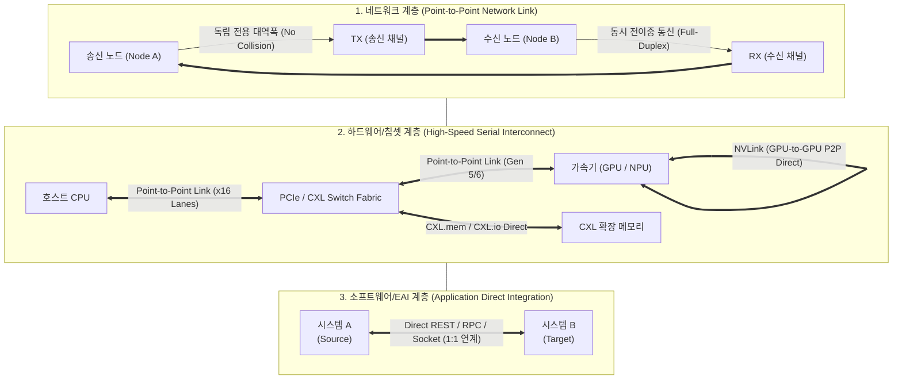

# Point-to-Point

## I. 독립된 전용 통로 기반 1:1 직접 연결, Point-to-Point의 개요

- **정의**: 두 개의 통신 노드 또는 시스템 단말 간에 중간 공유 매체 없이 단일 링크로 데이터를 송수신하는 1:1 직접 연결 통신 및 인터커넥트 방식
- **특징**: 대역폭 경합 및 충돌(Collision) 해결, 전이중(Full-Duplex) 고속 전송, 전용 대역폭 독점, 보안성 및 무결성 우수, 연결 노드 증가 시 회선 복잡도($\frac{n(n-1)}{2}$) 증가 
---
## II. Point-to-Point의 개념도 및 핵심 기술 요소
### 가. Point-to-Point의 연결 구성도 및 동작 메커니즘

- 송수신 단말 간 전용 링크를 설정하여 매체 접근 제어(MAC)의 경합 없이 전이중 고속 전송을 수행하며, 최근 단일 칩/가속기 인터커넥트([[PCIe]], NVLink, [[CXL]])로 확장 적용
### 나. Point-to-Point의 핵심 기술 및 구성 요소

| **구분**        | **핵심 기술(키워드)**                     | **세부 설명**                                                                  |
| ------------- | ---------------------------------- | -------------------------------------------------------------------------- |
| **[[네트워크 프로토콜]]** | **PPP (Point-to-Point Protocol)**  | 데이터 링크 계층 1:1 직렬 링크 표준, LCP(링크 제어) 및 NCP(네트워크 제어) 기반 캡슐화·인증 지원             |
| **네트워크 [[프로토콜]]** | **HDLC (High-Level Data Link)**    | 비트 지향 동기식 전송 제어 프로토콜, 슬라이딩 윈도우 기반 오류 제어 및 전이중 점대점 통신 제공                    |
| **물리/전송 링크**  | **전용회선 (Leased Line)**             | T1/E1, 광선로 기반 엔드포인트 간 고정 대역폭 독점 할당, QoS 보장 및 도청 차단                         |
| **시스템 인터커넥트** | **[[PCIe]] (PCI Express)**         | 공유 버스를 대체한 패킷 기반 직렬 점대점 인터커넥트, 레인(Lane) 단위 스케일링(x1~x16) 및 초저지연 전송          |
| **시스템 인터커넥트** | **[[CXL]] (Compute Express Link)** | PCIe 물리 계층 기반의 점대점 캐시 일관성(Cache Coherency) 및 메모리 풀링 프로토콜(CXL.io/cache/mem) |
| **가속기 인터커넥트** | **NVLink / P2P DMA**               | [[GPU]] 간 호스트 CPU 메모리를 경유하지 않고 직접 데이터를 복사·통신하는 초고대역폭(1.8TB/s) 점대점 패브릭          |
| **소프트웨어 통합**  | **P2P 연계 (Direct Integration)**    | 미들웨어([[EAI]]/ESB) 없이 소스-타깃 시스템 간 1:1 직접 API/소켓/DB 링크 연결 방식                     |
| **차세대 보안/양자** | **QKD 점대점 링크 (BB84)**              | 송수신자(Alice-Bob) 간 단일 광자 채널 및 고전 채널을 1:1 직접 연결하여 무조건적 안전성의 비밀키 분배           |

## III. Point-to-Point vs Multi-Point(공유 버스) 비교 및 발전 전망

### 가. Point-to-Point vs Multi-Point(Shared/Multipoint) 방식 비교

|**비교 항목**|**Point-to-Point (점대점)**|**Multi-Point (다중점 / 공유 버스)**|
|---|---|---|
|**연결 구조**|2개 노드 간 1:1 독립 전용선|1개 공유 매체에 다수 노드 1:N 연결|
|**대역폭 할당**|채널 대역폭 100% 독점 사용|전체 노드가 공용 대역폭 시분할 공유|
|**매체 접근 제어**|불필요 (경합/충돌 없음, No Contention)|필수 (CSMA/CD, Token, Polling/Selecting 제어)|
|**전송 지연 (Latency)**|매우 낮고 일정 (Deterministic)|트래픽 증가 시 충돌/재전송으로 지연 급증|
|**회선 비용 및 복잡도**|노드 증가 시 비용 및 포트 수 급증($O(N^2)$)|케이블 및 인터페이스 비용 절감($O(N)$)|
|**장애 영향도**|특정 링크 장애 시 해당 구간만 단절|공유 버스/케이블 단절 시 전체 네트워크 마비|
|**현대 기술 적용**|PCIe 6.0/7.0, NVLink, CXL, 전용선|레거시 이더넷(동축), I2C, CAN Bus|

### 나. Point-to-Point 아키텍처의 발전 전망

- **컴퓨팅 버스 패러다임의 완전 전환**: 과거 병렬 공유 버스(PCI, FSB)의 신호 왜곡(Skew) 문제를 점대점 고속 차동 신호(Differential Signaling) 인터커넥트(PCIe, CXL, NVLink)가 완전히 대체
    
      
    
- **[[스위치]] 패브릭 기반의 스케일아웃 진화**: 점대점 연결의 $O(N^2)$ 복잡도 한계를 극복하기 위해 점대점 링크 다수를 고속 패킷 스위치(PCIe Switch, NVSwitch)로 메시(Mesh)/크로스바 토폴로지화하는 가속기 클러스터 아키텍처 표준화