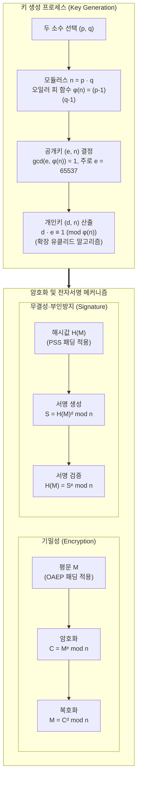

# RSA (Rivest-Shamir-Adleman)

## I. 소인수분해 난해성 기반 공개키 암호, RSA의 개요

- **정의**: 두 개의 큰 소수의 곱($n = p \cdot q$)을 구하기는 쉬우나, 합성수를 소인수분해하기는 극도로 어렵다는 소인수분해 난해성(Integer Factorization Problem, IFP)에 기반한 비대칭키(공개키) [[암호 알고리즘]]
    
      
    
- **등장 배경 및 특징**:
    
      
    - **대칭키 분배 병목 극복**: 키 사전 공유 없이 공개키$(e, n)$와 개인키$(d, n)$ 쌍을 분리하여 안전한 키 교환 및 기밀성 보장
        
          
        
    - **전자서명 및 부인방지 지원**: 공개키 연산과 개인키 연산의 수학적 가역성을 활용하여 기밀성([[암호화]])과 인증·무결성·부인방지(전자서명) 동시 제공
        
          
        
    - **글로벌 PKI 인프라 표준**: PKCS #1, X.509 인증서, [[TLS]] 핸드셰이크의 근간으로 전 세계 전자상거래 및 인증 체계 확립
        
          
        

## II. RSA의 아키텍처 및 핵심 기술 요소

### 가. RSA의 메커니즘 및 암호화·서명 아키텍처

- 공개키 $(e, n)$을 이용해 $C \equiv M^e \pmod n$으로 암호화하고, 개인키 $(d, n)$을 이용해 $M \equiv C^d \pmod n$으로 복호화하는 오일러 정리($M^{e \cdot d} \equiv M \pmod n$) 기반 단방향 트랩도어 함수 구조
    
      
    

### 나. RSA의 핵심 기술 요소

|**구분**|**요소기술(키워드)**|**세부 설명**|
|---|---|---|
|**수학적 난제**|**소인수분해 문제 (IFP)**|큰 합성수 $n$을 소인수 $p, q$로 분해하는 데 준지수 시간(Sub-exponential time, GNFS)이 소요되는 난해성|
|**수학 이론**|**Euler's Totient ($\phi(n)$)**|$\phi(n) = (p-1)(q-1)$, 법 $n$에 대해 서로소인 정수 개수 산출 및 군(Group)의 주기성 제공|
|**키 생성**|**확장 유클리드 알고리즘**|$e \cdot d \equiv 1 \pmod{\phi(n)}$을 만족하는 모듈러 곱셈 역원(개인키 $d$) 고속 산출|
|**연산 가속**|**Square-and-Multiply**|지수의 비트 단위 제곱 및 곱셈을 반복하여 $O(\log e)$ 복잡도로 처리하는 고속 모듈러 지수승 기법|
|**복호화 가속**|**CRT (중국인의 나머지 정리)**|$p, q$ 단위로 분할 연산($d_p, d_q$) 후 합성하여 개인키 복호화 및 서명 생성 속도를 약 4배 가속|
|**암호 패딩**|**RSA-OAEP (PKCS #1 v2.1)**|비대칭 암호 최적 패딩, Feistel 난수화를 결합하여 선택 암호문 공격(IND-CCA2) 및 Bleichenbacher 공격 방어|
|**서명 패딩**|**RSA-PSS**|확률적 서명 체계(Probabilistic Signature Scheme), 솔트(Salt) 난수화로 서명 위조 및 충돌 공격 원천 차단|
|**부채널 방어**|**Cryptographic Blinding**|복호화·서명 연산 전 난수 $r$을 곱해 마스킹($C \cdot r^e \pmod n$)하여 타이밍 및 전력 분석(DPA) 공격 방어|

## III. RSA vs ECC 비교 및 향후 전망

### 가. RSA와 ECC 기술 비교

|**비교 항목**|**RSA (Rivest-Shamir-Adleman)**|**[[ECC]] (Elliptic Curve Cryptography)**|
|---|---|---|
|**수학적 난제**|큰 합성수의 **소인수분해 문제 (IFP)**|유한체 상의 **타원곡선 이산대수 문제 (ECDLP)**|
|**키 길이 (128-bit 보안 기준)**|**3072 bit** (보안 강도 증가 시 키 크기 급증)|**256 bit** (적은 비트 수로 동일 보안성 제공)|
|**연산 및 처리 특성**|공개키 연산(암호화/검증)은 빠르나, 개인키 연산 무거움|암·복호화, 서명, 키 생성이 전반적으로 균일하게 고속|
|**자원 점유율**|대용량 인증서 및 통신 패킷 대역폭 오버헤드 큼|메모리·대역폭·저장공간 최소화 (IoT/임베디드 최적)|
|**주요 적용 분야**|레거시 PKI, X.509 인증서, 웹 보안 인프라|TLS 1.3, [[블록체인]] 서명, 모바일 기기, USIM/HSM|

### 나. 향후 전망 및 기술적 시사점

- **양자 컴퓨팅 위협(Shor 알고리즘)**: 대규모 큐비트 양자 컴퓨터 등장 시 쇼어(Shor) 알고리즘에 의해 다항 시간($O((\log n)^3)$) 내 소인수분해가 완료되어 RSA 암호 체계 전면 붕괴 위험 상존
    
      
    
- **PQC([[양자내성암호]]) 하이브리드 마이그레이션**: NIST 표준화 격자 기반 암호(ML-KEM, ML-[[DSA]])와 기존 RSA를 결합한 **Composite Certificate(복합 인증서) 및 하이브리드 키 교환** 인프라로의 단계적 전환 필수