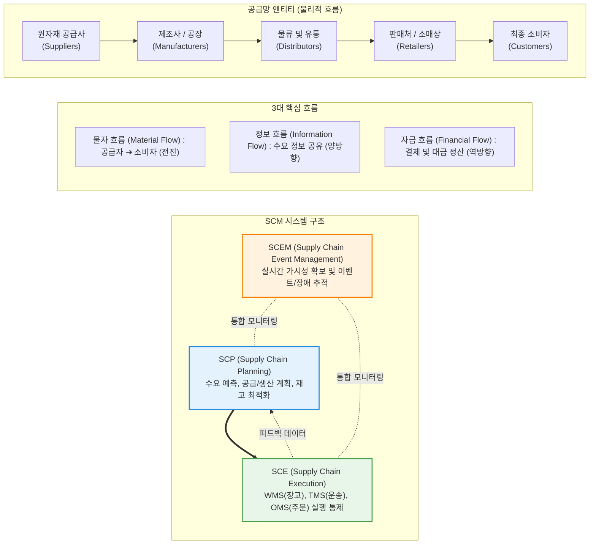

# SCM (Supply Chain Management, 공급망 관리)

---

## I. 가치사슬 전체의 흐름을 동기화하는 경영 패러다임, SCM의 개요

* **정의**: 원자재 조달에서부터 제품 생산, 유통, 물류를 거쳐 최종 고객에게 전달되기까지의 **전체 공급망(Supply Chain) 프로세스를 하나의 통합된 사슬로 보고, 정보·물자·자금의 흐름을 총체적으로 계획하고 실행·통제하는 전략적 경영 관리 기법**
* **등장 배경 및 필요성**:
* 기업 간 경쟁이 '개별 기업 대 개별 기업'의 대결에서 '공급망 생태계 대 공급망 생태계'의 경쟁으로 진화함
* 정보 왜곡으로 인해 상류로 갈수록 주문 변동 폭이 기하급수적으로 폭증하는 채찍 효과(Bullwhip Effect)를 해소하고, 리드 타임(Lead Time) 단축과 불필요한 재고 비용을 최소화할 전사적 통제 체계 요구 증대

* **핵심 목표**: 적시·적소·적량(Right Time, Right Place, Right Quantity) 공급을 통한 **재고 비용 최소화** 및 **고객 만족도 극대화**

---

## II. SCM의 아키텍처 및 핵심 구성요소

### 가. SCM의 3대 흐름과 SCP/SCE 아키텍처 개념도

### 나. SCM을 구성하는 2대 핵심 시스템 및 세부 기술 요소

|**분류**|**모듈/기능 (키워드)**|**세부 설명 및 역할**|
|---|---|---|
|**계획 계층**      **(SCP)**|**수요 계획 (Demand Planning)**|과거 판매 데이터, 시장 트렌드, 계절성 등을 분석하여 미래 수요를 정확히 예측|
|**계획 계층**      **(SCP)**|**공급/생산 계획 (Supply Planning)**|예측된 수요와 제약 조건(설비 용량, 자재 수급)을 기반으로 최적 생산 스케줄(APS) 및 원자재 발주 계획 수립|
|**실행 계층**      **(SCE)**|**WMS (Warehouse Mgmt System)**|창고 내 입고, 적재, 피킹(Picking), 패킹, 출고 및 로케이션 관리를 최적화하는 물류창고 관리 시스템|
|**실행 계층**      **(SCE)**|**TMS (Transportation Mgmt System)**|운송 수단(화물차 등) 배차, 최적 운송 경로(Route) 최적화, 화물 추적 및 정산을 담당하는 운송 관리 시스템|
|**실행 계층**      **(SCE)**|**OMS (Order Mgmt System)**|고객 주문의 접수부터 할당, 배송 처리 및 반품(역물류)까지 주문 라이프사이클을 통제하는 시스템|
|**협업 체계**|**VMI (Vendor Managed Inventory)**|공급자가 고객(유통사)의 재고 데이터를 직접 확인하고, 사전에 정한 재고 수준에 맞춰 스스로 재고를 보충해 주는 방식|
|**협업 체계**|**CPFR (협업 기획·예측·재고보충)**|제조사와 유통사가 단일화된 판매 예측 및 공급 계획을 사전에 공동으로 수립하여 공유하는 공급망 협업 모델|

---

## III. 공급망 병목 현상 및 차세대 SCM 발전 동향

### 가. 공급망의 대표적 병목 현상: 채찍 효과 (Bullwhip Effect)

* **현상**: 최종 소비자의 수요 변동은 미세(예: 5% 증가)함에도 불구하고, 이 정보가 소매상 $\rightarrow$ 도매상 $\rightarrow$ 제조사 $\rightarrow$ 원자재 공급사로 사슬의 상류(Upstream)로 전달될수록 각 단계별 안전재고 확보 심리로 인해 주문 변동 폭이 20%, 50%, 100%로 과도하게 증폭되는 왜곡 현상
* **주요 발생 원인 4가지 (Lee et al.)**:
1. **수요 예측의 다중 업데이트**: 각 단계마다 개별적으로 수요를 예측하고 안전재고를 덧붙임
2. **일괄 발주 (Batch Ordering)**: 운송비 절감을 위해 주기적으로 대량 주문
3. **가격 변동 (Price Fluctuation)**: 특별 할인 프로모션에 따른 사재기(Forward Buying)
4. **할당 게임 (Shortage Gaming)**: 물량 부족 조짐 시 실제 수요보다 부풀려 주문하는 현상

* **해결 방안**: POS(Point of Sale) 데이터 실시간 공유, 공급망 리드 타임 단축, VMI 및 CPFR 도입, 일관 가격제(EDLP) 시행

### 나. 현대 엔터프라이즈 SCM의 진화 동향

* **공급망 제어탑 (Control Tower)과 엔드투엔드(E2E) 가시성**: 글로벌 물류 대란, 지정학적 리스크(전쟁, 항만 파업 등) 발생 시 실시간으로 대안 운송 경로와 공급처를 시뮬레이션할 수 있는 클라우드 기반 '통합 관제 센터(Control Tower)' 구축이 필수로 자리 잡았습니다.
* **AI 기반 자율 공급망 (Autonomous Supply Chain)**: 머신러닝 알고리즘을 도입해 날씨, 거시경제 지표, 소셜 미디어 트렌드 등 외부 비정형 데이터를 실시간 수집하여 예측 정확도를 획기적으로 개선하고, 재발주 프로세스를 사람의 개입 없이 자동화하는 수준으로 진화했습니다.
* **블록체인과 [[RFID]]/IoT 기반 추적성(Traceability)**: 신선식품(콜드체인) 및 의약품 유통 시 위변조 방지와 온도 이탈을 감시하기 위해 스마트 센서와 [[블록체인]] 분산원장을 결합한 [[신뢰성]] 높은 공급망 추적 기술이 빠르게 보편화되고 있습니다.

---

### 🔗 연관 토픽

- **소속 도메인**: [[00_경영전략_MOC|📈 경영전략]]
- **세부 분류**: `1. 경영 환경 분석 & 전략 수립 프레임워크`
- **핵심 연관 토픽**:
  - [[RFID]]
  - [[ESG 경영]]
  - [[가치사슬|가치사슬(Value Chain)]]
  - [[신뢰성]]
  - [[블록체인|블록체인 (Block Chain)]]
