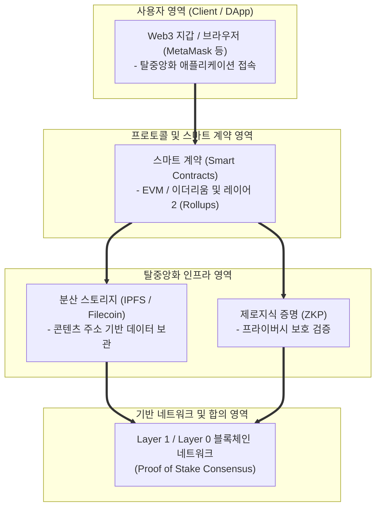

# Web 3.0

---

## I. 탈중앙화와 데이터 주권 보장을 위한 차세대 웹 패러다임, Web 3.0의 개요

* **정의**: [[블록체인]], 스마트 계약, [[암호화]] 기술 및 분산 원장을 기반으로 중앙집중형 플랫폼의 독점을 해소하고, 사용자가 자신의 데이터와 디지털 자산에 대한 완전한 소유권을 갖는 탈중앙화 웹 생태계
* 웹 2.0의 플랫폼 중앙화, 데이터 사유화 및 개인정보 침해 문제 극복, 신뢰 기반 분산 자치 조직(DAO) 구축 목적
* 특징: 데이터 소유권의 사용자 환원, 토큰 이코노미(Cryptoeconomics) 기반 인센티브, 시맨틱 웹 및 [[인공지능]](AI) 자율 연계

---

## II. Web 3.0의 아키텍처 및 핵심 기술 요소

### 가. Web 3.0의 계층별 아키텍처 및 동작 원리

* 사용자가 DApp과 웹3 지갑을 통해 요청을 보내면, 스마트 계약과 레이어 2 솔루션을 거쳐 분산 스토리지(IPFS)와 베이스 블록체인 인프라에서 신뢰 검증 및 데이터 처리가 이루어지는 구조

### 나. Web 3.0의 핵심 구성 요소 및 기술 요소

| 분류 | 요소기술(키워드) | 세부 설명 |
| --- | --- | --- |
| 확장성/합의 | 레이어 2 (ZK-Rollups / Optimistic) | 메인넷의 가스비 절감 및 [[트랜잭션]] 처리 속도를 극대화하는 확장 기술 |
| 분산 저장소 | IPFS / Filecoin | 중앙 서버 없이 콘텐츠 주소 기반으로 데이터를 영구 분산 저장하는 스토리지 |
| 신뢰 계약 | 스마트 계약 (Smart Contracts) | 블록체인 상에서 조건 충족 시 코드가 자동 실행되는 탈중앙화 계약 시스템 |
| 신원 증명 | DID 및 VC (Decentralized ID) | 중앙 기관 없이 개인이 직접 신원 정보를 통제하고 증명하는 인증 체계 |
| 보안/프라이버시 | 제로지식 증명 ([[영지식증명|ZKP]]) | 정보의 내용을 노출하지 않고 유효성만 수학적으로 증명하는 프라이버시 기술 |
| 거버넌스 | DAO (Decentralized Autonomous Org) | 토큰 기반 투표를 통해 중앙 관리자 없이 자율적으로 운영되는 조직 |
| 가치 교환 | 토크노믹스 (Tokenomics) | 네트워크 기여도에 따라 암호화폐 보상을 제공하는 생태계 인센티브 설계 |
| 최신 트렌드 | DePIN 및 AI 에이전트 연계 | 탈중앙화 물리 인프라(DePIN)와 AI 에이전트 간의 자율 경제 생태계 융합 |

---

## III. Web 1.0 vs Web 2.0 vs Web 3.0 비교 및 동향

| 비교 항목 | Web 1.0 (읽기 중심) | Web 2.0 (참여와 플랫폼) | Web 3.0 (소유와 탈중앙화) |
| --- | --- | --- | --- |
| **핵심 특성** | 정적 정보 제공 (Read-only) | 사용자 참여, 콘텐츠 생성 및 플랫폼 중심 (Read-Write) | 데이터 소유권 및 탈중앙화 (Read-Write-Own) |
| **데이터 통제권** | 웹사이트 관리자 / 소수 제작자 | 빅테크 중앙집중형 플랫폼 기업 | 사용자 본인 (Data Sovereignty) |
| **핵심 기술** | HTML, HTTP, 정적 웹페이지 | [[AJAX|Ajax]], API, [[클라우드 컴퓨팅]], SNS | Blockchain, Smart Contract, ZKP, AI |

* 초기 투기적 자산 중심의 한계를 넘어, 최근에는 실물 연계 자산(RWA), 탈중앙화 물리 인프라 네트워크(DePIN), 그리고 인공지능(AI) 에이전트가 블록체인 위에서 자율 거래를 수행하는 **에이전트 웹 3.0(Agentic Web 3.0)** 생태계로 고도화되는 중임

---

### 🔗 연관 토픽

- **소속 도메인**: [[00_디지털서비스_MOC|🚀 디지털서비스]]
- **세부 분류**: `2. 블록체인 & 분산원장 · Web3`
- **핵심 연관 토픽**:
  - [[블록체인|블록체인 (Block Chain)]]
  - [[NFT (Non Fungible Token)]]
  - [[Web 4.0, 5.0|Web 4.0 5.0]]
  - [[암호화|암호화 (Encryption)]]
  - [[영지식증명|영지식증명(Zero Knowledge Proof)]]
