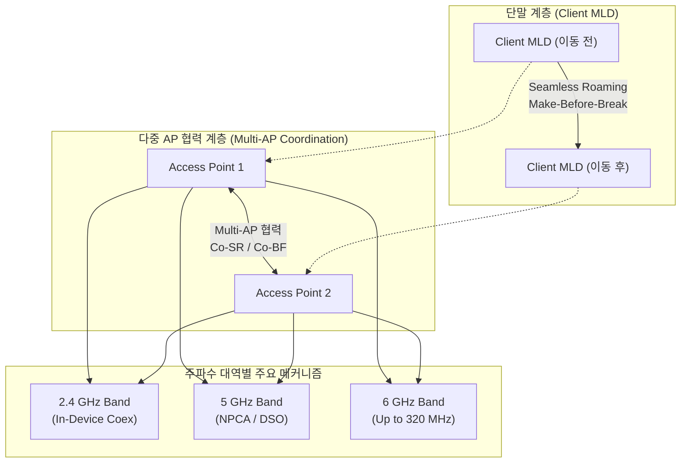

# Wi-Fi 8 (IEEE 802.11bn)
---

## I. 초고신뢰성 기반 차세대 무선랜, Wi-Fi 8 개요

| 구분 | 내용 |
| :--- | :--- |
| **정의** | Wi-Fi 7 대비 **초고밀도·간섭 환경**에서 **유선망 수준의 무선 신뢰성**과 **끊김 없는 로밍**을 보장하는 차세대 무선랜 표준 |
| **특징** | • **초고신뢰성 달성** (Ultra High Reliability) • **무중단 통신** (Make-Before-Break Seamless Roaming) • **다중 AP 협력** (Multi-AP Coordination) |

---

## II. Wi-Fi 8의 아키텍처 및 핵심 구성요소

### 가. Wi-Fi 8의 동작원리

> **핵심 메커니즘**: Multi-AP 협력 및 S-IMD(Single Radio MLD / Seamless Roaming)를 통한 무중단 통신 환경 구축

---
### 나. Wi-Fi 8의 핵심 기술요소

| 구분 | 기술명 | 주요 특징 및 기능 |
| :--- | :--- | :--- |
| **다중 AP 협력** *(Multi-AP)* | • **Co-SR** (Coordinated Spatial Reuse) • **Co-BF** (Coordinated Beamforming) | • 동일 채널 간섭 제어 및 동시 전송 최적화로 공간 재활용률 극대화 • 인접 AP 간 빔 형성 방향을 상호 조정하여 신호 간섭 최소화 |
| **로밍 이음성** *(Seamless)* | • **S-IMD / S-MLD** | • **Make-Before-Break** 기반 연결 단절 없는 무중단 핸드오버 환경 제공 |
| **전파도달 최적화** *(Coverage)* | • **DRU** (Distributed Resource Unit) • **ELR** (Enhanced Long Range) | • 업링크 도달 범위(Coverage) 확장 및 OFDMA 자원 효율화 • 셀 엣지(Edge) 영역에서의 통신 커버리지 및 수신 감도 성능 개선 |
| **주파수 운영** *(Spectrum)* | • **DSO** (Dynamic Subchannel Operation) • **NPCA** (Non-Primary Channel Access) | • 주파수 채널의 동적 서브채널 할당 및 스펙트럼 유연성 극대화 • 비주채널(Non-Primary)에 대한 유연한 접근 협력으로 지연시간 단축 |
| **기기 공존성** *(Coexistence)* | • **In-Device Coexistence** (IDC) | • 단말 내 다양한 무선 통신 모듈(Bluetooth, 셀룰러 등) 간 상호 간섭 최소화 |
| **물리계층** *(PHY Layer)* | • **New MCS / 4096 QAM** | • 채널 상태에 따른 적응형 전송 속도 향상 및 세분화된 변조 효율성 확보 |
> **요약**: Make-Before-Break 기반 무중단 로밍 환경을 제공하여 끊김 없는 실시간 데이터 처리 지원

---

## III. Wi-Fi 8의 유사 기술과의 비교 및 향후 전망

### 가. Wi-Fi 7 vs Wi-Fi 8 비교

| 비교 항목          | [[Wi-Fi 7]] (IEEE 802.11be)                 | Wi-Fi 8 (IEEE 802.11bn)                     |
| :------------- | :------------------------------------------ | :------------------------------------------ |
| **설계 핵심 목표**   | **EHT** (Extremely High Throughput, 초고속 전송) | **UHR** (Ultra High Reliability, 초고신뢰성)     |
| **주요 혁신 기능**   | 320MHz 초광대역 대역폭, 4096 QAM, 16x16 MIMO       | **다중 AP 협력 (Multi-AP Coordination)**, 지연 보장 |
| **로밍 및 AP 협력** | 제조사/벤더 종속적 (Proprietary 구현)                 | **표준화된 AP 협력** 및 표준 기반 Seamless Roaming     |
| **물리계층 기술**    | 4096 QAM, MLO (Multi-Link Operation)        | 4096 QAM, **DRU, ELR, Fine MCS** 적응 제어      |

#### 나. 향후 전망 및 도입 일정
- **산업 적용**: 미션 크리티컬(Mission-Critical) 산업용 스마트 팩토리, 원격 의료 및 실감형 XR(VR/AR) 인프라의 핵심 무선망으로 도약
- **표준화 일정**: **2027년 하반기** Wi-Fi Alliance 인증 프로그램 런칭 후, **2028년 최종 표준 인가(Approval)** 목표

---
**끝.**
