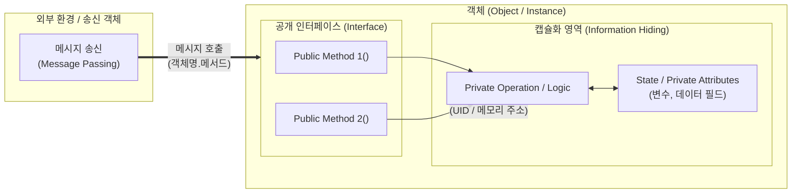

# 객체 (Object)

## I. 소프트웨어 모델링의 기본 단위, 객체(Object)의 개요

- **정의**: 현실 세계의 유·무형 개체(Entity)를 모델링하여 상태(State)와 행위(Behavior)를 하나로 캡슐화하고, 고유한 식별성(Identity)을 갖는 객체지향 프로그래밍(OOP)의 기본 실행 단위
- **등장 배경**: 구조적 프로그래밍의 데이터-함수 분리로 인한 유지보수성 저하 극복, 소프트웨어 재사용성 및 모듈화 극대화 요구
- **핵심 특징**: 상태(속성), 행위(메서드), 고유 식별자(Identity) 보유, 메시지 기반 상호작용

---
## II. 객체의 개념도 및 핵심 구성요소

### 가. 객체의 개념도 및 동작 원리

- 송신 객체가 메시지를 전송하면, 수신 객체는 공개 인터페이스(Method)를 통해 내부 로직을 수행하고 자신의 상태(Data)를 변경 및 반환함
### 나. 객체의 핵심 기술 및 구성요소

|**구분**|**요소기술(키워드)**|**세부 설명**|
|---|---|---|
|**핵심 3요소**|상태 (State)|객체가 보유한 속성값 및 데이터 필드, 시간 경과 및 행위에 따라 동적 변경|
|**핵심 3요소**|행위 (Behavior)|외부 요청(메시지)에 반응하여 상태를 조작하거나 작업을 수행하는 함수(Method)|
|**핵심 3요소**|식별성 (Identity)|상태값의 일치 여부와 무관하게 시스템 내에서 객체 자신을 구별하는 고유 식별자|
|**상호작용**|메시지 (Message)|객체 간 통신 수단, [수신객체, 메서드명, 매개변수] 형태로 전달되는 호출 메커니즘|
|**구조화 원리**|캡슐화 (Encapsulation)|데이터와 이를 처리하는 메서드를 하나의 단위로 결합하여 높은 응집도 보장|
|**구조화 원리**|정보 은닉 (Information Hiding)|내부 구현 세부사항(Private)을 감추고 외부에는 규격화된 인터페이스(Public)만 노출|
|**확장 메커니즘**|상속성 (Inheritance)|상위 클래스의 속성과 행위를 하위 객체가 물려받아 재정의 및 확장(Overriding)|
|**확장 메커니즘**|다형성 (Polymorphism)|동일한 메시지 호출에 대해 각 객체가 서로 다른 방식으로 처리(Overloading/Overriding)|

---
## III. 객체(Object) vs 클래스(Class) 비교 및 발전 동향
### 가. 객체(Object) vs 클래스(Class) 비교

| **비교 항목** | **객체 (Object)**                 | **클래스 (Class)**                       |
| --------- | ------------------------------- | ------------------------------------- |
| **개념 정의** | 클래스에 의해 실체화된 구체적 인스턴스(Instance) | 객체를 생성하기 위한 틀, 설계도, 추상 데이터 타입(ADT)    |
| **존재 공간** | 런타임 메모리(Heap 영역)에 상주하는 실체       | 컴파일 타임에 정의되는 코드/메타데이터(Code/Method 영역) |
| **상태 보유** | 독립적인 고유 속성값 및 상태 보유             | 상태를 갖지 않고 데이터 구조 및 로직의 정의만 보유         |
| **생명 주기** | 동적 생성(`new`) 및 소멸(GC/명시적 해제)    | 프로그램 실행 중 정적으로 유지                     |
| **식별성**   | 고유한 주소값 및 인스턴스 ID 존재            | 타입(Type) 레벨의 명칭만 존재                   |

- 객체는 마이크로서비스 환경에서 도메인 주도 설계(DDD)의 **애그리게잇(Aggregate)** 및 **도메인 엔티티** 단위로 확장되며, 클라우드 네이티브 기반 MSA 분산 객체 아키텍처로 고도화 중임

## 관련 노트

- [[02_IT_Tech/AES|AES]] — 공유 키워드: `IT`, `실제`
- [[02_IT_Tech/AJAX|AJAX]] — 공유 키워드: `IT`, `실제`
- [[02_IT_Tech/ARP|ARP]] — 공유 키워드: `IT`, `실제`
- [[02_IT_Tech/CDO|CDO]] — 공유 키워드: `IT`, `실제`
- [[02_IT_Tech/CIO|CIO]] — 공유 키워드: `IT`, `실제`

