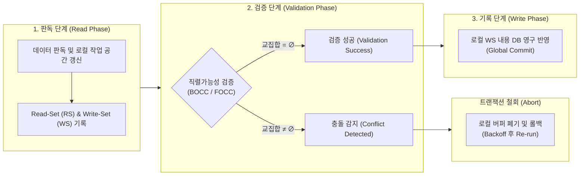

# 낙관적 검증(Validation) 기법

---

## I. 락 프리(Lock-Free) 동시성 제어를 위한 낙관적 검증 기법의 개요

* **정의**: [[트랜잭션]] 수행 중 락(Lock)을 획득하지 않고 로컬 버퍼에서 연산 후, 커밋 직전 검증 단계(Validation Phase)에서 직렬가능성(Serializability) 충돌을 검사하여 반영하는 동시성 제어 기법
* **필요성 및 특징**:
* **락 오버헤드 및 교착상태(Deadlock) 배제**: Lock/Unlock 관리 부하 및 상호 배제로 인한 데드락 탐지·회복 비용 원천 차단
* **읽기 위주(Read-Intensive) 워크로드 최적화**: 데이터 갱신 충돌 빈도가 낮은 환경에서 트랜잭션 병렬 처리율 및 [[처리량]](Throughput) 극대화
* **사후 검증(Validation-Centric) 메커니즘**: 사전 예방(Pessimistic) 대신 사후 충돌 탐지 및 선택적 롤백(Rollback) 수행

---

## II. 낙관적 검증 기법의 동작 메커니즘 및 핵심 기술 요소

### 가. 낙관적 검증 기법의 아키텍처 및 동작 프로세스

* 트랜잭션은 판독 단계에서 로컬 메모리를 기반으로 독립 실행된 후, 검증 단계에서 판독·기록 집합(RS/WS)의 교차 충돌 여부를 일괄 판별하여 무충돌 시에만 최종 커밋을 허용함

### 나. 낙관적 검증 기법의 핵심 기술 요소

| 구분 | 핵심 기술(키워드) | 세부 설명 |
| --- | --- | --- |
| **3단계 수명주기** | **판독 단계 (Read Phase)** | 공유 DB의 데이터를 로컬 메모리로 읽어와 연산 수행, 실제 DB 수정 없이 RS/WS 식별자 수집 |
| **3단계 수명주기** | **검증 단계 (Validation Phase)** | 트랜잭션 완료 전 직렬성 위반(동시 수행 트랜잭션 간 데이터 중복 갱신) 여부를 알고리즘으로 검사 |
| **3단계 수명주기** | **기록 단계 (Write Phase)** | 검증을 통과한 트랜잭션의 로컬 Write-Set을 공유 DB에 원자적으로 일괄 반영(Atomic Commit) |
| **검증 메커니즘** | **후진 검증 (BOCC)** | Backward Validation; 검증 대상 트랜잭션과 이미 커밋 완료된 트랜잭션의 Write-Set 충돌 검사 |
| **검증 메커니즘** | **전진 검증 (FOCC)** | Forward Validation; 검증 대상 트랜잭션의 Write-Set과 현재 동시 실행 중인 활성 트랜잭션의 Read-Set 검사 |
| **메타데이터 추적** | **Read-Set / Write-Set** | 트랜잭션 실행 중 참조(Read) 및 갱신(Write)한 튜플/레코드 ID를 비트맵 및 해시셋 구조로 추적 |
| **순서 제어** | **논리적 타임스탬프 (TS)** | 트랜잭션 시작($S$), 검증($V$), 완료($F$) 시점의 시퀀스 번호를 부여하여 유효 직렬화 순서(Serialization Order) 확정 |
| **충돌 회복** | **철회 및 재실행 (Abort & Restart)** | 검증 실패 시 즉각 Abort 처리 후 로컬 버퍼를 초기화하며, 지수 백오프(Exponential Backoff) 후 재시도 |

---

## III. 낙관적 검증 기법(OCC) vs 비관적 제어(PCC) 비교 및 최신 동향

### 가. 낙관적 동시성 제어(OCC) vs 비관적 동시성 제어(PCC) 비교

| 비교 항목 | 낙관적 검증 기법 (OCC) | 비관적 동시성 제어 (PCC, [[2PL]]) |
| --- | --- | --- |
| **설계 철학** | 충돌이 적을 것으로 가정 (사후 검증) | 충돌이 빈번할 것으로 가정 (사전 차단) |
| **자원 점유 방식** | **Lock-Free** (로컬 복사본 연산 후 검증) | **공유/배타 락 (Shared / Exclusive Lock)** |
| **[[교착상태|교착상태 (Deadlock)]]** | **발생 불가** (락 미사용) | 발생 가능 (자원 순환 대기 탐지/예방 필요) |
| **충돌 시 패널티** | 트랜잭션 롤백 및 전체 재실행 비용 | 락 획득 대기로 인한 스레드 블로킹/지연 |
| **적합한 환경** | 읽기 비중이 높고 충돌 빈도가 낮은 환경 | 쓰기 경합이 치열하고 긴 트랜잭션 환경 |
| **주요 한계점** | 갱신 빈도 증가 시 연쇄 Abort로 자원 낭비 | 락 오버헤드, 동시성 저하, 병목 유발 |

### 나. 최신 기술 동향 및 확장 적용 방향

* **인메모리 DB 동시성 제어 (Silo, Hekaton)**: 메모리 기반 트랜잭션 엔진에서 락 병목을 제거하기 위해 에포크(Epoch) 기반 검증과 결합한 변형 OCC 구조 채택
* **[[블록체인]] 병렬 스마트 컨트랙트 실행 (Block-STM)**: Aptos, Monad 등 고성능 [[EVM(Earned Value Management, 획득 가치 관리)|EVM]]/[[서포트 벡터 머신|SVM]] 환경에서 트랜잭션을 낙관적으로 동시 실행한 후 종단 검증 및 동적 재실행을 통해 TPS 수만 건 달성
* **분산 시스템 및 애플리케이션 낙관적 락**: 분산 DB(Spanner, [[CockroachDB]]) 및 ORM(JPA `@Version`) 계층에서 조건부 갱신(CAS; Compare-And-Swap) 기반의 경량화된 검증 기법 광범위 적용

---

### 🔗 연관 토픽

- **소속 도메인**: [[00_데이터베이스_MOC|🗄️ 데이터베이스]]
- **세부 분류**: `2. 트랜잭션 & 동시성 제어 (Concurrency)`
- **핵심 연관 토픽**:
  - [[2PL|2PL (Two-Phase Locking Protocol)]]
  - [[트랜잭션]]
  - [[CockroachDB|CockroachDB(코크로치DB)]]
  - [[블록체인|블록체인 (Block Chain)]]
  - [[Timestamp Ordering]]
