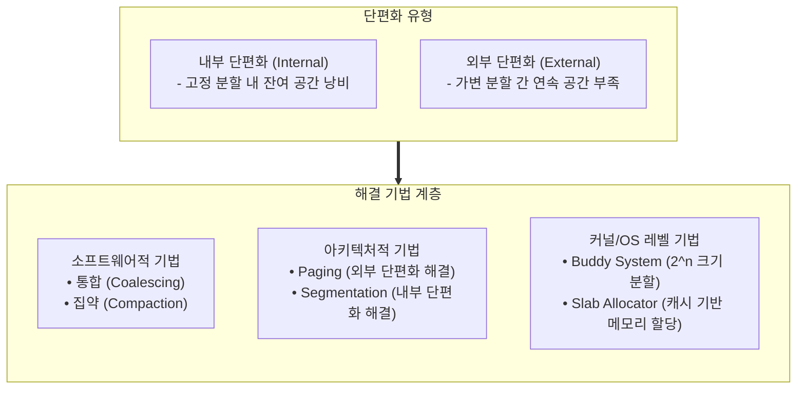

# 단편화 (Fragmentation)
---
## I. 메모리 자원 낭비의 주범, 단편화의 개요

| 구분     | 내용                                                                                                                                                 |
| :----- | :------------------------------------------------------------------------------------------------------------------------------------------------- |
| **정의** | 주기억장치에 프로세스를 할당하고 반납하는 과정에서, 가용 공간이 잘게 분할되어 **총 여유 공간은 충분하나 프로세스 할당이 불가능한 현상**                                                                     |
| **특징** | • **메모리 활용률 저하**: 낭비되는 메모리 슬롯 증가로 실질 가용 자원 축소 • **시스템 성능 병목 유발**: 잦은 메모리 할당 실패 및 스와핑/페이지 폴트 증가 • **할당 알고리즘 효율성 영향**: 적합(Fit) 알고리즘 탐색 오버헤드 가중 |

---

## II. 단편화의 유형 및 해결을 위한 기법

### 가. 단편화의 유형 및 해결 기법 개념도

```mermaid
flowchart TB
    %% 1. 내부 단편화
    subgraph G1["1. 내부 단편화 (Internal Fragmentation)"]
        direction TB
        subgraph B1["고정 분할 블록 (10MB)"]
            direction LR
            P1["프로세스 할당 (8MB)"] --- W1["낭비 공간 (2MB)"]
        end
    end

    %% 2. 외부 단편화
    subgraph G2["2. 외부 단편화 (External Fragmentation)"]
        direction TB
        subgraph B2["메모리 상태"]
            direction LR
            U2_1["사용 중 (5MB)"] --- H2_1["빈 공간 (1MB)"] --- U2_2["사용 중 (4MB)"]
        end
        N2["⚠️ 총 여유 공간은 충분하나<br/>연속 공간 부족으로 할당 불가"]
        B2 -.-> N2
    end

    %% 3. 통합
    subgraph G3["3. 통합 (Coalescing)"]
        direction TB
        subgraph B3_Pre["통합 전"]
            direction LR
            H3_1["빈 공간"] --- U3_1["사용 중"] --- H3_2["빈 공간"]
        end
        subgraph B3_Post["통합 후"]
            direction LR
            H3_Merged["통합 홀 (Merged)"] --- U3_2["사용 중"]
        end
        B3_Pre -->|"인접 빈 공간 합치기"| B3_Post
    end

    %% 4. 집약
    subgraph G4["4. 집약 (Compaction)"]
        direction TB
        subgraph B4_Pre["집약 전"]
            direction LR
            P4_A1["A"] --- H4_1["빈 공간"] --- P4_B1["B"] --- H4_2["빈 공간"]
        end
        subgraph B4_Post["집약 후"]
            direction LR
            P4_A2["A"] --- P4_B2["B"] --- H4_Merged["큰 연속 빈 공간"]
        end
        B4_Pre -->|"메모리 이동 및 재배치"| B4_Post
    end

    %% 스타일 정의
    style W1 fill:#ffcccc,stroke:#ff6666,stroke-width:2px
    style H2_1 fill:#ffcccc,stroke:#ff6666,stroke-width:2px
    style H3_Merged fill:#e6f3ff,stroke:#3399ff,stroke-width:2px
    style H4_Merged fill:#e6f3ff,stroke:#3399ff,stroke-width:2px
    style N2 fill:#fff3cd,stroke:#ffeeba,stroke-dasharray: 5 5
```

> **구조적 접근**: 고정 분할 및 가변 분할 할당 아키텍처에 따른 맞춤형 완화 메커니즘 적용

---
### 나. 단편화 해결을 위한 핵심 기술 및 기법

| 분류            | 기술명                 | 설명 및 특징                                                  |
| :------------ | :------------------ | :------------------------------------------------------- |
| **유형별 특성**    | **내부 단편화**          | 고정 분할(Fixed Partition) 방식에서 할당 크기가 프로세스 요구량보다 커서 발생      |
| **유형별 특성**    | **외부 단편화**          | 가변 분할(Dynamic Partition) 방식에서 해제된 잔여 세그먼트가 작아 새 작업 수용 불가 |
| **소프트웨어적 해결** | **통합 (Coalescing)** | 인접한 빈 가용 블록(Free Block)들을 하나의 연속된 공간으로 합침                |
| **소프트웨어적 해결** | **집약 (Compaction)** | 메모리 내 분산된 프로세스들을 한쪽으로 몰아 하나의 큰 연속 가용 공간 형성               |
| **아키텍처적 해결**  | **Paging**          | 고정 크기 페이지 단위 매핑을 통해 **외부 단편화 해결** (일부 내부 단편화 잔존 가능)      |
| **아키텍처적 해결**  | **Segmentation**    | 가변 크기 논리 단위 분할을 통해 **내부 단편화 해결** (외부 단편화 발생 가능)          |
| **커널 레벨 해결**  | **Buddy System**    | 메모리를 $2^n$ 단위 블록으로 분할·병합하여 연속 메모리 할당 및 외부 단편화 완화         |
| **커널 레벨 해결**  | **Slab Allocator**  | 커널 객체 크기별 프리 할당 캐시를 활용하여 내부 단편화 극소화                      |

> **동향**: CXL(Compute Express Link) 메모리 풀링 및 동적 오케스트레이션을 통한 거대 단편화 한계 극복

---

## III. 단편화 유형별 상세 비교 및 최신 동향

### 가. 내부 단편화 vs 외부 단편화 비교

| 항목           | 내부 단편화 (Internal)                | 외부 단편화 (External)                        |
| :----------- | :------------------------------- | :--------------------------------------- |
| **발생 방식**    | 고정 분할 (Fixed Partition) / Paging | 가변 분할 (Dynamic Partition) / Segmentation |
| **낭비 지점**    | 할당된 **블록 내부**의 잔여 공간             | 할당된 **블록 사이 외부**의 유휴 공간                  |
| **근본 해결**    | **Segmentation**, 가변 크기 할당       | **Paging**, 가상 메모리 기법                    |
| **관리/해결 기법** | **Slab Allocator**, 미세 단위 분할     | **통합(Coalescing), 집약(Compaction)**       |
### 나. 메모리 관리 최신 동향
- **CXL 메모리 풀링 (Compute Express Link)**: 이기종 호스트 간 메모리 공유 풀(Pool)을 형성하여 유휴 메모리 단편화 해소 및 활용률 극대화
- **Huge Page 최적화 (THP / 2MB·1GB)**: 대용량 워크로드(AI/LLM, DB)에 맞춰 TLB 미스를 줄이고 메모리 할당 효율성을 높이는 대형 페이지 튜닝

