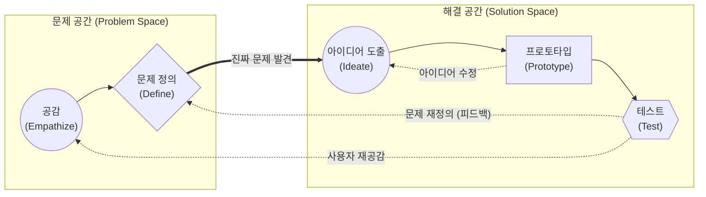

# 디자인 씽킹 (Design Thinking)

---

## I. 사용자 중심의 혁신적 문제 해결 방법론, 디자인 씽킹의 개요

* **정의**: 공급자가 아닌 사용자 중심(Human-centered)의 깊은 공감을 바탕으로 잠재적 니즈를 발굴하고, 확산적/수렴적 사고의 반복을 통해 혁신적인 해결책을 도출하는 실용적 문제 해결 방법론
* **등장배경 및 특징**:
* **초불확실성(VUCA) 시대 도래**: 정형화된 분석적 사고(Analytical Thinking)의 한계 극복 및 창의적/직관적 사고(Intuitive Thinking) 결합 필요
* **사용자 경험(UX) 중심 패러다임**: 기술 완성도보다 고객 가치 창출이 비즈니스 성패를 좌우함
* **특징**: 인간 중심적 접근, 빠른 실패와 반복(Fail Fast, Iterate), 발산과 수렴의 연속(Double Diamond 구조)

---

## II. 디자인 씽킹의 개념도 및 핵심 구성 요소

### 가. 디자인 씽킹의 개념도 및 동작 원리 (Stanford d.school 모델)

* 관찰과 인터뷰를 통해 사용자에 공감하고 문제를 정의(수렴)한 후, 다수의 아이디어를 발산하여 시제품 제작 및 테스트를 통해 해결책을 지속해서 고도화(반복)함.

### 나. 디자인 씽킹의 핵심 프로세스 및 기술 요소

| 구분 | 요소기술(키워드) | 세부 설명 |
| --- | --- | --- |
| **공감 (Empathize)** | Shadowing / Interview | 관찰, 인터뷰, 체험을 통해 사용자의 숨겨진 니즈와 페인포인트(Pain Point) 파악 |
| **공감 (Empathize)** | 고객 여정 지도 (CJM) | 사용자가 서비스와 상호작용하는 모든 접점(Touchpoint)에서의 경험과 감정을 시각화 |
| **문제 정의 (Define)** | [[페르소나|페르소나 (Persona)]] | 핵심 타겟 고객을 대표하는 가상의 인물을 설정하여 문제 상황을 구체화 |
| **문제 정의 (Define)** | HMW / POV 기법 | "우리가 어떻게 하면 ~할 수 있을까(How Might We)?" 형식으로 관점(Point of View) 재정의 |
| **아이디어 도출 (Ideate)** | Brainstorming | 비판 금지, 자유분방, 다량 산출의 원칙 하에 확산적 사고를 통해 해결 대안 도출 |
| **아이디어 도출 (Ideate)** | SCAMPER 기법 | 대체, 결합, 응용, 수정, 용도 변경, 제거, 재배열 등의 질문을 통한 창의적 발상 유도 |
| **프로토타입 (Prototype)** | Wireframe / Mock-up | 종이(Paper)나 스케치 도구를 활용하여 핵심 기능만을 담은 빠르고 저렴한 시제품 제작 |
| **테스트 (Test)** | 사용성 테스트 (UT) | 프로토타입을 실제 사용자에게 제공하여 피드백을 수집하고, 가설 검증 및 반복 개선 수행 |

---

## III. 유사 방법론과의 비교 및 최신 적용 동향

### 가. 3대 최신 혁신 방법론(Design Thinking, Lean Startup, Agile) 비교

| 비교 항목 | 디자인 씽킹 (Design Thinking) | 린 스타트업 ([[린 방법론|Lean]] Startup) | 애자일 ([[Agile]]) |
| --- | --- | --- | --- |
| **초점 영역** | **문제 발견 (Problem Exploration)** | **비즈니스 검증 (Business Validation)** | **제품 구현 (Solution Delivery)** |
| **핵심 질문** | "올바른 문제를 풀고 있는가?" | "시장이 원하는 제품인가?" | "제품을 제대로 만들고 있는가?" |
| **주요 활동** | 공감, 아이디에이션, 프로토타이핑 | Build - Measure - Learn ([[MVP]] 검증) | Sprint, [[SCRUM|Scrum]], 지속적 통합(CI/CD) |
| **결과물** | 혁신적 아이디어 및 제품 컨셉 | 시장 적합성(PMF) 검증된 비즈니스 모델 | 작동하는 소프트웨어 (Working S/W) |
| **융합 전략** | 3가지 방법론을 결합하여 **"디자인 씽킹으로 찾고, 린하게 검증하며, 애자일하게 구축"** 하는 파이프라인 구성 |  |  |

### 나. 디자인 씽킹 최신 동향 및 전망

* **AI 증강 디자인 씽킹 (AI-Augmented Design Thinking)**: 생성형 AI(ChatGPT, Midjourney 등)를 활용하여 가상 페르소나 생성, 방대한 아이디어 풀 창출, 텍스트 프롬프트 기반의 신속한 UI 프로토타이핑 등 각 단계의 소요 시간을 혁신적으로 단축
* **조직 문화로의 내재화 (DesignOps)**: 단순한 프로젝트성 방법론을 넘어, 전사적 디자인 워크플로우를 최적화하고 구성원들의 문제 해결 DNA로 정착시키는 Design Operations 체계로 진화 중

---

### 🔗 연관 토픽

- **소속 도메인**: [[00_경영전략_MOC|📈 경영전략]]
- **세부 분류**: `3. 비즈니스 프로세스 혁신 & 디지털 전환 (DX)`
- **핵심 연관 토픽**:
  - [[리빙랩, S.O.S랩|리빙랩(Living Lab), S.O.S랩]]
  - [[린 방법론|린 (Lean) 방법론]]
  - [[Agile]]
  - [[SCRUM]]
  - [[고객여정지도|고객여정지도 (Customer Journey Map)]]
