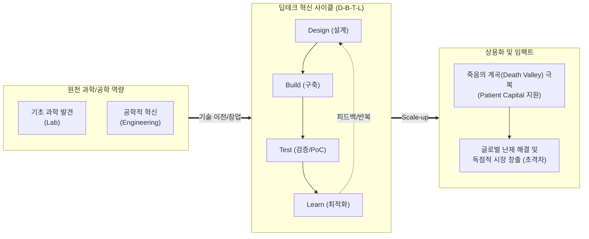

# 딥테크 (Deep Tech)

---

## I. 인류 난제 해결을 위한 혁신 원천기술, 딥테크의 개요

* **정의**: 획기적인 과학적 발견(Scientific Discovery)이나 고도의 원천 공학기술(Engineering Innovation)을 기반으로, 모방이 불가능한 진입장벽을 구축하여 글로벌 난제를 해결하는 첨단 기술
* **등장배경**: 기존 소프트웨어·플랫폼 중심 혁신(Shallow Tech)의 성장 한계 도달, 기후변화·고령화·우주 개척 등 복합적이고 거시적인 인류 문제 해결 필요성 증대
* **특징**: 고위험/고수익(High-Risk, High-Return), 장기적 투자와 R&D(인내심 있는 자본 필요), 이종 기술 간 융합(Convergence), 패러다임 파괴성(초격차 창출)

---

## II. 딥테크의 혁신 사이클 및 핵심 기술 요소

### 가. 딥테크의 혁신 프로세스 및 D-B-T-L 개념도

* 단순 비즈니스 모델 혁신이 아닌, 기초연구 단계부터 설계-구축-테스트-학습(D-B-T-L)의 물리적/기술적 검증 주기를 거쳐 독보적인 [[지식재산권]](IP)을 확보하고 상용화함

### 나. 딥테크의 핵심 특성 및 주요 10대 기술 분야 요소

| 분류 | 요소기술(키워드) | 세부 설명 |
| --- | --- | --- |
| **딥테크 특성** | **문제 지향형 (Problem Oriented)** | 탄소중립, 희귀질환 극복, 식량 위기 등 단일 기업 수준을 넘는 거시적 인류 난제(Grand Challenge) 해결 목표 |
| **딥테크 특성** | **이종 융합 (Convergence)** | AI, 양자역학, 합성생물학, 나노공학 등 서로 다른 과학 및 공학 기술의 다학제적 융합을 통한 시너지 창출 |
| **초격차 기술** | **시스템 반도체 / 양자 기술** | [[NPU]], [[뉴로모픽 칩]] 등 차세대 반도체 및 양자 컴퓨팅/통신 기반 초고속 연산 처리 한계 돌파 |
| **초격차 기술** | **바이오 헬스 / 생명과학** | 유전자 가위(CRISPR), mRNA 백신, 디지털 치료제, 표적항암제 등 인명 연장 및 질환의 근본적 극복 |
| **초격차 기술** | **친환경·에너지 / 차세대 원전** | 차세대 이차전지(전고체 배터리), 소형모듈원전(SMR), 탄소 포집·활용·저장(CCUS)을 통한 기후변화 대응 |
| **초격차 기술** | **빅데이터 / AI([[인공지능]])** | 대규모 언어 모델([[초거대 언어 모델|LLM]]), [[범용 인공지능]]([[AGI]]), AI 기반 신약 후보 물질 발굴(AlphaFold) 및 소재 설계 |
| **초격차 기술** | **미래 모빌리티 / 로봇공학** | 도심항공교통([[UAM]]), 완전 자율주행차(Lv.4 이상), 휴머노이드 및 극한 환경 투입용 협동 로봇 |
| **초격차 기술** | **우주항공·해양 / 사이버 보안** | [[재사용]] 발사체, 저궤도 위성통신 네트워크(Starlink 등), 양자 내성 암호(PQC) 기반 차세대 보안 아키텍처 |

---

## III. 딥테크와 섈로우테크(Shallow Tech) 비교 및 발전 전망

### 가. 딥테크와 섈로우테크 비교

| 비교 항목 | 섈로우테크 (Shallow Tech) | 딥테크 (Deep Tech) |
| --- | --- | --- |
| **핵심 혁신 대상** | **비즈니스 모델(BM) 혁신** (O2O 플랫폼 등) | **원천 기술 혁신** (Deep Science/Engineering 기반) |
| **기반 기술** | 이미 검증 및 상용화된 IT 기술 조합 | 미개척 영역의 기초 과학 및 하드웨어/소프트웨어 |
| **주요 리스크** | **시장 리스크** (마케팅 실패, 경쟁 심화) | **기술 리스크** (상용화 실패, 오랜 기술 검증 지연) |
| **투자 회수 기간** | 단기 (보통 1~3년 내 가시적 성과) | **장기 (수년~수십년, 대규모 Capex 투입)** |
| **경쟁 우위/진입장벽** | 네트워크 효과, 사용자 데이터, 선점 효과 | **강력한 특허(IP) 장벽, 기술적 모방의 불가능성** |

### 나. 딥테크 기술의 발전 한계 및 해결 방안(동향)

* **인내심 있는 자본(Patient Capital) 확충**: 딥테크 스타트업이 초기 수익 부재 상태에서 R&D 비용으로 고갈되는 '죽음의 계곡(Valley of Death)'을 넘기 위해 딥테크 팁스(TIPS), 초격차 스타트업 1000+ 프로젝트 등 국가 주도 R&D 펀드와 장기 민간 모태펀드 조성 필수
* **오픈 이노베이션(Open Innovation) 및 산학연 연계**: 대학과 국책 연구소의 유휴 특허를 기반으로 한 실험실 창업(Lab-to-Market) 활성화 및 대기업과의 기술 실증(PoC) 매칭 강화를 통한 상용화 시점 단축 과제 대두

---

### 🔗 연관 토픽

- **소속 도메인**: [[00_경영전략_MOC|📈 경영전략]]
- **세부 분류**: `3. 비즈니스 프로세스 혁신 & 디지털 전환 (DX)`
- **핵심 연관 토픽**:
  - [[인공지능]]
  - [[AGI|AGI (Artificial General Intelligence)]]
  - [[범용 인공지능]]
  - [[뉴로모픽 칩|뉴로모픽 칩 (Neuromorphic Chip)]]
  - [[초거대 언어 모델|초거대 언어 모델(Large Language Model)]]
