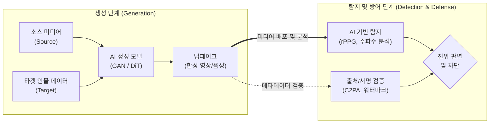

# 딥페이크(Deepfake)

---

## I. 인공지능의 역기능과 신뢰성 위협, 딥페이크의 개요

* **정의**: [[딥러닝]]([[GAN (Generative Adversarial Network)|GAN]], Diffusion) 기반의 이미지·영상 합성을 통해 특정 인물의 얼굴, 신체, 음성을 조작하여 실제처럼 보이게 만드는 [[인공지능]] 기반 미디어 위조 기술
* **등장배경**: 생성적 적대 신경망(GAN) 및 확산 모델(Diffusion)의 고도화, 오픈소스 AI 플랫폼 발달, 소셜미디어 기반 대규모 학습 데이터(얼굴/음성) 수집 용이성
* **특징**: 초현실주의(Hyper-realism), 다중 모달리티(시청각 결합), 실시간 변환 가능, 탐지 기술과의 적대적 진화(Cat-and-Mouse) 특성

---

## II. 딥페이크의 개념도 및 핵심 기술 요소

### 가. 딥페이크의 메커니즘 및 탐지/방어 개념도

* 생성 모델(GAN/Diffusion)을 통한 합성 미디어가 유포되면, 생체신호(rPPG) 및 주파수 분석, [[C2PA]] 기반 디지털 서명 검증을 복합적으로 적용하여 진위를 판별함

### 나. 딥페이크의 핵심 기술 요소

| 구분 | 요소기술(키워드) | 세부 설명 |
| --- | --- | --- |
| **생성 기술** | **GAN / StyleGAN** | 생성자(Generator)와 판별자(Discriminator)의 적대적 학습을 통한 고해상도 얼굴 합성 및 표정/특징 제어 |
| **생성 기술** | **Diffusion / DiT** | 노이즈 주입 및 복원 과정을 거치며, 최근 [[트랜스포머]](DiT) 구조가 결합되어 초현실적 영상 생성 기능 고도화 |
| **탐지 기술** | **생체 신호(rPPG) 분석** | 딥페이크 모델이 모방하기 어려운 심박동에 따른 미세한 피부색 및 혈류 변화 신호의 부재를 포착하여 가짜 판별 |
| **탐지 기술** | **주파수 아티팩트 탐지** | 영상 변환 시 발생하는 픽셀 경계의 블렌딩 흔적이나 공간적/시간적 주파수 도메인(DCT, FFT)의 기계적 왜곡 식별 |
| **방어 기술** | **C2PA 표준 적용** | 콘텐츠의 생성-편집-배포 전 과정의 메타데이터를 [[블록체인]] 및 [[암호화]] 서명으로 기록하는 출처 증명 개방형 표준 |
| **방어/보안** | **비가시 워터마킹** | AI로 생성된 미디어의 비가청/비가시 주파수 대역에 기계만 인식 가능한 식별 코드(예: SynthID)를 강제 삽입 |
| **사전 방어** | **데이터 포이즈닝** | 사용자가 자신의 사진을 업로드할 때 사람 눈에 띄지 않는 적대적 섭동(Noise)을 추가하여 딥페이크 모델의 학습을 무력화 |
| **사전 방어** | **다중 모달 교차 검증** | 영상의 입 모양(Lip-sync)과 출력되는 음성(Audio) 간의 시공간적 불일치를 딥러닝(ViT)으로 교차 검증하여 식별 |

---

## III. 딥페이크 악용 동향 및 안전한 AI 생태계를 위한 대응 방안

* **(사례 및 역기능)** 유명인 및 일반인 대상 불법 합성 성착취물 제작, 딥보이스를 결합한 금융 피싱 사기, 선거 개입 및 가짜뉴스 유포 등 사회·국가적 안보 위협 심화
* **(제도적 대응/동향)**
* **국내**: 정보통신망법 및 성폭력처벌법 개정을 통해 딥페이크 성착취물 소지·시청 처벌 신설 및 플랫폼 사업자의 선제적 삭제 의무 강화 추진
* **해외**: EU AI Act를 통한 고위험 AI 투명성 의무화 및 미국 캘리포니아주 AI 투명성법 시행으로 C2PA 기반 출처 표시 및 [[디지털 워터마킹]] 의무화 가속

* **(향후 발전 방향)** 단일 탐지 알고리즘의 한계를 극복하기 위해 통신사, 플랫폼 기기(On-Device AI), 보안 업계 간 연합학습(Federated Learning) 기반의 딥페이크 공조 방어망 체계 구축 필요

---

### 🔗 연관 토픽

- **소속 도메인**: [[00_인공지능_MOC|🤖 인공지능]]
- **세부 분류**: `3. 딥러닝 핵심 아키텍처 & 신경망`
- **핵심 연관 토픽**:
  - [[GAN (Generative Adversarial Network)]]
  - [[C2PA]]
  - [[인공지능]]
  - [[트랜스포머|트랜스포머(Transformer)]]
  - [[딥러닝]]
