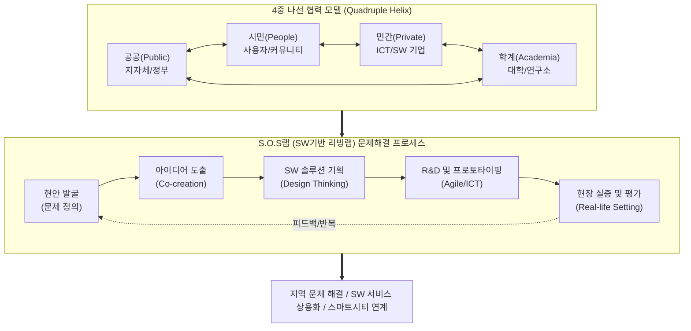

# 리빙랩(Living Lab)과 S.O.S랩 (Solution in Our Society Lab)

---

## I. 시민 주도의 사회문제 해결 플랫폼, 리빙랩과 S.O.S랩의 개요

* **정의**
* **리빙랩 (Living Lab)**: 일상생활 공간을 실험실로 삼아 사용자(시민)가 문제 해결 과정에 직접 주도적으로 참여하는 개방형 혁신(Open Innovation) 생태계
* **S.O.S랩 ([[SOS랩 (Solution in Our Society Lab)|Solution in Our Society Lab]])**: 리빙랩 방법론을 기반으로 지역사회 현안을 해결하기 위해 시민, 지자체, 기업이 협력하여 SW/ICT 기반의 해결책을 기획·개발하는 '지역 현안 해결형 SW R&D 플랫폼'

* **필요성 및 등장배경**
* 전통적 Top-down 방식 R&D의 한계(기술 공급자 중심) 극복 및 현장 체감형 Bottom-up 해결책 요구
* PPPP(Public-Private-People Partnership) 다중 협력망 기반의 지속 가능한 스마트시티 및 4차 산업혁명 기술(AI, IoT 등)의 사회적 수용성 확보

---

## II. S.O.S랩(리빙랩)의 개념도 및 핵심 구성요소

### 가. S.O.S랩(리빙랩)의 개념도 및 동작 원리

* 공공, 시민, 민간, 학계가 유기적으로 연대(PPPP)하여, 실제 생활 환경(Real-life Setting)에서 [[디자인 씽킹]] 기반으로 현안을 도출하고 SW/ICT 기술을 통해 프로토타입을 실증([[Agile]])함

### 나. S.O.S랩(리빙랩)의 핵심 구성 요소

| 구분 | 요소기술(키워드) | 세부 설명 |
| --- | --- | --- |
| **운영 주체** | **4중 나선 (Quadruple Helix)** | 시민(People), 공공(Public), 민간기업(Private), 연구소/학계(Academia)의 수평적 PPPP 협력 체계 |
| **운영 환경** | **Real-life Setting** | 통제된 연구소나 실험실이 아닌, 시민이 실제 거주하고 활동하는 일상생활 공간을 테스트베드로 활용 |
| **핵심 방법론** | **Co-creation (공동 창조)** | 기획-개발-실증-평가의 R&D 전 주기에 걸쳐 이해관계자와 사용자가 공동으로 가치를 창출 |
| **핵심 방법론** | **Design Thinking** | 사용자 공감(Empathy)을 바탕으로 진짜 문제를 정의하고, 창의적인 아이디어를 발산·수렴하는 문제해결 기법 |
| **개발 방법론** | **Agile / [[MVP]]** | 완벽한 제품보다는 핵심 기능만 담은 MVP(최소 기능 제품)를 빠르게 배포하고 현장 피드백을 통해 반복 개선 |
| **적용 기술** | **SW / ICT 융합 기술** | 지역 현안(환경, 안전, 교통 등) 분석 및 해결을 위한 IoT 센싱, 클라우드 플랫폼, AI 데이터 분석 기술 적용 |
| **데이터 연계** | **[[공공데이터|Open Data]] (공공 데이터)** | 지자체가 보유한 행정, 교통, 환경 데이터를 개방(API)하여 시민과 기업의 데이터 기반 의사결정 지원 |
| **지향 가치** | **Social Impact (사회적 가치)** | 기술 자체의 우수성보다 지역사회 삶의 질 향상, 탄소 중립, 재난 안전 등 체감 가능한 사회적 문제 해결 지향 |

---

## III. 기존 R&D와 리빙랩 비교 및 향후 전망

### 가. 전통적 R&D와 리빙랩(S.O.S랩) 비교

| 비교 항목 | 전통적 R&D (Closed Innovation) | 리빙랩 / S.O.S랩 (Open Innovation) |
| --- | --- | --- |
| **혁신 주체** | 기술 전문가, 연구원, 공급자 중심 | **시민, 사용자**, 이해관계자 등 수요자 주도 |
| **연구 공간** | 엄격히 통제된 연구실 및 가상 환경 | 시민들의 **실제 일상생활 공간 (현장)** |
| **목표 지향점** | 원천 기술 확보, 논문/특허 산출, 경제적 이윤 | **사회적 현안 해결**, 체감형 삶의 질 향상 |
| **추진 방식** | [[워터폴|폭포수]](Waterfall) 기반의 선형적 [[프로세스]] | **애자일(Agile)** 기반의 나선형 반복 프로세스 |

### 나. S.O.S랩(리빙랩)의 한계점 및 향후 발전 전망

* **스마트시티 플랫폼 연계 가속화**: 단발성 프로젝트에 그치지 않기 위해 국가 시범 스마트시티(세종, 부산 등) 인프라 통합 플랫폼 및 데이터 허브 모델의 필수 요소로 리빙랩 체계 의무화
* **BM 발굴 및 자생적 생태계 조성**: R&D 정부 지원금 종료 후 운영이 중단되는 한계(지속가능성 부족)를 극복하기 위해, 개발된 SW 서비스의 스핀오프(Spin-off) 창업 유도 및 [[ESG 경영]] 민간 기업의 투자 매칭(펀딩) 고도화
* **디지털 포용성 강화**: 고령자, 장애인 등 디지털 취약 계층의 리빙랩 참여를 독려하기 위한 유니버설 디자인(Universal Design) 적용 및 생성형 AI 기반의 자연어 소통형 헬프데스크 도입 등 기술 진입 장벽 완화 트렌드 확산

---

### 🔗 연관 토픽

- **소속 도메인**: [[00_경영전략_MOC|📈 경영전략]]
- **세부 분류**: `3. 비즈니스 프로세스 혁신 & 디지털 전환 (DX)`
- **핵심 연관 토픽**:
  - [[디자인 씽킹]]
  - [[Agile]]
  - [[워터폴]]
  - [[ESG 경영]]
  - [[SOS랩 (Solution in Our Society Lab)]]
