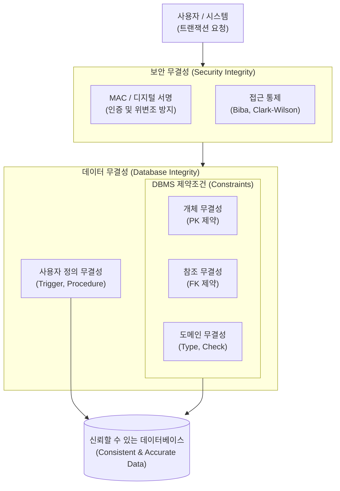

# 무결성 (Integrity)

---

## I. 데이터와 시스템의 신뢰성 보장, 무결성의 개요

* **정의**: 데이터의 전체 라이프사이클 동안 비인가된 위변조를 방지하고, 데이터의 정확성(Accuracy), 일관성(Consistency), 유효성(Validity)을 보장하는 성질
* **필요성 및 특징**:
* **[[신뢰성]] 확보**: 정보보안의 3요소(CIA Triad: [[기밀성]], 무결성, [[HA(High Availability)|가용성]]) 중 하나로 안전한 서비스 제공의 기반
* **이상현상([[Anomaly(이상현상)|Anomaly]]) 방지**: [[데이터베이스]] 내 삽입, 갱신, 삭제 시 발생하는 데이터 모순 및 불일치 방지
* **다계층 제어**: 물리적 디스크, [[DBMS]](제약조건), 네트워크(해시/[[MAC]]), 애플리케이션 계층에서 종합적으로 보장

---

## II. 무결성의 개념도 및 핵심 기술 요소

### 가. 무결성 보장 메커니즘 개념도

* 네트워크 및 시스템 계층에서 [[암호화]] 및 접근통제로 **보안 무결성**을 확보하고, DBMS 계층에서 제약조건과 트리거를 통해 **데이터 무결성**을 검증하여 안전하게 저장함

### 나. 무결성의 핵심 기술/구성 요소

| 분류 | 요소기술(키워드) | 세부 설명 |
| --- | --- | --- |
| **데이터 무결성** | 개체 무결성 (Entity) | 릴레이션의 기본키(Primary Key)는 NULL 값이나 중복값을 가질 수 없음을 보장 |
| **데이터 무결성** | 참조 무결성 (Referential) | 외래키(Foreign Key) 값은 참조하는 릴레이션의 기본키 값과 일치하거나 NULL이어야 함 |
| **데이터 무결성** | 도메인 무결성 (Domain) | 속성값이 사전에 정의된 데이터 타입, 길이, 유효 범위(Check) 내에 존재해야 함 |
| **데이터 무결성** | 사용자 정의 무결성 | 특정 비즈니스 룰이나 업무 규칙에 따라 사용자가 정의한 제약조건(Trigger 등) 준수 |
| **보안 무결성** | 해시 함수 (Hash) | SHA-256 등을 적용하여 데이터 송수신 및 저장 시 단방향 암호화를 통한 위변조 여부 탐지 |
| **보안 무결성** | MAC / 전자서명 | 메시지 인증 코드(MAC) 및 공개키 기반 전자서명을 통해 데이터 출처 인증 및 무결성 확인 |
| **보안 모델** | Biba 모델 | 'No Read Down, No Write Up' 원칙을 적용하여 비인가자에 의한 데이터 수정을 방지하는 모델 |
| **보안 모델** | 클라크-윌슨 모델 | 직무 분리(SoD)와 잘 구성된 [[트랜잭션]](Well-formed Transaction)을 통한 상업적 무결성 모델 |

---

## III. 데이터베이스 무결성 제어 기법 비교 및 최신 동향

### 가. 무결성 보장을 위한 선언적 기법과 절차적 기법 비교

| 비교 항목 | 선언적 무결성 (Declarative Integrity) | 절차적 무결성 (Procedural Integrity) |
| --- | --- | --- |
| **제어 주체** | DBMS 엔진 ([[스키마]] 정의) | 개발자 (애플리케이션, 데이터베이스 객체) |
| **구현 방식** | [[DDL]](Create, Alter) 내 제약조건(Constraint) 명시 | [[DML]], 트리거(Trigger), 스토어드 [[프로시저]] 적용 |
| **적용 기술** | Primary Key, Foreign Key, Unique, Check, Default | Trigger, User-defined Function, 트랜잭션 로직 |
| **장점** | 스키마 구조 파악 용이, DBMS 자체 최적화로 성능 우수 | 복잡한 비즈니스 룰 및 다중 테이블 교차 참조 제어 가능 |
| **단점** | 복잡한 제어 및 예외적인 업무 로직 표현에 한계 | [[유지보수]] 복잡도 증가, 무분별한 사용 시 시스템 성능 저하 우려 |

### 나. 분산 환경에서의 무결성 확보 동향

* **[[MSA (Micro Service Architecture)|MSA]](Microservices Architecture) 환경의 무결성**: [[분산 데이터베이스]] 환경에서 ACID 트랜잭션 유지가 어려움에 따라, Saga 패턴 및 이벤트 소싱(Event Sourcing)을 통한 최종 일관성(Eventual Consistency) 확보 체계로 전환 중
* **[[블록체인]] 및 [[영지식증명|ZKP]] 도입**: 데이터 위변조가 불가능한 분산 원장 기술(블록체인)과 원본 데이터 노출 없이 무결성을 증명하는 영지식 증명(ZKP, Zero-Knowledge Proof)을 결합한 신뢰 기반 데이터 공유 아키텍처 확산

---

### 🔗 연관 토픽

- **소속 도메인**: [[00_데이터베이스_MOC|🗄️ 데이터베이스]]
- **세부 분류**: `2. 트랜잭션 & 동시성 제어 (Concurrency)`
- **핵심 연관 토픽**:
  - [[트랜잭션]]
  - [[DML]]
  - [[데이터베이스]]
  - [[스키마]]
  - [[Anomaly(이상현상)]]
