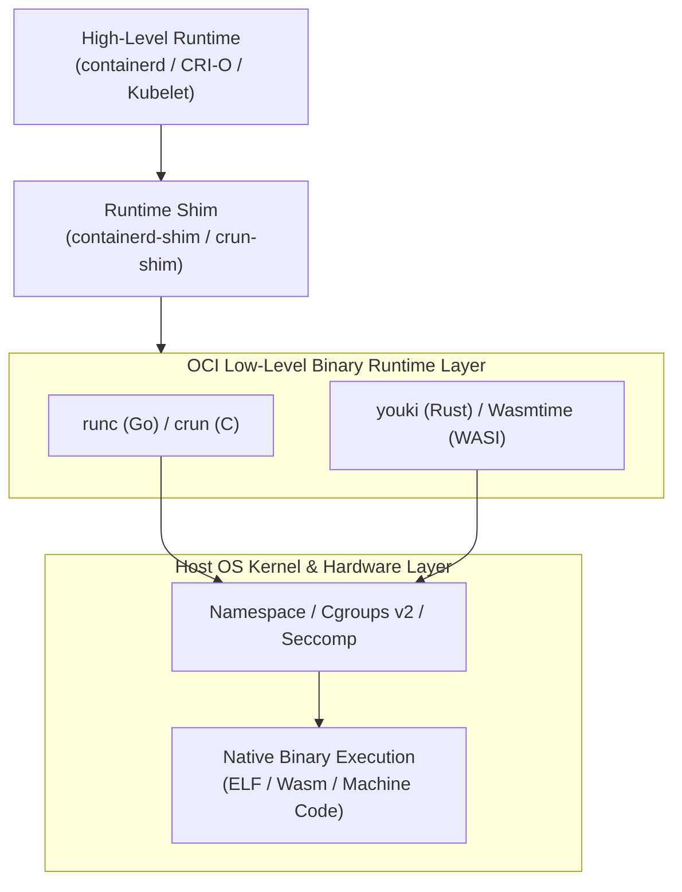

# 바이너리 런타임
**바이너리 런타임**은 기계어로 컴파일된 코드가 "정지된 파일" 상태에서 벗어나 **"실제로 동작하는 [[프로세스]]"로 굴러가게 만드는 보이지 않는 운영 엔진**입니다.

---
## I. 네이티브 고속 실행 및 리소스 최소화를 위한, 바이너리 런타임의 개요
- 정의: 표준 바이너리를 가상머신 오버헤드 없이 호스트 커널([[02_IT_Tech/운영체제|OS Kernel]]) 인터페이스를 통해 직접 격리·실행하는 저수준 실행 엔진.
- 특징: Cold Start 제거, 리소스 경량화, 표준 기반 격리
---
## II. 바이너리 런타임의 아키텍처 및 핵심 기술 요소
### 가. 바이너리 런타임의 아키텍처

- High-Level 런타임의 컨테이너 번들 전달 요청을 받아 호스트 커널 인터페이스를 프로비저닝하고 타깃 바이너리를 직접 `execve` 호출하여 실행함.
### 나. 바이너리 런타임의 핵심 기술 요소

| **구분**      | **요소기술(키워드)**             | **세부 설명**                              |
| ----------- | ------------------------- | -------------------------------------- |
| **커널 격리**   | **Linux Namespaces**      | 프로세스별 자원 뷰 독립화                         |
| **자원 제어**   | **Cgroups v2**            | 통합 계층 구조 기반 동적 할당 및 제한                 |
| **보안 통제**   | **Seccomp / AppArmor**    | 비인가 시스템 콜 차단 및 최소 권한 실행                |
| **표준 명세**   | **OCI Runtime Spec**      | 컨테이너 설정 파일 파싱 및 라이프사이클 훅 표준화           |
| **언어 최적화**  | **AOT 컴파일 (C/Rust)**      | 초경량·메모리 안전 구현                          |
| **샌드박싱**    | **MicroVM**               | 전용 커널 격리로 멀티테넌시 보안 강화                  |
| **동적 추적**   | **eBPF (Extended BPF)**   | 커널 레벨 시스템 콜 추적, 런타임 침해 탐지 및 네트워크 패킷 제어 |
| **바이너리 확장** | **Wasm/WASI Integration** | WebAssembly 바이너리를 네이티브 런타임에서 직접 구동     |

---
## III. 바이너리 런타임과 VM 기반 런타임 비교 및 향후 전망

| **비교 항목**             | **바이너리 런타임**                        | **VM 기반 런타임**                         |
| --------------------- | ----------------------------------- | ------------------------------------- |
| **실행 방식**             | 호스트 커널 직접 시스템 콜 호출                  | 바이트코드 인터프리팅 및 Guest OS 커널 에뮬레이션       |
| **구동 지연(Cold Start)** | 밀리초(ms) ~ 마이크로초 단위 즉시 기동            | 초(s) 단위                               |
| **메모리 풋프린트**          | 수 MB 이하                             | 수백 MB ~ 수 GB                          |
| **보안 격리 수준**          | 커널 공유 기반 격리 (Seccomp 보완 필요)         | 하이퍼바이저 기반 하드웨어 수준 완전 격리               |
| **대표 기술**             | `runc`, `crun`, `youki`, `WasmEdge` | KVM, VMware ESXi, OpenJDK, Node.js V8 |
- **Wasm/WASI 융합 가속화, 메모리 안전 언어(Rust) 전환, 서버리스 및 엣지 컴퓨팅 핵심 엔진화**