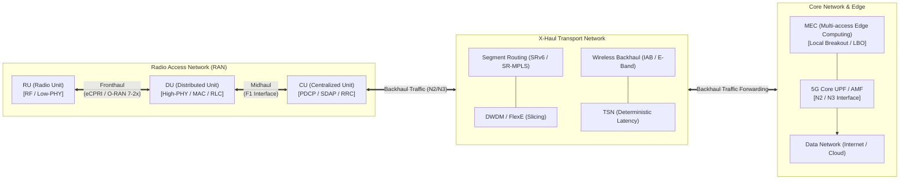

# 백홀 트래픽 (Backhaul Traffic)
- **라스트 마일 / 프론트홀:** 택배 기사님이 집 앞 골목길을 돌며 고객에게 직접 물건을 전달하는 단계 (스마트폰 ↔ 기지국 안테나)
- **백홀 트래픽 (Backhaul Traffic):** 동네 대리점에 모인 수많은 택배 상자를 모아 **중앙 물류 메인 허브(Core)로 실어 나르는 대형 간선 트럭의 화물량**
- **백본망 (Backbone):** 전국 물류 허브 사이를 연결하는 초대형 고속도로망
---
## I. 무선망과 코어망을 잇는 데이터 전송 경로, 백홀 트래픽의 개요

- 정의: 무선 기지국과 코어 네트워크 간에 송수신되는 사용자 데이터 및 제어 신호 트래픽
- 배경: 5G/6G 고용량, 생성형 AI 온디바이스 [[EDGE]] 연계, IoT 디바이스 폭증
- 요구 특징: 대용량 대역폭, 종단간 [[02_IT_Tech/네트워크|네트워크 슬라이싱]], 저지연 보장 및 서비스별 차등적 [[02_IT_Tech/QOS|QoS]]/QoE 지원
---
## II. 백홀 트래픽의 네트워크 아키텍처 및 핵심 기술 요소

### 가. 5G/6G X-Haul 구조에서의 백홀 트래픽 전달 체계

- RU-DU(프론트홀) $\rightarrow$ DU-CU(미드홀)을 거쳐 집계된 트래픽이 유/무선 트랜스포트망을 통해 5G Core(UPF) 및 에지 컴퓨팅(MEC)으로 비동기/고속 전달되는 구조
### 나. 백홀 트래픽 처리 및 최적화 핵심 기술 요소

| **구분**        | **요소기술 (키워드)**                     | **세부 설명**                      |
| ------------- | ---------------------------------- | ------------------------------ |
| **유선 전송**     | SRv6 (Segment [[02_IT_Tech/Routing Protocol|Routing]] IPv6)    | 대규모 트래픽 엔지니어링 수행               |
| **유선 전송**     | FlexE (Flexible [[02_IT_Tech/네트워크|Ethernet]])      | 단일 물리 링크를 논리적 하드웨어 슬라이스로 격리 할당 |
| **유선 전송**     | TSN (IEEE 802.1Q)              | 시간 동기화와 스케줄링으로 확정적 저지연 보장      |
| **무선 백홀**     | IAB (Integrated Access & Backhaul) | 단말 액세스용 기지국 간 백홀 전송 링크로 공유 활용  |
| **무선 백홀**     | E-band / mmWave 백홀                 | 초고주파를 이용해 수 Gbps급 무선 링크 제공     |
| **트래픽 분산**    | MEC Local Breakout (LBO)           | 데이터 트래픽을 즉시 로컬 처리              |
| **네트워크 슬라이싱** | E2E [[02_IT_Tech/네트워크|Network Slicing]]            | 백홀 구간 리소스를 논리적으로 분할·보장         |
| **위성 백홀**     | 3GPP NTN (Non-Terrestrial)     | 재난 복원력 확보                      |

---
## III. 5G/6G X-Haul 구간별 비교 및 향후 발전 전망

| **비교 항목**          | **프론트홀 (Fronthaul)**           | **미드홀 (Midhaul)**               | **백홀 (Backhaul)**                    |
| ------------------ | ------------------------------ | ------------------------------- | ------------------------------------ |
| **연결 구간**          | RU $\leftrightarrow$ DU        | DU $\leftrightarrow$ CU         | CU $\leftrightarrow$ 5GC (UPF/AMF)   |
| **표준 인터페이스**       | eCPRI, Open RAN 7-2x           | 3GPP F1 Interface               | 3GPP N2/N3 Interface                 |
| **지연시간 (Latency)** | 초극저지연 ($\le 100\,\mu\text{s}$) | 저지연 ($\le 1 \sim 5\,\text{ms}$) | 상대적 유연 ($\le 10 \sim 30\,\text{ms}$) |
| **트래픽 특성**         | 원시 IQ 데이터 기반 고정 대역폭            | RLC 계층 처리 기반 가변 대역폭             | 패킷 집계(Aggregation) 대용량 트래픽           |
| **주요 전송 기술**       | WDM-PON, Direct Fiber, RoE     | IP/MPLS, FlexE                  | SRv6, DWDM, IAB, NTN(위성)             |
- AI 기반 자율 트래픽 엔지니어링, 3D 입체 백홀 아키텍처(6G)