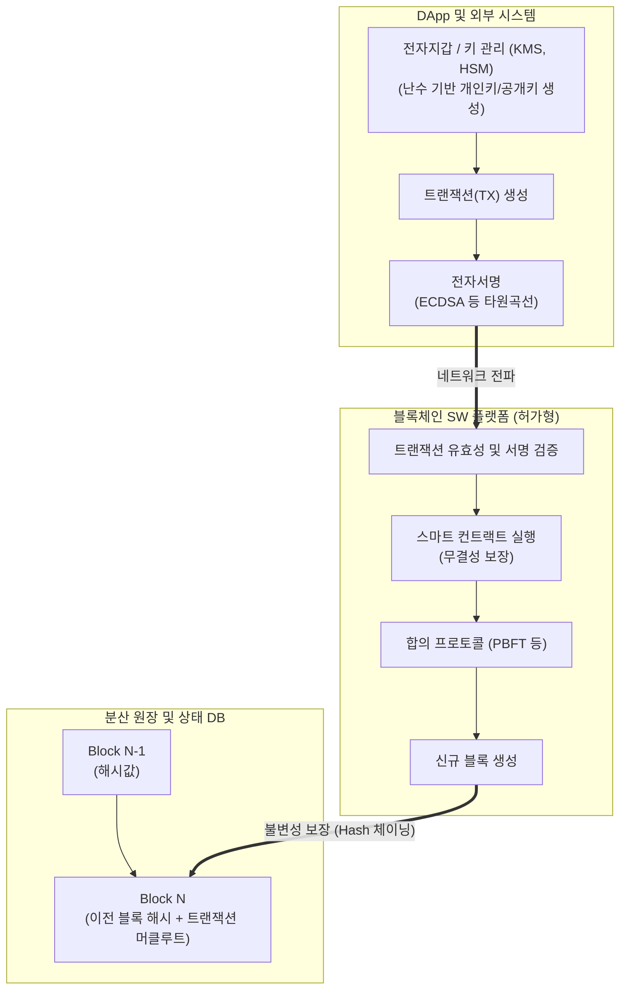

# 블록체인 암호기술 가이드라인

---

## I. 신뢰 가능한 분산 원장 구축, 블록체인 암호기술 가이드라인의 개요

**가. [[블록체인]] 암호기술 가이드라인의 정의**

* 국가·공공기관 및 금융권에서 블록체인 시스템 도입 시 안전성 확보를 위해 해시, 공개키 암호, 영지식 증명 등 기반 암호기술의 최소 요구사항과 적용 기준을 제시한 보안 실무 지침

**나. 가이드라인의 필요성 및 핵심 특징**

* **도입 기준 표준화**: 허가형(Private/Consortium) 블록체인 환경에 적합한 [[암호 알고리즘]] 및 키 관리 적용 기준 부재 해소
* **보안 위협 대응**: 난수값 [[재사용]] 금지, [[트랜잭션]] 변조, 프라이버시 침해, 양자 컴퓨팅 발전에 따른 기존 암호체계 무력화 방어
* **특징**: **허가형 블록체인 기반**, **다계층 보안**(원장, 트랜잭션, 스마트 컨트랙트), **프라이버시 강화**(영지식 증명 등 최신 암호 편입)

---

## II. 블록체인 암호기술 적용 아키텍처 및 핵심 구성 요소

### 가. 블록체인 암호기술 적용 구성도 및 검증 프로세스

* 사용자(DApp) 단의 안전한 키 관리를 통한 전자 서명 수행부터, 노드에서의 서명 검증, 블록 생성 시 해시 체이닝을 통한 [[무결성]] 확보의 전 과정을 명세화함

### 나. 블록체인 암호기술의 핵심 기술 요소

| 구분 | 요소기술(키워드) | 세부 설명 |
| --- | --- | --- |
| **데이터 무결성** | 암호학적 해시 함수 | SHA-256 등 충돌 저항성, 역상 저항성을 갖춘 알고리즘을 사용하여 원장 내 블록을 체인 구조로 연결 |
| **인증 및 부인 방지** | [[전자 서명|전자 서명 (Digital Signature)]] | 사용자의 개인키로 트랜잭션을 서명하여 데이터의 출처 보장 및 위조 불가를 증명 (주로 타원곡선암호-ECDSA 적용) |
| **접근 제어** | 허가형 기반 권한 제어 (Permissioned) | 인증기관(CA)과 연계하여 노드 참여 및 트랜잭션 기록 권한을 사전에 부여받은 개체로 제한 (Fabric, Corda 등) |
| **개인정보 보호** | 영지식 증명 (Zero-Knowledge Proof) | 거래의 세부 내용이나 개인 식별 정보를 공개하지 않고도 해당 트랜잭션의 참/거짓 여부를 증명하여 프라이버시 강화 |
| **안전한 난수 생성** | 보안 난수 발생기 | 키 생성 및 전자 서명에 사용되는 난수의 패턴 예측을 차단하고, 동일 난수값의 재사용을 엄격히 금지함 |
| **키 관리 체계** | 하드웨어 보안 모듈 (HSM / [[KMS]]) | 개인키의 유출 및 탈취를 방지하기 위해 논리적·물리적으로 분리된 안전한 공간에서 키의 생성·보관·폐기 수행 |
| **실행 무결성** | 스마트 컨트랙트 보안 | 코드로 자동 실행되는 계약의 취약점 방지를 위해 정적 분석, 포멀 인증(Formal Verification) 등 보안 검수 적용 |
| **트랜잭션 검증** | 머클 트리 (Merkle Tree) | 다수의 트랜잭션 해시를 이진 트리로 구성하여, 단일 해시(Merkle Root)만으로 블록 내 데이터 변조 여부를 초고속 검증 |

---

## III. 일반 암호체계와의 비교 및 최신 보안 기술 전망

### 가. 전통적 암호 기술과 블록체인 암호기술의 비교

| 비교 항목 | 전통적 시스템 암호 (Centralized) | 블록체인 시스템 암호 (Decentralized) |
| --- | --- | --- |
| **주요 목적** | 통신 구간 및 저장 데이터의 **[[기밀성]] 보장** | 분산 원장 데이터의 **무결성과 부인 방지** |
| **키 관리 구조** | 중앙화된 KMS 연계 대칭키/비대칭키 활용 | 각 노드 및 개인 지갑 단위의 탈중앙화된 개인키 관리 |
| **데이터 연결성** | 레코드 단위 [[암호화]] (독립적) | 머클 트리와 이전 블록 해시를 통한 암호학적 체이닝 (상호 의존) |
| **신뢰 기반** | 중앙 서버(TTP)에 대한 전적인 신뢰 | 합의 알고리즘과 다자간 검증을 통한 [[알고리즘]] 기반 신뢰 |

### 나. 한계점 및 블록체인 암호기술의 산업 대응 전망

* **양자 컴퓨터 위협 대비 (PQC 도입)**: 쇼어 알고리즘(Shor's Algorithm) 등으로 인해 타원곡선암호([[ECC]]) 및 [[RSA (Rivest Shamir Adleman)|RSA]] 등 현행 공개키 기반 전자 서명이 무력화될 위협이 대두됨에 따라, 최근 가이드라인은 **양자 내성 암호(Post-Quantum Cryptography)** 알고리즘으로의 이행(Migration)을 권고하는 추세임.
* **데이터 프라이버시와 규제 컴플라이언스 연계**: 개인정보보호법에 따른 '파기권(잊힐 권리)'과 블록체인의 '불변성'이 충돌하는 문제를 해결하기 위해, 원장 외부에 오프체인(Off-chain) 데이터베이스를 두거나 **동형암호([[동형 암호|Homomorphic Encryption]])** 및 영지식 증명을 결합한 상태 채널(State Channel) 기술의 상용화 적용이 본격화되고 있음.

---

### 🔗 연관 토픽

- **소속 도메인**: [[00_보안_MOC|🛡️ 보안]]
- **세부 분류**: `2. 현대 암호학 & 키 관리 · 전자서명`
- **핵심 연관 토픽**:
  - [[RSA (Rivest Shamir Adleman)]]
  - [[ECC|ECC(Elliptic Curve Cryptography)]]
  - [[동형 암호|동형 암호 (Homomorphic Encryption)]]
  - [[암호화|암호화 (Encryption)]]
  - [[기밀성]]
