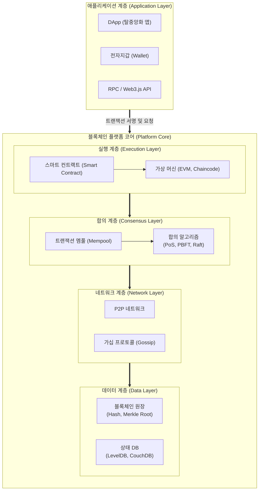

# 블록체인 (Block Chain) 플랫폼

---

## I. 신뢰 기반의 탈중앙화 인프라, 블록체인 플랫폼의 개요

**가. [[블록체인]] 플랫폼의 정의**

* 분산 원장 기술(DLT)을 기반으로 스마트 컨트랙트, [[합의 알고리즘]], [[암호화]] 기술을 제공하여 탈중앙화 애플리케이션(DApp) 및 Web3 서비스를 개발·운영할 수 있는 기반 인프라 소프트웨어

**나. 블록체인 플랫폼의 필요성 및 특징**

* **필요성**: 중앙 집중형 서버의 단일 장애점(SPOF) 해결, 중개자 없는 상호 신뢰 보장 및 거래(Transaction) 비용 절감
* **특징**: **탈중앙화**(P2P 네트워크 기반), **불변성**(해시 암호화로 위변조 방지), **자동화**(스마트 컨트랙트 기반 비즈니스 로직 실행), **가시성**(모든 거래 내역 투명성 보장)

---

## II. 블록체인 플랫폼의 아키텍처 및 핵심 기술 요소

### 가. 블록체인 플랫폼의 아키텍처 및 동작 원리

* 사용자(DApp)의 [[트랜잭션]] 요청이 스마트 컨트랙트를 통해 실행되고, 멤풀에 대기하다가 합의 알고리즘을 거쳐 검증된 후, P2P 네트워크를 통해 전파되어 분산 원장(블록)에 최종 기록됨

### 나. 블록체인 플랫폼의 핵심 기술 요소

| 구분 | 요소기술(키워드) | 세부 설명 |
| --- | --- | --- |
| **분산 네트워크** | P2P & Gossip [[프로토콜]] | 중앙 서버 없이 노드 간 직접 통신하여 트랜잭션과 블록 데이터를 네트워크 전체에 전파 및 동기화 |
| **데이터 [[무결성]]** | 해시 및 머클 트리 (Merkle Tree) | 이전 블록의 해시값을 포함하여 체인 형태로 연결하고, 블록 내 다수 거래를 해시 트리로 구성하여 위변조 방지 |
| **보안 인증** | 공개키 기반 구조 (PKI) | 사용자의 개인키(Private Key)로 트랜잭션을 전자서명하고 공개키로 검증하여 부인 방지 보장 |
| **신뢰 제어** | 합의 [[알고리즘]] (Consensus) | 불특정 다수(PoS, DPoS) 또는 허가된 노드(PBFT, Raft) 간에 거래의 유효성과 순서를 일치시키는 규칙 |
| **로직 실행** | 스마트 컨트랙트 (Smart Contract) | 사전에 합의된 조건이 충족되면 플랫폼([[EVM(Earned Value Management, 획득 가치 관리)|EVM]] 등 가상머신) 위에서 자동으로 실행되는 튜링 완전한 스크립트 |
| **상태 관리** | World State DB | 블록에 기록된 트랜잭션의 결과로 변경된 최신 계정 상태 및 자산 정보를 저장하는 키-값(Key-Value) [[데이터베이스]] |
| **확장성/성능** | 모듈러 아키텍처 (Modular) | 실행(Execution), 합의(Consensus), 데이터 [[HA(High Availability)|가용성]](DA) 계층을 분리하여 레이어2 롤업(Rollup) 확장을 지원 |
| **프라이버시** | 영지식 증명 ([[영지식증명|ZKP]]) | 거래의 세부 내용(송금액 등)을 공개하지 않고도 해당 거래가 유효하고 참임을 암호학적으로 증명 |

---

## III. 퍼블릭 플랫폼과 프라이빗 플랫폼 비교 및 최신 동향

### 가. 블록체인 플랫폼 유형 비교

| 비교 항목 | 퍼블릭 블록체인 (Public Platform) | 프라이빗/컨소시엄 블록체인 (Private/Consortium) |
| --- | --- | --- |
| **참여 권한** | 누구나 네트워크 참여 및 원장 열람 가능 (Permissionless) | 사전 인가된 특정 기관 및 노드만 참여 가능 (Permissioned) |
| **합의 알고리즘** | PoS (지분증명), DPoS (위임지분증명) | PBFT, Raft (리더 기반 투표 방식) |
| **처리 성능 (TPS)** | 상대적으로 낮음 (탈중앙성 우선, 수십~수천 TPS) | 매우 높음 (기업 환경에 맞춘 수만 TPS 이상) |
| **암호화폐/보상** | 필수 (네트워크 유지를 위한 노드 보상 인센티브) | 불필요 (필요시 내부 토큰 형태로만 제한적 활용) |
| **대표 플랫폼** | Ethereum, Solana, Polkadot | Hyperledger Fabric, R3 Corda, Quorum |

### 나. 블록체인 플랫폼의 향후 전망 및 산업 동향

* **단일(Monolithic) 체인에서 모듈러(Modular) 아키텍처로 진화**: 플랫폼의 확장성 트릴레마(Trilemma)를 해결하기 위해 Celestia, EigenLayer 등 데이터 가용성(DA)과 합의를 분리하고, 연산은 Layer 2/3 앱체인(App-Chain)에서 수행하는 구조로 재편 중임.
* **전통 금융 인프라와의 융합 가속화**: 부동산, 채권 등 실물 자산 토큰화(RWA, Real World Asset) 플랫폼 및 중앙은행 디지털 화폐([[CBDC]]) 인프라로 Hyperledger 기반의 기업용 프라이빗/컨소시엄 블록체인 채택이 글로벌 표준으로 정착되고 있음.

---

### 🔗 연관 토픽

- **소속 도메인**: [[00_보안_MOC|🛡️ 보안]]
- **세부 분류**: `2. 현대 암호학 & 키 관리 · 전자서명`
- **핵심 연관 토픽**:
  - [[영지식증명|영지식증명(Zero Knowledge Proof)]]
  - [[암호화|암호화 (Encryption)]]
  - [[무결성]]
  - [[데이터베이스]]
  - [[트랜잭션]]
