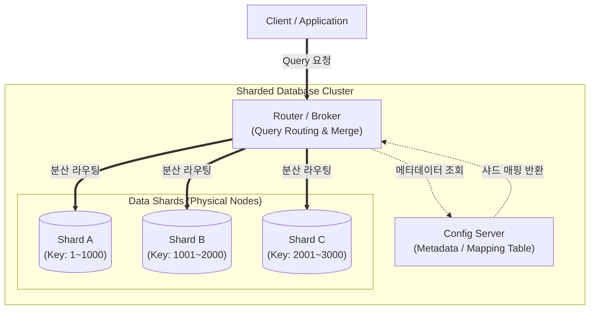

# 샤딩 (Sharding)

---

## I. 대규모 데이터 분산 처리의 핵심, 샤딩(Sharding)의 개요

### 가. 샤딩의 정의

* 대용량 데이터베이스나 테이블을 수평적(Horizontal Partitioning)으로 분할하여, 물리적으로 서로 다른 여러 노드(서버)에 분산 저장하고 처리하는 [[데이터베이스]] 아키텍처 기술

### 나. 샤딩의 필요성 및 특징

* **확장성(Scalability)**: 단일 데이터베이스 서버의 하드웨어 한계 극복을 위한 스케일 아웃(Scale-out) 아키텍처 지원
* **고가용성([[HA(High Availability)|High Availability]])**: 특정 샤드(서버)에 장애가 발생해도 다른 샤드의 데이터 서비스는 정상 동작하여 장애 영향도 격리(Fault Tolerance)
* **성능 최적화**: [[트랜잭션]] 부하 및 쿼리 요청을 여러 노드로 분산시켜 응답 속도 향상 및 병목 현상 해소

---

## II. 샤딩의 개념도 및 핵심 기술 요소

### 가. 샤딩의 개념도 및 동작 원리

* 클라이언트 쿼리 유입 → 라우터가 Config 서버의 메타데이터 참조 → 해당 데이터가 위치한 독립된 물리적 샤드 노드로 요청 전달 및 병렬 처리

### 나. 샤딩의 핵심 기술 및 구성 요소

| 구분 | 요소기술(키워드) | 세부 설명 |
| --- | --- | --- |
| **기준 값** | Shard Key (샤드 키) | 데이터를 여러 샤드로 분배하기 위해 기준이 되는 특정 컬럼 또는 필드 값 |
| **분산 라우팅** | Router (Broker) | 클라이언트의 요청을 받아 적절한 샤드로 쿼리를 전달하고 결과를 병합 (예: mongos) |
| **메타데이터** | Config Server | 샤드 키의 범위와 실제 데이터가 저장된 샤드 노드 간의 매핑 정보(Lookup Table) 보관 |
| **분할 기법** | Hash Sharding | 샤드 키의 해시(Hash)값을 기준으로 데이터를 균등하게 분산 (특정 노드 쏠림/Hotspot 방지) |
| **분할 기법** | Range Sharding | 샤드 키의 연속적인 범위(날짜, 숫자 등)를 기준으로 분할 (범위 검색/Range Query에 유리) |
| **분할 기법** | Directory Sharding | 별도의 룩업 테이블을 두어 샤드 키와 타겟 샤드를 동적으로 직접 매핑 (유연성 높음) |
| **부하 분산** | Rebalancing / Chunk Migration | 특정 샤드에 데이터나 부하가 집중될 경우, 백그라운드에서 데이터를 타 샤드로 재배치 |
| **가용성 보장** | Replica Set (복제) | 단일 샤드 노드의 장애(SPOF)를 방지하기 위해 각 샤드 내부에 Master-Slave 복제 구성 |

---

## III. 샤딩과 파티셔닝(Partitioning)의 비교 및 최신 동향

### 가. 샤딩과 수평 파티셔닝의 비교

| 비교 항목 | 샤딩 (Sharding) | 수평 [[파티셔닝]] (Horizontal Partitioning) |
| --- | --- | --- |
| **분할의 물리적 위치** | **서로 다른 물리적 서버(노드)**에 분산 저장 | **동일한 단일 데이터베이스(서버)** 내에 논리적 분할 |
| **확장성 아키텍처** | **Scale-out** (저비용 범용 서버 다수 증설) | **Scale-up** (고성능 대용량 서버 단일 구성) |
| **장애 격리 (SPOF)** | 한 샤드의 장애가 전체 시스템에 미치는 영향 적음 | [[DBMS]] [[인스턴스]] 전체 장애 시 모든 파티션 마비 |
| **[[조인|조인(Join)]] 연산** | 이기종 서버 간 조인(Cross-shard Join) 성능 저하 심각 | 동일 서버 내 위치하여 조인 연산 상대적 용이 |
| **도입 목적** | 대규모 트래픽 분산 및 분산 컴퓨팅 한계 극복 | 대용량 테이블의 관리 편의성(백업, 인덱스) 향상 |

* **최신 트렌드 및 향후 전망**:
* 기존 RDBMS의 분산 트랜잭션(2PC) 처리 한계를 극복하기 위해, Google Spanner와 같은 **[[New SQL|NewSQL]]** 계열 데이터베이스에서 자동화된 글로벌 샤딩 모델 적용 확대
* [[블록체인]] 분야에서도 네트워크 확장성(TPS) 한계(Trilemma) 극복을 위해, 데이터 가용성(DA)과 검증을 분할 처리하는 **Danksharding(이더리움 롤업 최적화)** 형태의 특수 샤딩 기술로 진화 중

---

### 🔗 연관 토픽

- **소속 도메인**: [[00_데이터베이스_MOC|🗄️ 데이터베이스]]
- **세부 분류**: `4. 물리 저장 구조 & 인덱스 최적화`
- **핵심 연관 토픽**:
  - [[파티셔닝|파티션]]
  - [[데이터베이스]]
  - [[New SQL]]
  - [[분산 데이터베이스|분산 데이터베이스 (Distributed Database)]]
  - [[트랜잭션]]
