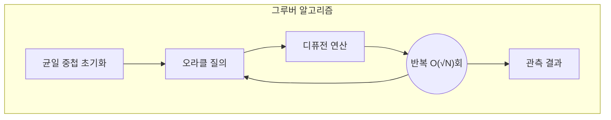

# 쇼어 & 그루버 알고리즘
- 쇼어 알고리즘 (Shor's Algorithm): 소인수분해와 주기성 찾기
- 그로버 알고리즘 (Grover's Algorithm): 비정렬 데이터 검색

---
## I. 양자 컴퓨팅의 암호체계 무력화 위협, 쇼어 & 그루버 알고리즘
- **쇼어**: 양자 푸리에 변환을 활용하여 다항 시간 내에 공개키를 무력화하는 알고리즘
- **그루버**: 진폭 증폭 원리를 통해 $O\sqrt{N}$ 속도로 대칭키 및 해시함수 무력화 양자 알고리즘

---
## II. 쇼어&그루버 알고리즘의 아키텍처 및 핵심기술요소
### 가. 쇼어&그루버 알고리즘의 동작 원리

- 양자 컴퓨팅 시대에 위 알고리즘으로 
### 나. 쇼어 & 그루버 알고리즘의 핵심 기술 요소 비교

| 구분      | 핵심 구성요소  | 기능 및 역할        |
| :------ | :------- | :------------- |
| **쇼어**  | - QFT    | [[양자컴퓨터|양자 푸리에 변환(QFT)]]  |
| **쇼어**  | - 위협대상   | 공개키([[RSA]], [[ECC]])  |
| **쇼어**  | - 지수적 가속 | 빠른 다항 시간 안에 해결 |
| **쇼어**  | - 대응 방안  | [[양자내성암호|PQC]] [[양자내성암호]] |
| **그루버** | - Oracle | 위상 반전 함수       |
| **그루버** | - 진폭증폭   | 정답만 증폭         |
| **그루버** | - 위협 대상  | 대칭키 [[AES]], [[DES]]   |
| **그루버** | - 이차적 가속 | 연산 시간 단축       |
- 위 두 알고리즘을 통해 PQC 출현 가속화
---
## III. 쇼어 & 그루버 알고리즘 최신 동향 보안

### 가. 양자 컴퓨팅 기술 최신 동향
- QEC 및 큐비트 스케일링으로 결함 허용 컴퓨팅 시대로 가속화 및 NISQ 환경 및 하드웨어 한계로 인해 UQE, QAOA 등 알고리즘
### 나. 양자 알고리즘 위협에 대비한 차세대 보안 대응
| 구분   | 방어기술         | 설명              |
| :--- | :----------- | :-------------- |
| 알고리즘 | PQC 양자 내성 암호 | ML-KEM 등 수학적 난제 |
| 키관리  | 키 길이/해시확장    | 512bit 해시       |
| 인프라  | QKD 양자 암호 통신 | BB84 [[프로토콜]]       |

---
## 추가자료
### shor
![[Pasted image 20260829075956.png]]
![[Pasted image 20260829080006.png]]![[Pasted image 20260829080017.png]]![[Pasted image 20260829080028.png]]

### Grover
![[Pasted image 20260829080046.png]]
![[Pasted image 20260829080057.png]]
![[Pasted image 20260829080105.png]]![[Pasted image 20260829080117.png]]