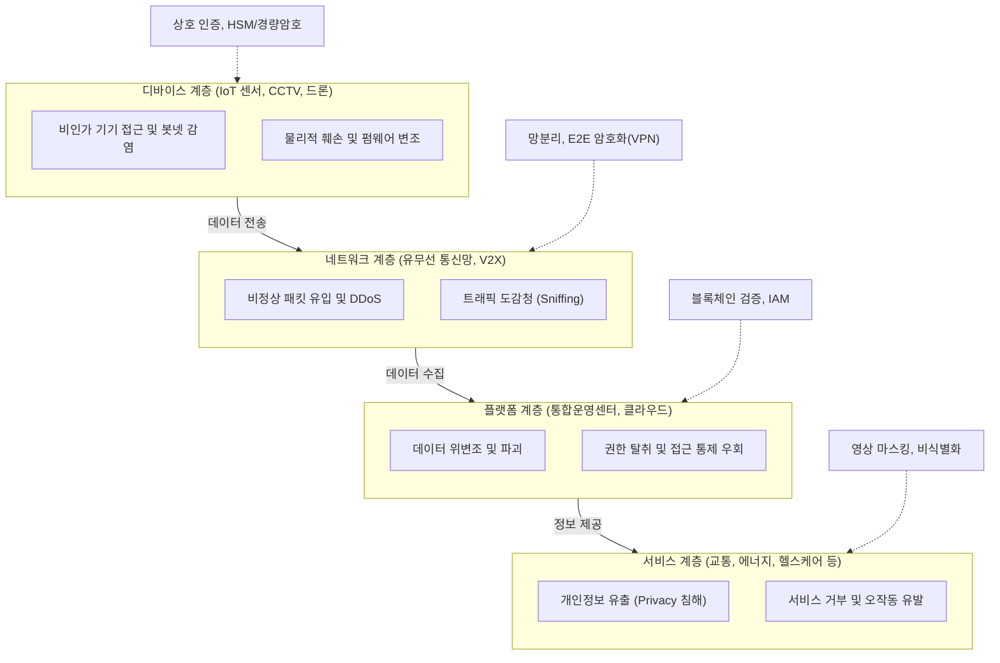

# 스마트시티 보안취약점 및 대응방안

---

## I. 초연결·초지능 도시 인프라 보호를 위한, 스마트시티 보안의 개요

* **정의**: 도시 전체가 하나의 네트워크로 연결된 초연결 환경에서, 교통·에너지·의료 등 주요 인프라의 데이터 유출 및 물리적 시스템 마비를 방지하기 위해 사이버-물리 융합 보안 체계를 구축하는 활동
* **필요성 및 특징**:
* 물리적 피해 동반: 사이버 공격이 시민의 생명과 도시 인프라 마비로 직결([[CPS]] 융합 환경)
* 연쇄적 장애 방지: 인프라 간 상호 의존성으로 인한 피해 확산을 막기 위한 사이버 회복력(Resilience) 필수
* 대규모 데이터 보호: 방대한 개인정보 및 도시 운영 데이터의 안전한 활용을 위한 거버넌스 확립

---

## II. 스마트시티 보안취약점 발생 계층 및 핵심 대응 기술

### 가. 스마트시티 계층별 보안 위협 및 방어 개념도

* 스마트시티는 디바이스-네트워크-플랫폼-서비스 4계층으로 구성되며, 하위 계층의 취약점이 전체 도시 시스템의 마비로 이어짐
* 각 계층별 특화된 방어 요소를 적용하고, 물리적 보안과 정보 보안을 통합 관제하는 융합 방어 체계 구현이 핵심

### 나. 스마트시티 핵심 보안취약점 및 대응 요소 기술

| 계층 (구분) | 취약점 (위협 요소) | 핵심 대응 기술 (대응 방안) | 세부 설명 |
| --- | --- | --- | --- |
| **디바이스** | 기기 훼손 및 정보 탈취 | **경량 [[암호화]] 및 HSM** | 자원 제약적 IoT 기기 대상 경량 [[암호 알고리즘]](LEA) 및 하드웨어 보안 모듈 탑재 |
| **디바이스** | 비인가 단말 접속 | **기기 상호 인증 (EAP-TLS)** | PKI(공개키 기반 구조) 인증서를 활용한 기기와 서버 간의 강력한 상호 인증 체계 적용 |
| **네트워크** | 트래픽 도청 및 위조 | **구간 암호화 (국산 [[알고리즘]])** | 전송 구간 E2E 암호화(SEED, ARIA, [[AES]]-256 이상) 및 안전한 통신망 구축 |
| **네트워크** | 내부망 침투 및 전파 | **망분리 및 제로 트러스트** | 논리적/물리적 망분리 적용, 네트워크 접근 제어(NAC) 및 지속적인 신뢰 검증 기반 통제 |
| **플랫폼** | 대량 데이터 위변조 | **[[블록체인]] 기반 [[무결성]] 검증** | 분산원장 기술을 활용하여 핵심 로그 및 센서 데이터의 위변조 방지 및 추적성 확보 |
| **플랫폼** | 관리자 권한 탈취 | **엄격한 접근 통제 ([[IAM]])** | 통합 계정 권한 관리, 최소 권한 원칙(Need-to-Know) 적용 및 다중 인증(MFA) 도입 |
| **서비스** | 위치 및 영상정보 침해 | **프라이버시 강화 기술 (PET)** | 지능형 CCTV 영상 실시간 마스킹, [[동형 암호]], 가명/익명 처리 등을 통한 [[비식별화]] 조치 |
| **통합 관제** | 복합적 침해사고 발생 | **AI 융합 보안 관제 (PSIM)** | 사이버-물리 보안 정보 통합(PSIM), AI 기반 이상 탐지([[Anomaly(이상현상)|Anomaly]] Detection)를 통한 즉각 대응 |

---

## III. 스마트시티 보안 강화를 위한 거버넌스 및 향후 전망

* **사이버 회복력(Cyber Resilience) 중심 방어**: 완벽한 차단이 불가능함을 전제로, 침해사고 발생 시에도 핵심 인프라 기능 유지 및 신속한 백업·복원을 위한 분산형 Fail-Over 체계 설계
* **민·관 협력 보안 거버넌스 구축**: 지자체, 공공기관, 민간 기업 간 상호의존적인 데이터 보호를 위해 명확한 책임 추적성 확보 및 통합 보안 정책(가이드라인, 조례) 법제화 추진
* **지능형 보안 자동화([[SOAR (Security Orchestration, Automation and Response)|SOAR]]) 고도화**: AI 및 머신러닝을 활용하여 보안 위협 패턴을 스스로 학습하고, 인간의 개입 없이 최적의 방어 정책을 자동 실행하는 자율 보안 시스템(Self-Defending System)으로 진화
* **공급망 보안(Supply Chain Security) 강화**: 스마트시티를 구성하는 수많은 서드파티 하드웨어 및 소프트웨어 도입 시, 기획-설계-운영 전 주기에 걸친 취약점 점검 및 보안 내재화(Security by Design) 의무화

---

### 🔗 연관 토픽

- **소속 도메인**: [[00_보안_MOC|🛡️ 보안]]
- **세부 분류**: `4. 웹 & 애플리케이션 보안 · 취약점 점검`
- **핵심 연관 토픽**:
  - [[암호화|암호화 (Encryption)]]
  - [[AES]]
  - [[암호 알고리즘]]
  - [[무결성]]
  - [[비식별화]]
