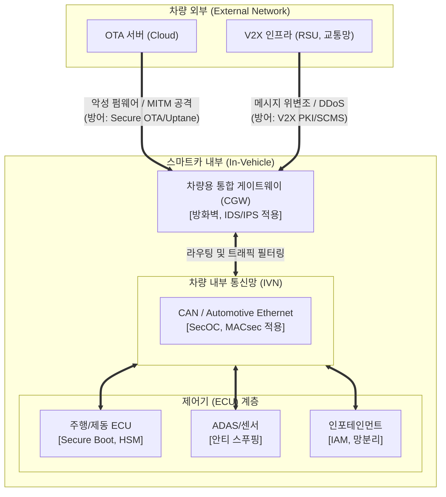

# 스마트카 보안 취약점 및 대응방안

---

## I. 운전자의 생명과 직결된 사이버 물리 시스템, 스마트카 보안의 개요

* **정의**: [[Smart Car(자율주행)|자율주행]] 및 커넥티드 환경에서 차량 내·외부 네트워크(V2X, IVN)를 통한 사이버 공격으로부터 차량 제어권을 방어하고 운전자의 생명과 데이터를 보호하는 융합 보안 체계
* **필요성 및 등장 배경**:
* **생명 직결(물리적 피해)**: 제어기(ECU) 해킹 시 조향 및 제동 장치 마비로 대형 인명 사고 직결
* **공격 표면(Attack Surface) 급증**: OTA, V2X, 인포테인먼트(IVI) 도입에 따른 외부 접점 확대
* **컴플라이언스 의무화**: UNECE R155/R156 채택 및 ISO/SAE 21434 제정에 따른 보안 인증 필수화

---

## II. 스마트카의 아키텍처 및 핵심 보안 기술 요소

### 가. 스마트카 계층별 보안 위협 및 방어 개념도

* 외부 망(V2X, OTA)을 통한 침투 후 내부망(CAN)을 거쳐 최종 ECU 제어권을 탈취하는 연쇄 공격 방어
* 심층 방어(Defense in Depth) 관점에서 단말(ECU)-내부망(IVN)-외부망 전 구간에 [[암호화]] 및 인증 적용

### 나. 스마트카 핵심 보안 기술 요소

| 구분 | 요소 기술 | 세부 설명 |
| --- | --- | --- |
| **외부 통신** | **V2X PKI (SCMS)** | 차량 간(V2V), 차량-인프라 간(V2I) 통신 시 인증서 기반 상호 인증 및 메시지 [[무결성]] 보장 |
| **외부 통신** | **Secure OTA** | 무선 펌웨어 업데이트 시 코드 서명(Code Signing), 롤백 방지 및 Uptane [[프레임워크]] 적용 |
| **내부 통신** | **SecOC (Secure Onboard Comm)** | AUTOSAR 표준 기반으로 CAN 메시지에 인증 식별자([[MAC]])를 추가하여 위변조 방지 및 재전송 공격 차단 |
| **내부 통신** | **차량용 [[방화벽]] / IDS** | [[게이트웨이]](CGW)에서 비정상 패킷, 주기 이상 메시지, 비인가 접근을 실시간 탐지 및 필터링 |
| **단말(제어기)** | **Secure Boot (안전 부팅)** | ECU 부팅 시 펌웨어의 전자 서명을 검증하여, 인가되지 않거나 변조된 OS의 실행을 원천 차단 |
| **단말(제어기)** | **HSM (Hardware Security Module)** | 암호키 생성, 저장 및 암호화 연산을 독립적으로 수행하는 하드웨어 기반 위변조 방지 칩셋 |
| **어플리케이션** | **망분리 및 [[IAM]]** | 인포테인먼트(IVI)와 핵심 제어(차량 구동) 영역의 논리적/물리적 망분리 및 엄격한 접근 권한 통제 |
| **거버넌스** | **TARA (위협 및 위험 분석)** | ISO/SAE 21434 기반으로 자산 식별, [[위협 모델링]], 위험 수준 평가 및 완화 조치 도출 체계 |

---

## III. 스마트카 보안 글로벌 컴플라이언스 및 향후 전망

### 가. 스마트카 주요 사이버보안 국제 표준 및 규제 동향

| 규제 / 표준명 | 제정 기관 | 핵심 내용 및 의의 |
| --- | --- | --- |
| **UNECE R155** | 유엔유럽경제위원회 | **CSMS(사이버보안 관리체계) 인증 의무화** (유럽 진출 신차 대상 필수 요구사항) |
| **UNECE R156** | 유엔유럽경제위원회 | **SUMS(소프트웨어 업데이트 관리체계)**, 무선 업데이트(OTA) 안전성 및 이력 관리 규정 |
| **ISO/SAE 21434** | ISO / SAE 공동 | **차량 사이버보안 엔지니어링 국제 표준**, 설계부터 폐기까지 E2E([[End-to-End]]) 사이버보안 [[프로세스]] 명시 |

### 나. 향후 전망 및 기술 진화 방향

* **SDV(Software Defined Vehicle) 보안 내재화**: Zonal 아키텍처 및 중앙 집중형 HPC(High Performance Computer) 도입에 따른 통합 보안 제어기(Security Gateway)의 역할 증대
* **제로 트러스트 아키텍처 적용**: '아무것도 신뢰하지 않는다'는 원칙 하에, 차량 내부 네트워크(Automotive Ethernet 등)의 모든 통신 노드 간 지속적 인증(Continuous Authentication) 도입
* **미래 기술 융합**: 양자 컴퓨터의 공격에 대비한 양자 내성 암호(PQC) 차량 도입 연구 및 차량 소유주·기기 신원 증명을 위한 [[블록체인]] 기반 DID(Decentralized ID) 적용 확대

---

### 🔗 연관 토픽

- **소속 도메인**: [[00_보안_MOC|🛡️ 보안]]
- **세부 분류**: `4. 웹 & 애플리케이션 보안 · 취약점 점검`
- **핵심 연관 토픽**:
  - [[위협 모델링|위협 모델링(Threat Modeling) - Secure SDLC]]
  - [[무결성]]
  - [[End-to-End]]
  - [[IAM]]
  - [[암호화|암호화 (Encryption)]]
